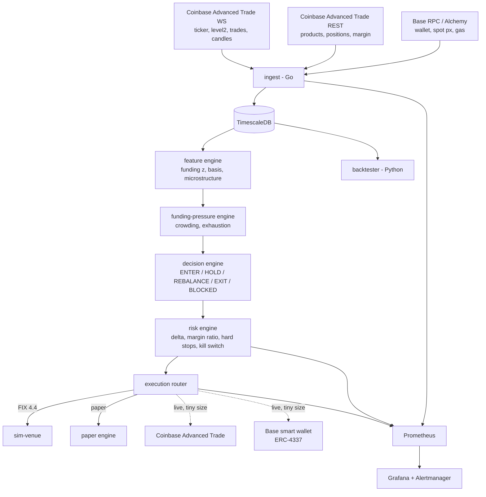

# delta-neutral

A small, real, delta-neutral **funding-carry system**: long spot ETH on Base, short the ETH perpetual-style future on Coinbase, sized to net delta ≈ 0, collecting funding while the future trades rich. A funding-pressure engine — built on the idea that you are trading *incentives and crowding*, not price — times entries, exits, and hold-offs. Go services, Python research, one TimescaleDB, FIX 4.4 order entry, full observability stack.

Every on-chain trade in this project comes from one named wallet (ENS + .base.eth resolving to the same address), so the spot side of the book is publicly auditable; the perp leg trades off-chain at a CFTC-regulated venue and is recorded in the system's own decision and fill logs. **Architecture is the product; edge stays private** — the public repo ships the full system with synthetic thresholds; fitted parameters, credentials, and live config never leave `.env.private`.

> Wallet: `<ens-name>.eth` / `<name>.base.eth` *(filled in at public release)*

## How it works



The trade in one sentence: when funding is positive, perp longs pay shorts every hour — the system shorts the future, holds equal spot, and earns that payment while staying price-neutral; the pressure engine decides when the payment is worth the fees, slippage, and basis risk, and hard stops flatten everything when it isn't.

Two details shape most of the code. The perp leg is **quantized** — one contract is 0.10 ETH and only whole contracts trade — so the perp leg is sized first and the continuous spot leg on Base trims the residual delta. And the venue publishes only the *current* funding rate and no history, so the system **computes its own hourly rate** from the venue's published formula — which is what lets it check the venue's number, reconstruct the months of history a z-score needs, and reconcile both against the cash adjustments that actually land, twice daily.

Three binaries: `ingest` (market data → TimescaleDB), `carry` (features → pressure → decision → risk → execution), `sim-venue` (a FIX 4.4 exchange simulator with slippage, latency, and partial fills). The decision engine only ever emits *intent*; the risk engine is the sole component that can emit orders, and every decision is persisted with its full input snapshot so it can be re-derived later. Paper, simulated, and live venues sit behind one `Venue` interface and feed the same execution state machine.

## Why this exists

Built as a working demonstration of three things at once (see the [PRD](docs/prd.md)):

- **Perp market structure** — hourly funding from a premium TWAP, futures-mark vs spot-mark basis, margin-ratio liquidation, crowding and contract quantization.
- **Institutional order entry** — a real FIX session with heartbeats, file-backed sequence numbers, and resend recovery that survives restarts.
- **Reliability engineering** — reconnects with gap detection, one-writer persistence, staleness-aware risk, hard stops, kill switch, Prometheus/Grafana/Alertmanager, and a 30-day replay harness.

It runs real (small) size, and its wallet history is the audit trail.

## Repository layout

```
cmd/ingest, cmd/carry, cmd/sim-venue    service binaries
internal/...                            ingest, venue, features, pressure,
                                        carry, risk, exec, fix, treasury,
                                        metrics, db, config
research/                               Python backtester, notebooks
deploy/                                 Compose, Grafana, Prometheus, Alertmanager
docs/                                   the documents below
```

## Documentation

| Doc | What it covers |
|---|---|
| [`docs/basis-carry-build-spec.md`](docs/basis-carry-build-spec.md) | The reconciled build spec — source of truth |
| [`docs/prd.md`](docs/prd.md) | Requirements, goals, success metrics, risks |
| [`docs/architecture.md`](docs/architecture.md) | Processes, concurrency, state machines, data, reliability |
| [`docs/api-spec.md`](docs/api-spec.md) | External APIs, internal contracts, FIX dictionary, DB schema, metrics |
| [`docs/build-plan.md`](docs/build-plan.md) | Sequenced 22-part build plan with acceptance criteria |
| [`docs/venue-coinbase-perps.md`](docs/venue-coinbase-perps.md) | Venue mechanics: contract spec, funding formula, margin, API surface |
| [`docs/engineering-principles.md`](docs/engineering-principles.md) | Code quality bar |
| [`docs/testing-strategy.md`](docs/testing-strategy.md) | Test conventions and chaos matrix |
| [`docs/manual-carry-playbook.md`](docs/manual-carry-playbook.md) | Manual wallet-track procedure and log template |
| [`docs/decisions/`](docs/decisions/README.md) | Architecture decision records |

## Running

```sh
make up               # full stack: services + TimescaleDB + Prometheus + Grafana + Alertmanager
make migrate          # apply schema, seed the perp product row
make test             # Go + Python suites
make test-integration # schema and writer against the Compose TimescaleDB
make lint             # golangci-lint
make replay           # 30-day backtest, refreshes Grafana
```

`make up` creates `.env` from `.env.example` on first run and waits until all seven
services report healthy. Grafana is on `:3000`, Prometheus on `:9090`, Alertmanager
on `:9093`, TimescaleDB on `:15432` (not the default `5432`, so it cannot collide
with a Postgres already on the machine); the binaries expose `/metrics` on `:9101`
(ingest), `:9102` (carry) and `:9103` (sim-venue). Every published port binds
`127.0.0.1` only — Docker's port rules sit in front of the host firewall, so the
usual `0.0.0.0` default would put an anonymous-viewer Grafana and the database on
every interface.

> **On a completely fresh volume, `make up` will report `ingest is unhealthy` and exit non-zero.** That is expected and self-healing: the services start before `make migrate` has created the schema, so `ingest` correctly treats the missing tables as an invariant violation, exits, and is restarted by Compose until the schema exists. Run `make migrate` and it comes up healthy. The two steps are deliberately separate so that bringing the stack up never migrates as a side effect ([ADR-0010](docs/decisions/0010-embedded-migrations.md)).

`make migrate` runs a one-shot container that applies the embedded migrations and
exits — bringing the stack up never changes the schema on its own. It is safe to
re-run: it reports the schema version and leaves any product metadata already read
from the venue untouched.

Configuration is env-based: `.env.example` documents every variable with synthetic placeholder values; real thresholds and credentials live in a gitignored `.env.private`.

## Status

[Part 2](docs/build-plan.md#part-2--database-schema-migrations-writer-package) complete (2026-08-17): the full v1 schema — seven hypertables, seven state tables — as embedded migrations, and the shared one-writer persistence layer that every binary writes through. `make up && make migrate` brings the stack up and creates the schema; the system is running with an empty database waiting for feeds. Money is `decimal` in Go and `numeric` in SQL end to end, proven by a round trip of values a `float64` cannot represent. [Part 3](docs/build-plan.md#part-3--go-onramp-toy-collaborative-part--hand-written-first-waived-by-the-po) followed (2026-08-18): a learning toy in [`research/onramp/`](research/onramp/README.md) that is `cmd/ingest` in miniature — two fake feeds fanning into one channel, one writer batching through pgx, `/metrics` served — with a walkthrough of every Go construct in it. [Part 4](docs/build-plan.md#part-4--coinbase-ws-ingest) — the Coinbase WebSocket ingest — is **feature-complete and demonstrated** (2026-08-21), pending the PO's diff review: five live market-data streams, each with its own connection, reconnect loop and gap detection, feeding `cb_venue_state`, `cb_bars`, `cb_book_snapshots` and `cb_trades_agg`. A 1-hour soak against the live venue accrued rows in all four tables with zero writer errors and flat goroutine and memory profiles, caught a candle-persistence bug that no test had, and happened to span the Friday market close — so the maintenance-window handling is validated against a real one. `kill -TERM` flushes the queue cleanly; a full network loss stops the streams, reports the fatal write and restarts. [Part 5](docs/build-plan.md#part-5--rest-poller-funding-estimator-backfill) followed (2026-08-25): the local funding-rate estimator, plus the REST poller and account polling against a real futures account. The venue *does* publish an hourly rate — a mistaken reading of an empty look-alike field said otherwise for two build parts — so both are recorded side by side: the published rate as `funding_source='venue'`, the estimate beside it. The estimator stays primary because it is the only route to *history* and because running it alongside is what makes the venue's number checkable at all. Over a 30-hour live window the two differ by **+0.22 percentage points annualised** (sd 1.91), once corrected for the venue publishing its rate one hour behind ours. Because the estimator's inputs are just a futures mark and a spot mark, and the venue serves candles back to the contract's launch, **45 days of funding history were reconstructed rather than waited for**: 981 hours averaging +8.80% annualised, marked `backfilled` so nothing downstream mistakes them for live measurements. Next: [Part 6](docs/build-plan.md#part-6--base-poller), the Base wallet poller. The wallet track (manual carries) runs ahead of the code by design.

*Personal project. Not investment advice; live size is deliberately tiny.*
