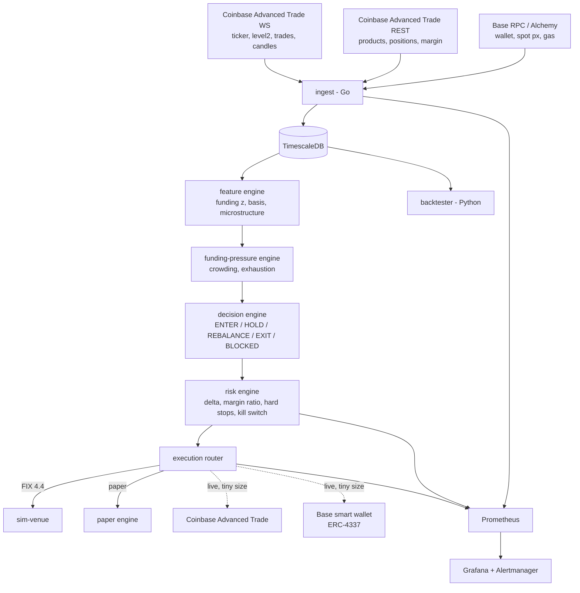

# delta-neutral

A small, real, delta-neutral **funding-carry system**: long spot ETH on Base, short the ETH perpetual-style future on Coinbase, sized to net delta ≈ 0, collecting funding while the future trades rich. A funding-pressure engine — built on the idea that you are trading *incentives and crowding*, not price — times entries, exits, and hold-offs. Go services, Python research, one TimescaleDB, FIX 4.4 order entry, full observability stack.

Every on-chain trade in this project comes from one named wallet (ENS + .base.eth resolving to the same address), so the spot side of the book is publicly auditable; the perp leg trades off-chain at a CFTC-regulated venue and is recorded in the system's own decision and fill logs. **Architecture is the product; edge stays private** — the public repo ships the full system with synthetic thresholds; fitted parameters, credentials, and live config never leave `.env.private`.

> Wallet: `<ens-name>.eth` / `<name>.base.eth` *(filled in at public release)*

## How it works



The trade in one sentence: when funding is positive, perp longs pay shorts every hour — the system shorts the future, holds equal spot, and earns that payment while staying price-neutral; the pressure engine decides when the payment is worth the fees, slippage, and basis risk, and hard stops flatten everything when it isn't.

Two details shape most of the code. The perp leg is **quantized** — one contract is 0.10 ETH and only whole contracts trade — so the perp leg is sized first and the continuous spot leg on Base trims the residual delta. And the venue may not publish a funding rate to this API tier, so the system **computes its own hourly rate** from the venue's published formula and reconciles it against the cash adjustments that actually land, twice daily.

Three binaries: `ingest` (market data → TimescaleDB), `carry` (features → pressure → decision → risk → execution), `sim-venue` (a FIX 4.4 exchange simulator with slippage, latency, and partial fills). The decision engine only ever emits *intent*; the risk engine is the sole component that can emit orders, and every decision is persisted with its full input snapshot so it can be re-derived later. Paper, simulated, and live venues sit behind one `Venue` interface and feed the same execution state machine.

## Why this exists

Built as a working demonstration of three things at once (see the [PRD](docs/prd.md)):

- **Perp market structure** — hourly funding from a premium TWAP, futures-mark vs spot-mark basis, margin-ratio liquidation, crowding and contract quantization.
- **Institutional order entry** — a real FIX session with heartbeats, file-backed sequence numbers, and resend recovery that survives restarts.
- **Reliability engineering** — reconnects with gap detection, one-writer persistence, staleness-aware risk, hard stops, kill switch, Prometheus/Grafana/Alertmanager, and a 30-day replay harness.

It runs real (small) size, and its wallet history is the audit trail.

## Repository layout

```
cmd/ingest, cmd/carry, cmd/sim-venue    service binaries
internal/...                            ingest, venue, features, pressure,
                                        carry, risk, exec, fix, treasury,
                                        metrics, db, config
research/                               Python backtester, notebooks
deploy/                                 Compose, Grafana, Prometheus, Alertmanager
docs/                                   the documents below
```

## Documentation

| Doc | What it covers |
|---|---|
| [`docs/basis-carry-build-spec.md`](docs/basis-carry-build-spec.md) | The reconciled build spec — source of truth |
| [`docs/prd.md`](docs/prd.md) | Requirements, goals, success metrics, risks |
| [`docs/architecture.md`](docs/architecture.md) | Processes, concurrency, state machines, data, reliability |
| [`docs/api-spec.md`](docs/api-spec.md) | External APIs, internal contracts, FIX dictionary, DB schema, metrics |
| [`docs/build-plan.md`](docs/build-plan.md) | Sequenced 22-part build plan with acceptance criteria |
| [`docs/venue-coinbase-perps.md`](docs/venue-coinbase-perps.md) | Venue mechanics: contract spec, funding formula, margin, API surface |
| [`docs/engineering-principles.md`](docs/engineering-principles.md) | Code quality bar |
| [`docs/testing-strategy.md`](docs/testing-strategy.md) | Test conventions and chaos matrix |
| [`docs/manual-carry-playbook.md`](docs/manual-carry-playbook.md) | Manual wallet-track procedure and log template |
| [`docs/decisions/`](docs/decisions/README.md) | Architecture decision records |

## Running

```sh
make up        # full stack: services + TimescaleDB + Prometheus + Grafana + Alertmanager
make migrate   # apply schema
make test      # Go + Python suites
make lint      # golangci-lint
make replay    # 30-day backtest, refreshes Grafana
```

`make up` creates `.env` from `.env.example` on first run and waits until all seven
services report healthy. Grafana is on `:3000`, Prometheus on `:9090`, Alertmanager
on `:9093`; the binaries expose `/metrics` on `:9101` (ingest), `:9102` (carry) and
`:9103` (sim-venue).

Configuration is env-based: `.env.example` documents every variable with synthetic placeholder values; real thresholds and credentials live in a gitignored `.env.private`.

## Status

[Part 1](docs/build-plan.md#part-1--repo-scaffold-compose-stack-config) complete (2026-08-16): repo scaffold, Compose stack, and typed configuration. `make up` brings all seven services to healthy, each binary serves `/metrics`, and Prometheus and Grafana are wired to them — the system is running and empty. Next: [Part 2](docs/build-plan.md#part-2--database-schema-migrations-writer-package), the schema and the one-writer persistence layer. The wallet track (manual carries) runs ahead of the code by design.

*Personal project. Not investment advice; live size is deliberately tiny.*
