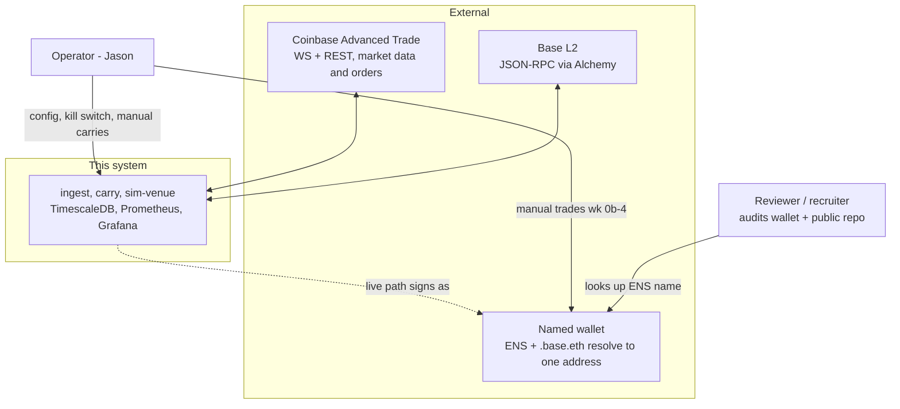
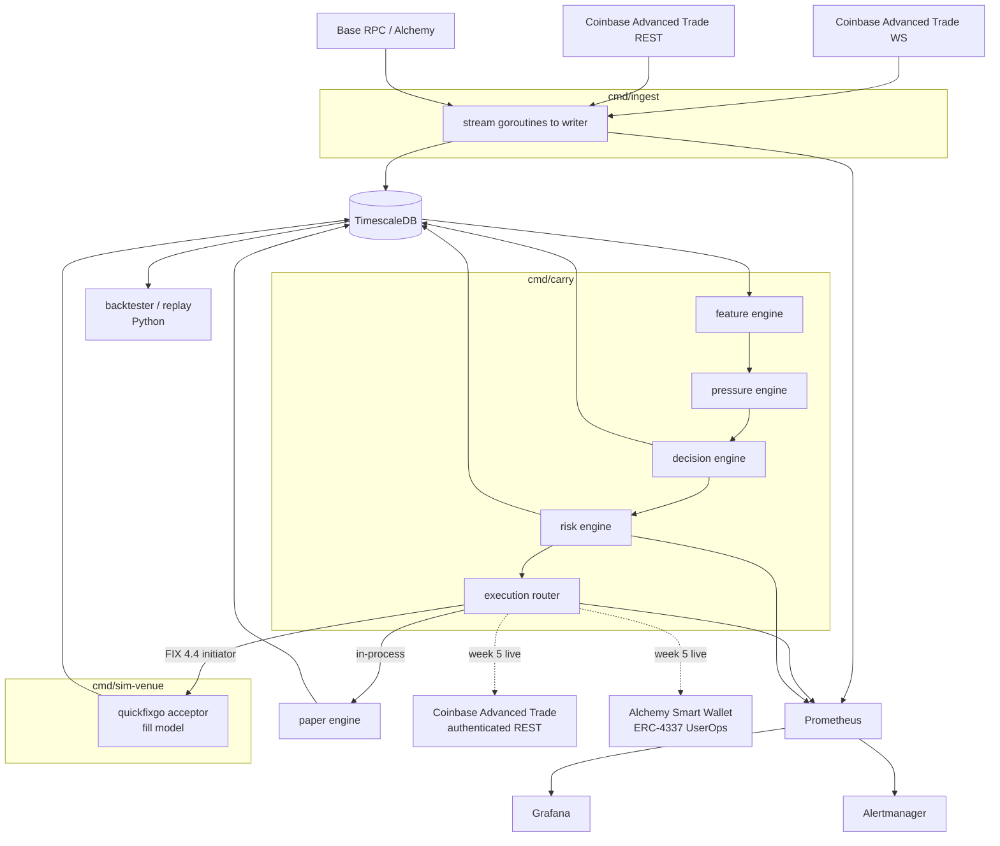
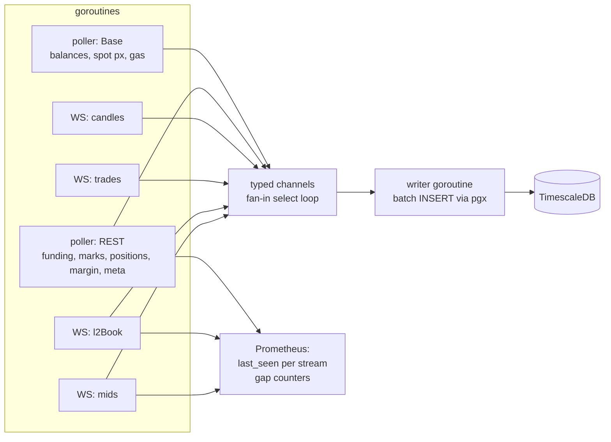
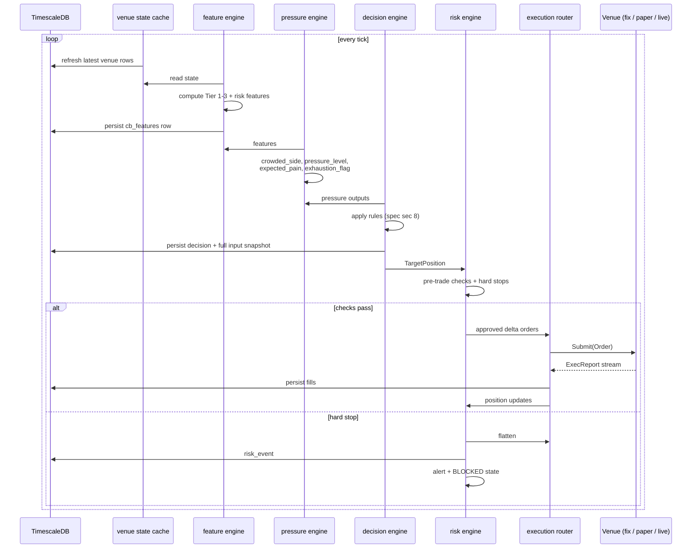
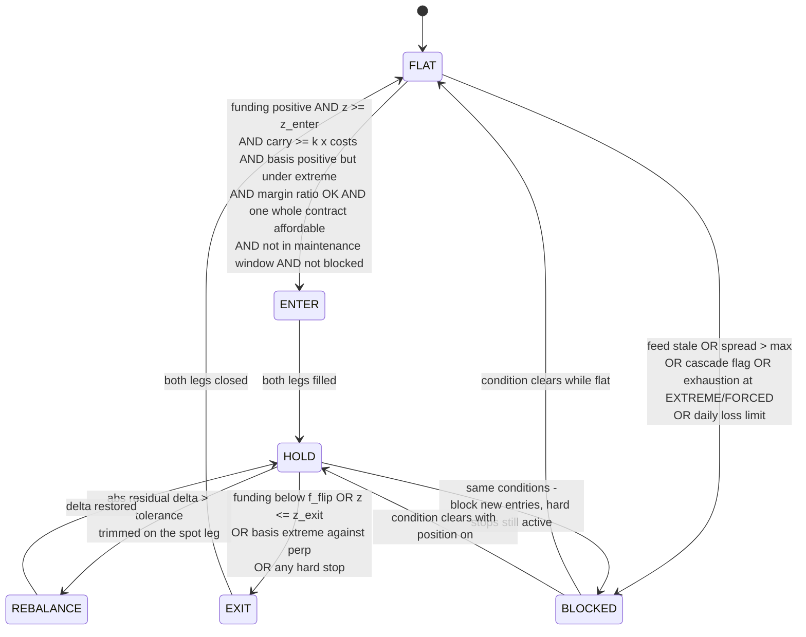
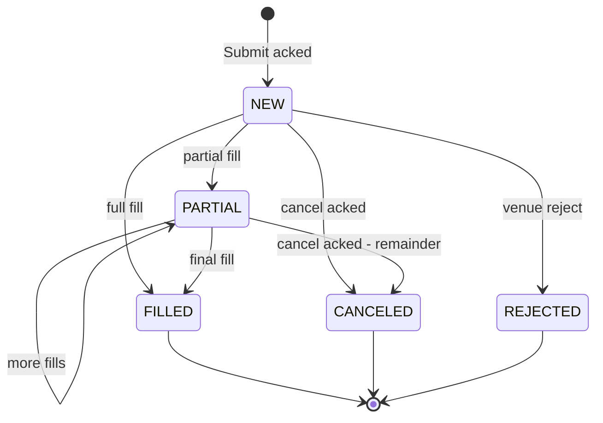
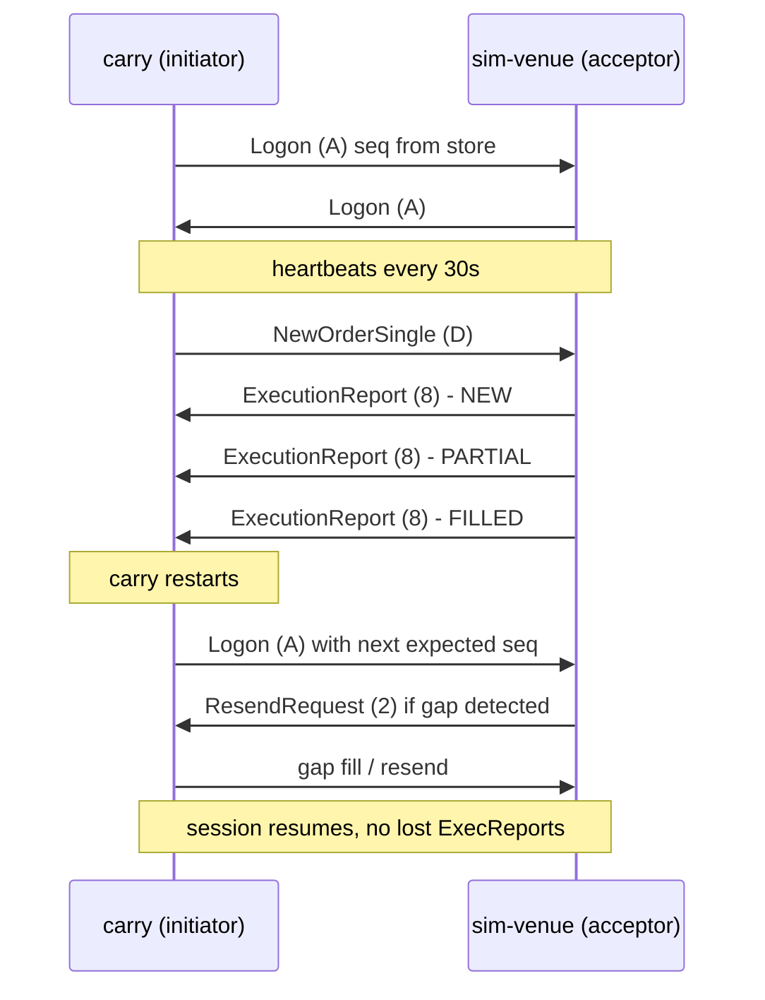
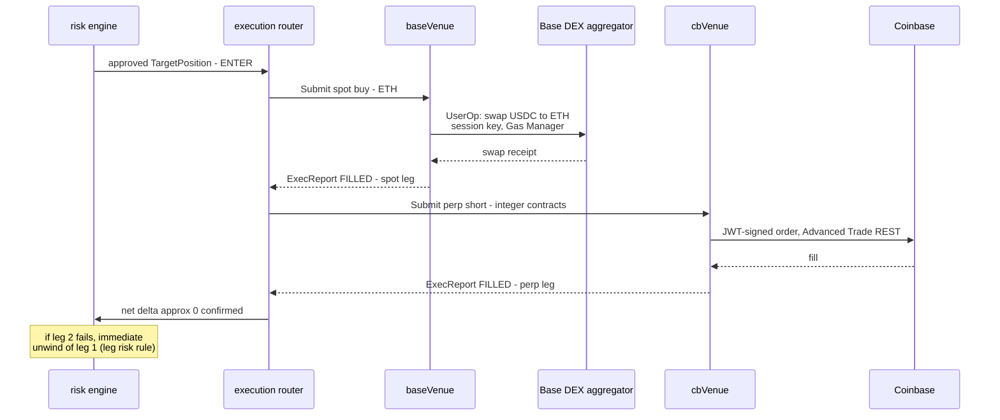
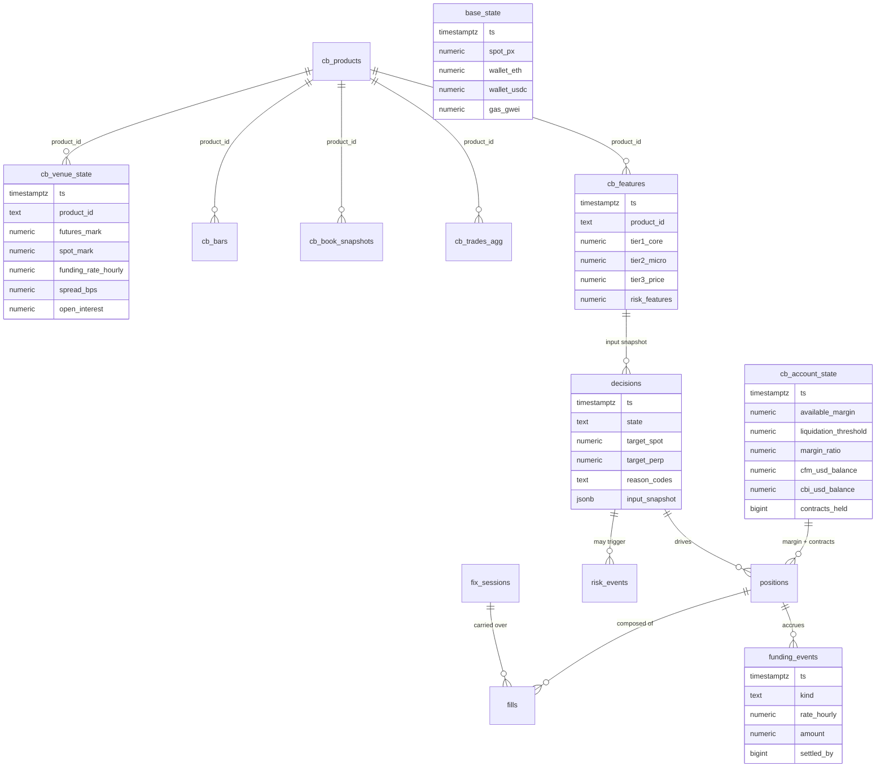
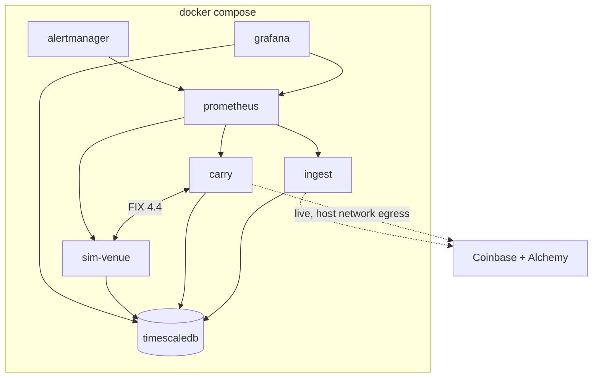

# Architecture — Basis Carry System

**Source of truth for requirements:** [`basis-carry-build-spec.md`](basis-carry-build-spec.md) (v3.1)
**Companion docs:** [PRD](prd.md) · [API Spec](api-spec.md) · [Build Plan](build-plan.md) · [Venue Facts](venue-coinbase-perps.md)

This document describes *how* the system is built: processes, concurrency, data flow, state machines, storage, deployment, and reliability design. Requirements and rationale live in the PRD; wire-level and schema-level contracts live in the API spec.

---

## 1. System context

The system runs a delta-neutral funding carry: **long spot ETH on Base, short the ETH perpetual-style future on Coinbase**, collecting funding while it is positive. A funding-pressure engine times entries, exits, and hold-offs. Everything the system observes is self-recorded, because retail history depth is limited and the venue may not publish a funding rate to this API tier — **our own database is the primary history**. Venue mechanics live in [venue-coinbase-perps.md](venue-coinbase-perps.md); this doc does not restate them.



Two consumers matter and they see different surfaces:

- The **operator** sees Grafana, alerts, and the decision log.
- A **reviewer** sees the public repo and the on-chain history of the named wallet. The wallet is a deliverable, not a side effect (spec §1).

---

## 2. Process model

Three Go binaries plus infrastructure containers, one `go.mod`, orchestrated by Docker Compose.

| Binary | Role | Talks to |
|---|---|---|
| `cmd/ingest` | Market data in → TimescaleDB | Coinbase Advanced Trade WS + REST, Base RPC, TimescaleDB, Prometheus |
| `cmd/carry` | Features → pressure → decision → risk → execution | TimescaleDB, sim-venue (FIX), paper engine (in-proc), live venues (week 5), Prometheus |
| `cmd/sim-venue` | FIX 4.4 acceptor simulating an exchange | `carry` (FIX), TimescaleDB, Prometheus |



**Why `carry` reads from TimescaleDB rather than subscribing to feeds directly:** it gives live trading and replay the *same read path*. The backtester replays DB rows chronologically; the live engine polls the same tables for the latest rows. One code path to reason about, and every decision's inputs are already persisted (reproducibility NFR, spec §6.5).

### Repository layout

```
cmd/ingest/          cmd/carry/          cmd/sim-venue/
internal/ingest/     internal/venue/     internal/features/
internal/pressure/   internal/carry/     internal/risk/
internal/exec/       internal/fix/       internal/metrics/
internal/treasury/   internal/db/        internal/config/
research/            deploy/             docs/
```

`internal/db` is the shared persistence layer: the pgx pool (with the shopspring codec registered so `numeric` is a `decimal` on the wire), the embedded SQL migrations, the typed row structs that enumerate every table the system writes to, and the batch writer. `cmd/migrate` is a fourth, one-shot binary that applies those migrations and seeds the product row; it is not a service and is not part of `make up`. `internal/config` loads each binary's typed configuration from the environment ([API spec §7](api-spec.md#7-configuration-surface)) and is the one place that knows how a credential is redacted; `internal/metrics` owns each binary's Prometheus registry and its `/metrics` and `/healthz` endpoints. Everything else matches spec §6.11.

---

## 3. Concurrency model (`ingest`)

The one-writer pattern is the load-bearing idea: many readers, typed channels, exactly one goroutine that touches the database per binary.



Rules, enforced in review:

1. **One writer per binary.** Stream goroutines never call the DB. They publish typed structs to channels; the writer batches inserts (interval- and size-triggered flush) and sends each flush as a single pgx batch, which Postgres runs in one implicit transaction — so a flush lands whole or not at all, in one round trip. The channel is bounded: when it fills, producers block, which is the backpressure that keeps an unreachable database from turning into unbounded memory.
2. **`context` cancellation flows down the stack.** Root context → per-stream contexts. Graceful shutdown = cancel root, flush channels, close writer, log out FIX, close pool — in that order. The writer's final flush runs on a context cancellation cannot reach, so SIGTERM still persists the last batch.
3. **Each stream owns its reconnect loop** with exponential backoff + jitter. Reconnects and detected gaps increment per-stream counters; a `last_seen` timestamp gauge per stream feeds the staleness flag that the risk engine consumes.
4. **Errors on a feed are wrapped and surfaced, not swallowed** — but a feed error degrades to `stale`, it never crashes the binary. Only invariant violations (e.g. writer cannot reach DB after retries) are fatal.

The `carry` binary is simpler: a ticker-driven loop (decision tick) plus the FIX session goroutines that quickfixgo manages, plus one DB writer for decisions/fills/events.

---

## 4. The decision tick

The core loop of `cmd/carry`, run on every funding tick (hourly boundary), on a fast evaluation ticker, and on risk events:



Two invariants:

- **Every decision row carries its full input snapshot** (JSON). Any historical decision can be re-derived and argued about.
- **The risk engine is the only component that can emit orders.** The decision engine emits *intent* (`TargetPosition`); risk converts intent into approved order deltas or blocks it.

---

## 5. Decision engine state machine

States and transitions per spec §8. Thresholds (`z_enter`, `z_exit`, `f_flip`, `k`, bands) come from config; the public repo ships synthetic placeholders.



`BLOCKED` gates *new risk*, it does not disable hard stops: a stale feed while a position is on still allows (and may force) a flatten.

---

## 6. Execution architecture

### 6.1 The Venue interface

Defined at the consumer (`internal/carry`), implemented by each path:

```go
type Venue interface {
    Submit(ctx context.Context, o Order) (Ack, error)
    Cancel(ctx context.Context, id OrderID) error
    ExecReports() <-chan ExecReport
}
```

| Implementation | Package | Transport | Fills |
|---|---|---|---|
| `fixVenue` | `internal/fix` | FIX 4.4 to `sim-venue` | sim fill model (slippage, latency, partials) |
| `paperVenue` | `internal/exec` | in-process | book-depth fill model, both legs, funding accrual |
| `cbVenue` (week 5) | `internal/exec` | JWT-signed Advanced Trade REST + WS user channel | real |
| `baseVenue` (week 5) | `internal/exec` | ERC-4337 UserOps via Alchemy | real (DEX aggregator swap) |

Every implementation feeds the same `ExecReport` channel and the same order state machine, so the router, risk engine, and P&L accounting are identical across paper, sim, and live.

### 6.2 Order lifecycle



### 6.3 FIX session (initiator in `carry`, acceptor in `sim-venue`)

FIX 4.4, 30s heartbeat, file-backed sequence numbers so sessions survive restart, standard resend/gap-fill handling (details and tag dictionary in the [API spec](api-spec.md#4-fix-44-specification)).



### 6.4 Live carry entry (week 5)

The automated version of the manual carry sequence from spec week 0b — same steps, same wallet:



**Leg risk rule:** the spot leg fills first (it is slower and lumpier); if the perp leg cannot be placed within a timeout, the spot leg is unwound immediately rather than carrying naked delta. Kill switch halts both venues.

**Quantization rule:** the perp leg moves in whole contracts of 0.10 ETH, so it is sized first (floor toward zero) and the spot leg is sized to match it, leaving a residual under half a contract. Delta is trimmed on the spot leg only — the perp leg cannot express fractions. No entry is attempted unless at least one whole contract is affordable within the notional cap.

---

## 7. Data architecture

TimescaleDB (Postgres + hypertables). Full column-level schema in the [API spec](api-spec.md#5-database-schema). Hypertables hold time series; plain tables hold state.



Flow of truth:

- `ingest` writes raw observations (`cb_venue_state`, `cb_bars`, `cb_book_snapshots`, `cb_trades_agg`, `base_state`, `cb_account_state`).
- `carry` writes derived and stateful rows (`cb_features`, `decisions`, `positions`, `fills`, `funding_events`, `risk_events`).
- The Python backtester **reads the same tables** and replays them chronologically; `make replay` runs 30 days end-to-end and refreshes Grafana.

---

## 8. Reliability design

| Failure | Detection | Response |
|---|---|---|
| WS disconnect | read error / heartbeat miss | per-stream reconnect with backoff + jitter; gap counter; resubscribe |
| Data gap | sequence/timestamp discontinuity per stream | gap metric; backfill via REST where history allows |
| Stale feed | `last_seen` age > threshold | `BLOCKED` for new entries; alert at 60s; hard-stop evaluation continues on last good data |
| FIX session drop | quickfixgo session state | auto re-logon, sequence recovery from disk store; alert |
| Hard stop breach (notional, leverage, margin-ratio floor, basis blowout, funding flip, cascade) | risk engine, every tick | flatten via fastest venue path, `risk_event` row, alert; manual reset required |
| Leg failure on entry | ExecReport timeout on second leg | unwind first leg immediately |
| Daily loss limit | realized+unrealized P&L vs limit | flatten, `BLOCKED` until UTC day roll |
| Operator kill switch | config flag / signal | cancel all open orders, flatten, halt submission on both live venues |
| Process crash | Compose restart policy | on restart: reload positions from DB, resume FIX with persisted seq nums, re-derive state — DB is the source of truth, no in-memory-only state |
| Maintenance window (Fri 17:00–18:00 ET) | venue calendar + `status` channel | no new orders, no rebalances; no funding published for that hour, so the funding series records a gap rather than a zero |
| Funding reconciliation drift | computed accrual vs cash adjustments applied twice daily | `funding_reconciliation_error` metric; alert on drift beyond tolerance; computed rate flagged `funding_source = "computed"` |

Graceful shutdown order: stop accepting decisions → cancel open orders → flush channels → persist state → FIX logout → close DB pool.

---

## 9. Observability

- **Prometheus** (catalog in [API spec §6](api-spec.md#6-prometheus-metrics)): funding rate/z, basis, net delta, accrued funding, P&L split by component, order round-trip latency, FIX session state, WS gap counts, feed staleness, margin ratio, funding reconciliation error.
- **Grafana**, four panels: (1) funding & basis, (2) position & delta, (3) P&L decomposition, (4) system health. Headline card: *"Who is paying whom, how much, and is the crowd getting exhausted?"*
- **Alertmanager:** FIX session down, WS gap > 30s, delta breach, hard-stop trigger, margin ratio < floor, feed stale > 60s, funding reconciliation drift.

---

## 10. Deployment



`make up` brings the stack up; `make replay` runs the 30-day backtest; `make test` runs the Go and Python suites. Config is env-based: `.env` (public defaults) + gitignored `.env.private` (real thresholds, credentials, session keys).

---

## 11. Public / private split

Per spec §9 — *architecture is shown, edge is not*:

- **Public:** all service code, sim-venue, paper engine, observability stack, replay harness, these docs, synthetic threshold placeholders.
- **Private (`.env.private`, never committed):** fitted thresholds and weights, live credentials, wallet session keys, treasury config, live P&L.

---

## 12. Key design decisions

| Decision | Rationale |
|---|---|
| Go services, Python research | quickfixgo is the only production-grade open FIX engine in a modern language; goroutines map onto multi-stream ingestion; Python owns notebooks/backtest (spec §2) |
| `carry` reads DB, not feeds | one read path for live and replay; inputs persisted by construction |
| One writer goroutine per binary | serializes DB access, makes batching trivial, is an explainable interview pattern |
| Risk engine is sole order emitter | intent (decision) and authority (risk) separated; hard stops cannot be bypassed |
| Consumer-defined `Venue` interface | paper → sim → live swap without touching the state machine |
| Self-recorded data as primary history | retail history depth limited and funding may be unpublished; z-scores need >= 30 days of trusted history |
| Spot leg first, perp second, unwind on leg failure | perp is fast/reliable; spot (DEX) is the slow leg; never hold naked delta |
| ETH only, leverage ≤ 3× overnight, no intraday opt-in, small notional | v1 scope control; the intraday/overnight margin transition can never trigger a call; the wallet must stay a *readable* résumé line |
| Perp sized in whole contracts, delta trimmed on spot | contract size is 0.10 ETH and integer-only; spot on Base is the continuous leg |
| Funding rate computed locally and reconciled | the retail API may not publish one for this product; reconciliation against applied cash adjustments is the correctness check |
