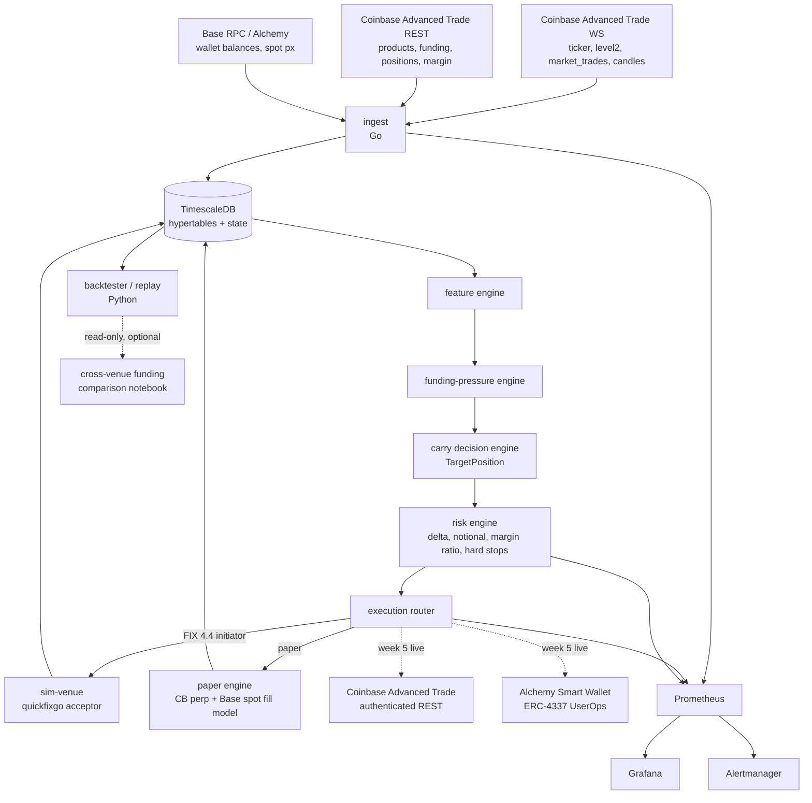

# Basis Carry System — Reconciled Build Spec

**Version:** 3.3 (supersedes `hyperliquid_signal_app_system_spec.md`, `hyperliquid_updated_system_spec.md`, `hyperliquid_formulas_thresholds.md`, `perps-carry-mvp-spec.md`, and `SPEC.md` — the last of which described a Rust / offshore-venue / bridge design that no longer applies; anything still valid from it is folded into §4)
**Authority:** this file is the only build spec. If an older spec surfaces, it is superseded, not a second opinion.
**Owner:** Jason
**Status:** Build-ready for v1. Sections marked *v2* are deferred.

**Amendment record.** This spec is written before the venue is met, so contact with it changes some of what is written here. Amendments are made on PO direction, marked inline as *(amended vN, date)*, and never silently: a spec that quietly agrees with whatever was built stops being a spec. Each one is also a dated entry in the [build-plan changelog](build-plan.md#changelog--decision-record) with the evidence behind it.

- **v3.3 (2026-09-04)** — one correction from building Part 6: the Base read path is **hand-rolled JSON-RPC**, not `ethereum/go-ethereum` (§3). Four RPC methods and five contract calls, none of them dynamically typed and none signed, against a full consensus client's dependency tree — the same trade §3 already made for the Advanced Trade client ([ADR-0017](decisions/0017-hand-rolled-base-rpc.md)). Part 17 makes its own choice when it needs signing.
- **v3.2 (2026-08-24)** — six corrections from building Parts 4 and 5 against the live venue: the venue *does* publish a funding rate (§4); the backfill is gap-driven on every start rather than a first-run script, and derives funding from candles because `fundingHistory` does not publish (§6.1); the WebSocket client and JWT choices are settled (§3, closing open item 1); JWT signing is EdDSA/Ed25519, not ES256 (§3); the package layout gained `internal/config` and `internal/coinbase` and a fourth binary (§6.11); and `funding_source` carries a third value (§7).

---

## 0. Reconciliation record

The source docs described two different projects. This spec merges them by making one of them the body and the other the brain.

| Conflict | Source A (funding-signal docs) | Source B (perps-carry-mvp) | Decision |
|---|---|---|---|
| Strategy | Directional funding mean-reversion (fade the crowded side) | Delta-neutral funding carry (long spot / short perp) | **Carry is the core position.** The funding-pressure engine from A becomes the entry / exit / flip / hold-off logic for the carry book. Directional fade is a *v2* overlay mode sharing the same features and risk engine. |
| Language | Python-shaped (FastAPI, Postgres) | Go (quickfixgo, goroutines) | **Go for all services, Python for research and backtest.** Rust deferred; see §2. |
| Execution | Paper engine, then optional live | Simulated FIX venue, live is a wk-8 decision | **Manual trades from week 0, paper for the automated path, tiny live size from week 5** on Coinbase US perpetual-style futures + Base spot. FIX loop kept as the order-entry path for the sim venue. Reason: applications ask for the ENS name; the wallet must have history before the code is finished. |
| Assets | BTC, ETH, SOL, one alt | One asset (BTC or ETH) | **ETH only in v1.** Multi-asset ranking is *v2*. Reason: ETH is the leg you can hold as spot on Base with the ENS wallet. |
| Storage | Postgres | TimescaleDB + Postgres | **One TimescaleDB instance** (it is Postgres). Hypertables for time series, plain tables for state. |
| Dashboard | FastAPI + custom UI | Grafana only | **Grafana in v1**, custom public dashboard *v2* (recruiter-facing artifact). |
| Funding formula detail | Hourly, 8h-rate/8, premium vs external reference | Hourly or 8h | Adopt the venue's own hourly computation everywhere; see §4. |
| Purpose | Trading tool | Portfolio artifact for SE/SA roles | **Both:** trading-infra / quant credibility (on-chain wallet history, real system) and SE/SA credibility (FIX, reliability, observability). |

**What was dropped:** the "Secondary Trend-Following Mode" from A (directional, out of scope), maker-rebate strategy, multi-venue basis arb, options overlay, second FIX counterparty, LLM regime classifier (still optional later).

---

## 1. Purpose

Build a real, small, delta-neutral funding-carry system on Coinbase US perpetual-style futures + Base that:

1. Generates verifiable on-chain activity tied to Jason's ENS / .base.eth address (Coinbase hiring filter).
2. Demonstrates perp market-structure fluency: funding, futures mark vs spot mark, crowding, margin and liquidation mechanics.
3. Demonstrates institutional order-entry fluency: a working FIX session with sequence recovery.
4. Demonstrates reliability engineering: reconnects, gap detection, hard stops, observability, replay.
5. Could later run capital. Not a trading business. Architecture is the product; edge stays private.

Rule from the source docs, kept verbatim in spirit: **AI writes most of the code; you read every line and can explain the structure. If you can't explain a file, rewrite it until you can.**

Ordering rule specific to this build: **wallet history is the deliverable that can't slip.** Job applications ask for the ENS name, and a reviewer who looks it up sees whatever is there on that day. Paper fills, sim-venue, and Grafana leave no on-chain trace, so every milestone below is checked against one question: does the named wallet have more real, explainable activity at the end of this week than at the start? Priority 1 above outranks 2–5 whenever they conflict.

**Wallet doctrine.** One address, resolved by both the ENS name and the .base.eth name, used for every on-chain trade in this project and nothing else. Activity should be small, real, and readable: spot swaps on Base and wallet operations, all consistent with a delta-neutral carry story you can walk a reviewer through. The perp leg is off-chain by design — it trades at a CFTC-regulated venue through a brokerage account — so **on-chain history comes from the Base spot leg and wallet operations only**, and the carry story is completed by the trade log and the system's own records. Do not size up to make the wallet look impressive; do not run degenerate trades from it; do not mix in unrelated airdrop farming or memecoin activity. The wallet is a résumé line that anyone can audit.

---

## 2. Language and tooling

**Go** for every long-running service (`ingest`, `carry`, `sim-venue`, `execution`). Reasons: quickfixgo is the only production-grade open FIX engine in a modern language; Coinbase and most crypto infrastructure is Go; goroutines + channels map directly onto multi-stream ingestion feeding a state machine; fastest path to a shipped system for a solo builder.

**Python** for research: feature exploration, threshold fitting, backtester, notebooks. `polars`, `duckdb`, `pandas` where convenient. Reads the same TimescaleDB.

**Explicitly deferred:** Rust. It remains the stronger signal for pure prop-shop trading-systems roles. If the target narrows to that lane, port the execution hot path to Rust as a second, separate artifact. Do not run two systems languages in this repo.

**Go libraries:** `pgx` (Postgres), `prometheus/client_golang`, `quickfixgo/quickfix`, `ethereum/go-ethereum` (`ethclient`, `abigen`) for Base. *(Amended v3.2, 2026-08-24 — the working assumptions here are now decisions, and two of the three changed.)* The WebSocket client is **`coder/websocket`**, chosen over `gorilla` because its reads take a `context` and cancellation therefore stays one mechanism rather than two ([ADR-0013](decisions/0013-websocket-client-coder.md)). The Coinbase Advanced Trade client is **hand-rolled**, with the credential isolated in its own package so the market-data path cannot reach it ([ADR-0016](decisions/0016-hand-rolled-coinbase-client.md), closing open item 1). JWT signing is **EdDSA over Ed25519**, not `golang-jwt`/ES256: the CDP portal marks ECDSA as legacy, and the signing is ~50 lines over `crypto/ed25519` with no dependency. Alchemy Smart Wallet / ERC-4337 calls go over JSON-RPC (Alchemy's SDK is TypeScript; use raw RPC from Go). *(Amended v3.3, 2026-09-04 — and so does the **read** path: `ethereum/go-ethereum` is **not** used. Part 6's Base surface is four RPC methods and five contract calls, none carrying a dynamic ABI type and none signed, so the client is hand-rolled over `net/http` and `math/big` with method ids derived by keccak-256 rather than pasted — [ADR-0017](decisions/0017-hand-rolled-base-rpc.md). The one dependency it adds is `golang.org/x/crypto/sha3`, since the standard library's `crypto/sha3` deliberately omits legacy keccak. Part 17 decides for itself when it needs signing.)*

**Tooling:** Claude Code, spec-driven. Each milestone section is handed to Claude Code as a task; every diff is reviewed before commit.

---

## 3. The trade

### 3.1 Core: delta-neutral funding carry
Long spot ETH on Base, short the ETH perpetual-style future on Coinbase, sized to net delta ≈ 0. Collect funding while the rate is positive (future rich to spot → longs pay shorts). P&L = accrued funding − fees − slippage − basis drift on entry/exit − gas.

Reverse carry (short spot / long perp) when funding is persistently negative is *v2*; borrowing spot on Base adds counterparty and liquidation surface not worth v1 scope.

### 3.2 Brain: funding-pressure engine
The signal docs' core insight — *you are trading incentives and crowding, not price* — is applied to the carry book's timing rather than to directional bets. The engine answers three questions each funding tick:

- **Is carry worth entering?** Funding positive, elevated versus rolling history, and expected carry over the minimum hold horizon clears fees + slippage + basis-entry cost by a margin.
- **Should we stay?** Funding still positive; cumulative funding earned is on track; basis has not blown out; margin ratio healthy.
- **Should we exit or flatten?** Funding turned negative past threshold, or funding z-score collapsed toward zero (edge gone), or basis dislocation is *extreme* in the direction that hurts the perp leg (crowd unwinding violently), or any hard stop.
- **Should we hold off?** Data stale, spread wide, maintenance window imminent, or order-book exhaustion signals suggest a sharp mean reversion is imminent (enter after, not into, the unwind).

### 3.3 v2 overlay: directional funding fade
Once carry runs, add a mode that takes small directional perp positions when funding z-score, basis, and imbalance align (the LONG/SHORT setups from the signal docs). Same features, same risk engine, tighter margin buffer, shorter horizon, separate P&L bucket. Not built in v1.

---

## 4. Venue facts that drive design

The perp leg trades **Coinbase US perpetual-style futures** (nano Ether, ticker root ETP, product `ETP-20DEC30-CDE`) on Coinbase Derivatives Exchange, cleared by Nodal Clear, accessed retail through Coinbase Financial Markets via the Advanced Trade API.

**[docs/venue-coinbase-perps.md](venue-coinbase-perps.md) is the single source of truth for venue mechanics.** It holds the researched contract spec, funding formula, margin model, fee notes, API surface, onboarding checklist, and the open `TODO(verify)` items to confirm against the live API in week 1. Do not restate its numbers here or anywhere else — link to it.

The facts that actually shape the design:

- **Contracts are quantized.** One contract = 0.10 ETH, integer contracts only. Perp size cannot be trimmed finely; the Base spot leg is the fine-grained leg used to bring net delta to ≈ 0.
- **Funding is hourly**, computed from a 1-hour TWAP of 3-minute futures-vs-spot premium scaled by 1/24, smoothed 75/25 against the previous hour. Positive funding: longs pay shorts.
- **Funding accrues hourly but settles as cash adjustments twice daily**, so accrued-but-unsettled funding is a tracked position field, not an instant balance change.
- **The retail API publishes an hourly funding rate, and the system computes its own beside it.** *(Amended v3.2, 2026-08-24.)* The rate is at `future_product_details.funding_rate`; an identically named field one level deeper in `perpetual_details` is permanently empty, and reading that one led this project to record "no rate is published" as a verified fact for two build parts. The local estimate is not made redundant by the discovery — it is what makes the venue's number checkable, it is the only route to *history* (the venue publishes the current rate and nothing before it), and the difference between the two is what the reconciliation measures. `funding_rate_hourly` takes the venue's rate with `funding_source='venue'`; `funding_rate_est` is always the local computation. Computing it remains a design requirement, not an optimization.
- **Price references are futures mark and spot mark** (both Coinbase VWAP/TWAP constructions). There is no oracle. `basis = (futures_mark − spot_mark) / spot_mark`.
- **Margin health is read, not derived.** The venue returns `margin_ratio = available_margin / liquidation_threshold`; the risk engine consumes it directly rather than computing a liquidation price.
- **Leverage is windowed.** Up to 10× intraday *only if opted in*; lower overnight. v1 does not opt in and sizes ≤ 3× on overnight margin, so the intraday/overnight transition can never trigger a margin call.
- **Trading is 24/7 except a maintenance break Fridays 5:00–6:00 pm ET**, during which no funding is published; the system places no new orders and runs no rebalances in that window.
- **The perp leg leaves no on-chain trace.** Margin funding moves inside Coinbase accounts.

### Base leg (spot)

Spot ETH is held in an **Alchemy Smart Wallet (ERC-4337)** on Base, resolved from the ENS / .base.eth name — one address for the whole project.

- **Account model:** smart contract account, not an EOA. Operations are UserOperations submitted through Alchemy's bundler RPC, not raw transactions.
- **Automation:** a **session key** signs automated swaps, so the owner key is never in the running service. It is provisioned by hand from the owner wallet as an explicit on-chain operation (week 5), scoped to the DEX router only, with a capped allowance and an explicit expiry. Its expiry is recorded in config so `baseVenue` **refuses to start once lapsed and alerts before it lapses**, rather than discovering it mid-carry. Session keys live in `.env.private`; rotation is the same manual operation.
- **Gas:** sponsored via Alchemy **Gas Manager** under a gas policy; gas cost is still recorded per fill for honest P&L even when sponsored.
- **Execution:** manual carries use a Base DEX from week 0b; the automated `baseVenue` (week 5) performs the same USDC↔ETH swap through a DEX aggregator called from the smart wallet, with a slippage bound from config.
- **Alchemy's SDK is TypeScript**, so Go calls the bundler and RPC endpoints directly (§2).
- Spot is continuous and is therefore the leg used to trim residual delta left by the quantized perp leg.

---

## 5. Architecture

Single `carry` binary hosts feature engine → funding-pressure engine → decision → risk → execution router. `ingest` and `sim-venue` are separate binaries. One writer goroutine per binary owns DB inserts.

---

## 6. Components

### 6.1 Ingestion (`internal/ingest/`)
- One goroutine per Coinbase WS channel (`ticker`, `level2`, `market_trades`, `candles`, plus `status`) for the perp product and for `ETH-USD` spot, and one poller goroutine for REST-only data (product metadata, funding history if exposed, account balance summary, positions), each publishing to a typed channel. One writer goroutine batches inserts.
- Base poller: wallet spot balance, ETH/USDC price for basis reference, gas.
- Reconnect with backoff, sequence/gap detection per stream, `last_seen` heartbeat metric per stream, stale-feed flag consumed by risk.
- Historical recovery is **gap-driven and runs on every start**, not a first-run script: it reads what is stored, downloads only the ranges missing from it, and does nothing when nothing is missing — so a container down for an hour recovers that hour by itself. Funding history is *derived* from candles rather than fetched, because `fundingHistory` does not publish for this product. Derived series are computed from **stored** data, not from the download, so the result is reproducible; and they carry their provenance, because a value built from coarser inputs is not the same measurement as one recorded live. The six steps are [architecture §7.1](architecture.md#71-historical-recovery--the-backfill-pattern), and any future backfill follows them. History depth may be limited — **self-recorded data is the primary history.** *(Amended v3.2, 2026-08-24.)*
- Persist: every completed candle, periodic L2 snapshots (top N), trade aggregates, every funding / futures-mark / spot-mark sample.

### 6.2 Venue state (`internal/venue/`)
Cache per tracked product: funding now (published or computed), estimated next funding, futures mark, spot mark, mid, premium proxy, spread bps, contract size, margin ratio, leverage setting, max leverage, tick size, fee tier assumptions, open interest where available, maintenance-window status. Also: Base wallet spot inventory, gas price, venue status flags.

### 6.3 Feature engine (`internal/features/`)
Tiers per the updated spec, priority order preserved:

**Tier 1 — core state:** `funding_rate_hourly`, `funding_rate_est`, `funding_source`, `funding_annualized`, `funding_zscore`, `cumulative_funding`, `expected_carry_N_hours`, `futures_mark`, `spot_mark`, `basis = (futures_mark − spot_mark)/spot_mark`, `trade_premium = (futures_mid − spot_mark)/spot_mark`, `time_to_next_funding`.

**Tier 2 — microstructure:** spread bps, top-of-book imbalance, impact-price imbalance, short-term trade imbalance, sweep intensity, mid-vs-mark distance, realized slippage estimate.

**Tier 3 — price (confirmation only):** log returns, EMA fast/slow, ATR, realized vol, VWAP, momentum slope.

**Risk features:** margin ratio at current and proposed size, effective leverage, net delta, residual delta in ETH, notional, contracts held.

Design rule: Tier 1 and risk features are first-class; Tier 3 never triggers a decision on its own.

### 6.4 Funding-pressure engine (`internal/pressure/`)
Inputs: `funding_rate_hourly`, `funding_zscore`, `cumulative_funding`, `basis`, imbalance.
Outputs: `crowded_side` (LONG / SHORT / NONE), `pressure_level` (NORMAL / ELEVATED / EXTREME / FORCED per z-score bands), `expected_pain` (projected funding cost to the crowded side over the horizon), `exhaustion_flag` (|imbalance| > threshold and momentum slope flattening).

### 6.5 Carry decision engine (`internal/carry/`)
Runs on each funding tick and on risk events. Emits `TargetPosition{asset, spot_qty, perp_contracts, reason_codes, confidence}` with states ENTER / HOLD / REBALANCE / EXIT / BLOCKED. Perp target is an **integer contract count**; spot target is continuous and trims residual delta. Rules in §8. Thresholds from private config. Every decision persisted with its full input snapshot (NFR: reproducible).

### 6.6 Risk engine (`internal/risk/`)
State: spot inventory, perp contracts, net delta, residual delta, notional, margin ratio, accrued funding, settlement-pending funding, realized / unrealized P&L (mark-based), fees, slippage.
- Rebalance when |net delta| exceeds tolerance (tolerance ≤ half a contract, trimmed on the spot leg).
- Pre-trade checks: leverage ≤ cap, margin ratio ≥ floor, expected carry ≥ k × (fees + slippage), spread ≤ max, feed not stale, not inside the maintenance window, daily loss limit not hit.
- Hard stops: max notional, max leverage, margin-ratio floor, basis blowout, funding flip past threshold, cascade flag. Violations flatten and alert.
- Persist to `positions`, `fills`, `funding_events`, `risk_events`.

### 6.7 Execution (`internal/exec/`, `internal/fix/`, `cmd/sim-venue`)
- Consumer-defined interface: `type Venue interface { Submit(ctx, Order) (Ack, error); Cancel(ctx, ID) error; ExecReports() <-chan ExecReport }`. Lives in `carry`, not `fix`.
- **FIX path (v1):** quickfixgo initiator in `carry`. FIX.4.4, heartbeat 30s, sequence persistence on disk, resend handling. Messages: `NewOrderSingle` (D), `ExecutionReport` (8), `OrderCancelRequest` (F), `Reject` (3). `sim-venue` is a quickfixgo acceptor filling against last recorded Coinbase top-of-book with configurable slippage and latency, partial fills above a size threshold.
- **Paper path (v1):** paper engine implementing `Venue` for both legs. Contract-quantized perp fills consuming recorded book depth for marketable orders, queue-aware slippage for passive, Coinbase maker/taker fees, funding accrued hourly and settled on the venue's twice-daily schedule as `contracts × contract_size × mark × funding_rate`, unrealized PnL on futures mark. Spot leg simulated against Base reference price + assumed DEX slippage + gas.
- **Live path (week 5, behind the same interface):** `cbVenue` (Coinbase Advanced Trade authenticated REST for orders/cancels, WS user channel for fills) and `baseVenue` (Alchemy Smart Wallet UserOps via session key, Gas Manager). Kill switch on both. Credentials in `.env.private`.
- Every path emits `ExecReport` into the same state machine: NEW → PARTIAL → FILLED | CANCELED | REJECTED.

### 6.8 Treasury (`internal/treasury/`) — *week 5*
Reconciles three balance domains: the Coinbase spot (CBI) account, the Coinbase futures (CFM) margin account, and the Base wallet. There is no bridge and no on-chain withdrawal in this design — money moves *inside* Coinbase between CBI and CFM, and separately on Base — so the timeouts below are defined here rather than inherited from any earlier spec.

Tracked transitions, each with an expected duration and a timeout that raises a `risk_event` and an alert when exceeded:

| Transition | Watched | Timeout parameter |
|---|---|---|
| Cash auto-transfer CBI → CFM when an order needs margin | `cfm_usd_balance` / `cbi_usd_balance` movement after order submission | `TREASURY_TRANSFER_TIMEOUT` — submitted → visible in balance summary |
| Scheduled sweep CFM → CBI | sweep request accepted → balances reflect it | `TREASURY_SWEEP_TIMEOUT` — scheduled → landed |
| Twice-daily funding cash adjustment | expected settlement time → observed adjustment on the account | `TREASURY_SETTLEMENT_TIMEOUT` — expected → observed |
| Base wallet funding / withdrawal | tx submitted → confirmed at required depth | `TREASURY_BASE_TX_TIMEOUT` — submitted → confirmed |

A missed settlement is not just late money: it means the accrual ledger and the account disagree, so it feeds `funding_reconciliation_error` as well as its own timeout alert. Built alongside the live adapters; manual carries in weeks 0b–3 exercise the same transfer and settlement sequence by hand first, which is where the expected durations come from.

### 6.9 Observability (`internal/metrics/`, `deploy/`)
Prometheus: funding rate (published and computed), funding reconciliation error, funding z, basis, net delta, residual delta, accrued and settlement-pending funding, P&L (split), order round-trip latency, FIX session state, WS gap count per stream, feed staleness, margin ratio.
Grafana, four panels: (1) funding & basis, (2) position & delta, (3) P&L decomposition, (4) system health. Headline card: **"Who is paying whom, how much, and is the crowd getting exhausted?"**
Alertmanager: FIX session down, WS gap > 30s, delta breach, hard-stop trigger, margin ratio < floor, feed stale > 60s, funding reconciliation drift, treasury transition timeout.

### 6.10 Backtester / replay (`research/`, Python)
Replays candles + funding + book snapshots chronologically from TimescaleDB. Applies funding hourly with twice-daily settlement, fees, slippage, mark-based risk, and contract quantization. Metrics: total return, expectancy, max DD, Sharpe, profit factor, funding earned/paid per trade, PnL split (price / funding / fees / slippage), margin near-miss count, slippage vs quoted spread. Acceptance rule: **not accepted unless profitable after fees, slippage, and funding.** `make replay` runs 30 days end to end and refreshes Grafana. An optional notebook may read **public Hyperliquid data for cross-venue funding comparison only** — read-only, out of the production path, no trading.

### 6.11 Runtime
Layout: `cmd/ingest`, `cmd/carry`, `cmd/sim-venue`, `cmd/migrate`, `internal/{ingest,venue,features,pressure,carry,risk,exec,fix,metrics,treasury,config,db,coinbase,guard}`, `research/`, `deploy/` (Compose, Grafana, Prometheus, Alertmanager). Single `go.mod`. *(Amended v3.2 — four packages and a binary this list did not name: `config` loads each binary's typed configuration, `db` is the shared persistence layer, `coinbase` isolates the credential away from the market-data path, `guard` holds module-wide invariant tests, and `cmd/migrate` applies the schema as a one-shot rather than as a startup side effect.)*
Compose services: `ingest`, `carry`, `sim-venue`, `timescaledb`, `prometheus`, `grafana`, `alertmanager`. `make up`, `make replay`, `make test`.
Config: env + gitignored `.env.private`. Research and live configs separable.

---

## 7. Data model (TimescaleDB)

Hypertables: `cb_venue_state` (ts, product_id, futures_mark, spot_mark, mid, funding_rate_hourly, funding_rate_est, funding_source, premium_proxy, spread_bps, open_interest), `cb_bars`, `cb_book_snapshots` (best bid/ask, depth_1..N, imbalance_top_n, impact_bid_px, impact_ask_px), `cb_trades_agg`, `cb_features` (Tier 1–3 + risk features), `base_state` (ts, spot_px, wallet_eth, wallet_usdc, gas_gwei), `cb_account_state` (ts, available_margin, liquidation_threshold, margin_ratio, cfm_usd_balance, cbi_usd_balance, futures_buying_power, contracts_held, avg_entry_price, unrealized_pnl, intraday_margin_enabled) — the polled account snapshot the risk engine reads margin ratio from and treasury reconciles against.

State tables: `cb_products`, `decisions` (ts, state, target_spot, target_contracts, reason_codes, confidence, input_snapshot_json), `positions`, `fills`, `funding_events`, `risk_events`, `fix_sessions`.

`funding_source` is a closed set of three: **`venue`** (published by the venue), **`computed`** (this system's estimate from live three-minute VWAP marks) and **`backfilled`** (the same formula on one-minute candle closes, for history recorded before the system was running). The third exists because a value derived from coarser inputs is not the same measurement even when the formula is identical, and merging them would leave the z-score, the backtest and the reconciliation each averaging two different things with nothing to warn them ([ADR-0015](decisions/0015-backfilled-funding-provenance.md)). *(Amended v3.2, 2026-08-24 — was two values.)*

`funding_events` records **both sides of funding**: `kind='ACCRUAL'` rows for what was computed hourly and `kind='SETTLEMENT'` rows for the cash adjustments actually observed twice daily, linked by `settled_by`. Reconciliation compares the two; storing only the accrual would make it unfalsifiable.

---

## 8. Formulas and thresholds

Real values live in `.env.private`. Public repo ships synthetic placeholders. Venue-side constants (contract size, funding formula, margin fields) come from [venue-coinbase-perps.md](venue-coinbase-perps.md).

| Metric | Formula | Bands (starting points, to be fit) |
|---|---|---|
| Funding z | `(f − mean(f_n)) / std(f_n)` | \|z\|<1 normal, 1–2 elevated, 2–3 extreme, ≥3 forced |
| Cumulative funding | `Σ hourly rates over hours held` | >0.5% meaningful, >1% strong, >2% unsustainable |
| Basis | `(futures_mark − spot_mark)/spot_mark` | <0.1% neutral, 0.1–0.3% mild, 0.3–0.7% strong, >0.7% extreme |
| Imbalance | `(bid_vol − ask_vol)/(bid_vol + ask_vol)` | >0.2 buy pressure, <−0.2 sell pressure, \|x\|>0.4 exhaustion |
| Expected carry | `contracts × contract_size × mark × Σ expected hourly rates` | must exceed k × (fees + slippage + basis entry cost), k ≥ 2 |
| Pressure score | `w1·z + w2·cum_funding + w3·basis`, w = (0.5, 0.3, 0.2) | fit in research |
| Position size (perp) | `contracts = floor_toward_zero( min(notional_cap, margin_available × leverage) / (mark × contract_size) )`; spot sized so net delta ≈ 0 | leverage ≤ 3× on overnight margin in v1 |
| Residual delta | `spot_qty − contracts × contract_size` | must be trimmed on the spot leg to ≤ `delta_tolerance_eth` (≤ 0.05, half a contract) |
| Margin ratio | `available_margin / liquidation_threshold`, read from the venue | floor from config; block if breached at proposed size |
| Funding-cost cap | funding paid < 30% of expected profit (only relevant on reverse carry / directional) | — |

**Carry decision rules (v1):**
- ENTER: `funding > 0` AND `funding_z ≥ z_enter` AND `expected_carry ≥ k × costs` AND `basis > 0` (future rich) AND `basis < basis_extreme` AND margin ratio OK AND at least one whole contract affordable AND not inside the maintenance window AND not BLOCKED.
- HOLD: position on, funding still > 0, margin ratio OK, basis not extreme against.
- REBALANCE: |net delta| > tolerance — trimmed on the spot leg, since perp size is quantized.
- EXIT: `funding < f_flip` OR `funding_z ≤ z_exit` (edge decayed) OR basis extreme against perp leg OR any hard stop.
- BLOCKED: feed stale, spread > max, maintenance window, cascade flag, exhaustion_flag with pressure EXTREME/FORCED (wait for unwind), daily loss limit.

---

## 9. Public / private split

**Public repo:** ingestion, venue state, feature engine, funding-pressure engine structure, decision engine with synthetic thresholds, risk model, FIX initiator + sim-venue, paper engine, observability stack, Compose, replay harness, architecture doc, README with diagram and demo script.

**Private:** real thresholds and weights, live P&L, live venue credentials (CDP API key/secret) and adapters, wallet session keys, treasury config.

Architecture is shown, edge is not.

---

## 10. Milestones (one weekend block each)

| Wk | Deliverable | Status | Done when | Wallet at end of week |
|---|---|---|---|---|
| 0a (this week, no code) | **Wallet + account bootstrap** | 🟡 **PO-tracked** — the Coinbase half is confirmed live (`cb_account_state` polls a funded CFM account, intraday margin reads false); the on-chain half (ENS, `.base.eth`, Base funding) has no record in this repo | ENS name registered; .base.eth name claimed and both resolve to the same address; wallet funded with a small amount of ETH + USDC on Base; Coinbase futures (CFM) account approved and perps onboarding complete in Advanced Trade; perps portfolio funded with a small USDC/USD balance; intraday margin **not** opted in; leverage sized ≤ 3× on overnight margin. | Named, funded on Base; perp account live off-chain. |
| 0b (parallel with wk 0–1) | **Manual carry #1** | ⬜ **PO-tracked** — no record in this repo | By hand: swap USDC→ETH on a Base DEX from the named wallet (spot leg), open an equal-notional short in `ETP-20DEC30-CDE` on Coinbase, log contract count, entry marks, funding accrued, and fees in a spreadsheet, hold ≥ 24h across several funding hours and at least one settlement, close both legs. Write a one-paragraph explanation of the trade. This is the reference sequence the code must reproduce. | First real carry cycle: spot leg on-chain, perp leg logged. |
| 0 | Go onramp | ✅ **done** 2026-08-18 — build plan Part 3 | Two goroutines read a fake WS feed, fan into a channel, one writer inserts to Postgres via `pgx`, `/metrics` exposed. Read *Go by Example*: goroutines, channels, `select`, `context`, errors, interfaces. Written by hand first, then refactored by Claude Code and diff read. | — |
| 1 | Ingest + storage + backfill | 🟡 **partial** — Coinbase ingest, funding estimator and gap-driven backfill done (Parts 4–5, 2026-08-25) and the Base wallet poller live against Base mainnet (Part 6, 2026-09-04); the Grafana view is the one piece still open | Grafana shows live ETH perp funding (published or computed), futures mark, spot mark, basis. Base wallet balance and Coinbase account/margin state polled and stored. | Manual carry #2 opened. |
| 2 | FIX loop | ⬜ not started — Parts 7–9 | Initiator sends NOS to sim-venue, receives ExecutionReport, sequence numbers survive restart. | Manual carry #2 closed. |
| 3 | Features + pressure engine | ⬜ not started — Parts 10–12 | Tier 1–2 features and pressure outputs land in `cb_features` every tick; visible in Grafana. Decision engine emits ENTER/EXIT for the manual book (advisory only, human executes). | Manual carry #3 timed by the engine's signal. |
| 4 | Decision + risk + paper | ⬜ not started — Parts 13–15 | `TargetPosition` drives orders through FIX to sim-venue and through paper engine; delta tracked with contract quantization; hard stops fire in tests; kill switch implemented and tested against paper. | — |
| 5 | **Live adapters, tiny notional** | ⬜ not started — Parts 16–18 | Session key created from the owner wallet as its own on-chain operation — router-scoped, allowance-capped, explicit expiry, expiry recorded in config. `cbVenue` (Advanced Trade REST, JWT-signed) and `baseVenue` (Alchemy Smart Wallet UserOps via that session key, Gas Manager) behind the same `Venue` interface. Notional cap hard-coded low. First fully automated carry entry and exit. Treasury reconciliation across CBI spot, CFM margin, and the Base wallet. | Session-key grant + first automated carry cycle, both on-chain. |
| 6 | Dashboard + replay | ⬜ not started — Parts 19–20 | Four-panel dashboard; `make replay` runs 30 days; PnL decomposition matches reality for the live book. | Automated carry running continuously at small size. |
| 7–8 | Hardening | ⬜ not started — Parts 21–22 | Reconnect tests, partial fills, cancel/replace, alerting, README with wallet address and architecture diagram, demo script. Investigate whether any Coinbase FIX access is reachable for an individual (§12). | Weeks of continuous, explainable history. |
| 9+ | v2 | ⬜ out of v1 scope | Directional overlay mode; multi-asset ranking; public recruiter dashboard reading the wallet directly; optional Rust hot-path port. | — |

**Status column** *(added 2026-09-04 on PO direction; bookkeeping only — no requirement changed).* This is the milestone-level view; per-part acceptance lives in [build-plan.md](build-plan.md) and the current headline in the README. The two `PO-tracked` rows are the wallet track, which by §1's ordering rule outranks the code milestones and is the one track with **no completion record anywhere in the repo** — it happens by hand, so nothing here can observe it. Worth fixing: the manual carry log is the parity baseline every later component is validated against.

Rules for the wallet column: it never goes backwards, and if a code milestone slips, the manual carry for that week still happens. On-chain activity comes from the Base spot leg and wallet operations; the perp leg is off-chain at a regulated venue by design, and the carry story is completed by the trade log. Sim-venue, FIX, and the paper engine continue in parallel through week 8 as the reliability and order-entry showcase; they are not gating the live path once week 4 hard stops pass.

---

## 11. Interview surface

- Why funding carry exists on perps and what breaks it: basis blowout, funding flip, margin exhaustion, crowd exhaustion.
- Coinbase US perp-style futures mechanics: contract sizing and quantization, hourly funding computed from a premium TWAP with 75/25 smoothing, twice-daily funding settlement, margin-ratio-based liquidation, intraday vs overnight margin windows — and how these differ from offshore perps.
- Computing a funding rate locally from the venue's own formula and reconciling it against the rate the venue publishes and the cash actually applied to the account — which is also the only way to obtain the history the signal needs, since the venue publishes the current rate and nothing before it.
- FIX session lifecycle, sequence recovery, ExecutionReport state machine.
- Delta-neutral position management with a quantized leg and a continuous leg, hard stops, and a reason-coded decision log.
- Reliability engineering on a live feed: gap detection, backoff, one-writer pattern, graceful shutdown.
- Observability as a first-class part of the system.
- On-chain: ERC-4337 smart wallet, session keys, sponsored gas, ENS-resolved identity, and a wallet history that shows the spot leg.
- Cross-venue funding comparison (research notebook), if built.

Resume framing: "Built and deployed a Go trading system with FIX order entry and on-chain settlement," not "Go engineer."

Go patterns to be able to explain by the end: one writer goroutine; `context` cancellation through the stack; error wrapping vs log-and-continue on a feed; interfaces defined at the consumer; graceful shutdown (flush channels, log out FIX, close DB).

---

## 12. Open items

1. ~~Coinbase Advanced Trade Go client: community package vs thin hand-rolled REST+WS wrapper with CDP JWT auth.~~ **Closed 2026-08-24** — hand-rolled, credential isolated in `internal/coinbase`, JWT EdDSA over Ed25519 ([ADR-0016](decisions/0016-hand-rolled-coinbase-client.md)).
2. Live spot venue for the automated Base leg: DEX aggregator vs Coinbase Advanced Trade spot + withdraw to Base. Decide wk 4, informed by manual carries. **Weigh the wallet column, not just slippage:** with the Coinbase-spot route the buy itself is off-chain and only the withdrawal appears on Base, so the on-chain story thins to periodic transfers — which cuts against §1's ordering rule. Better fills would have to be worth that.
3. FIX beyond the sim venue: Coinbase Derivatives Exchange offers FIX/SBE/UDP to institutional participants via FCMs. Investigate at wk 7 whether any sandbox is reachable for an individual; otherwise `sim-venue` remains the FIX counterparty and the FIX loop stays as-is.
4. Threshold fitting: minimum recorded history before trusting z-scores (target ≥ 30 days self-recorded). **The clock starts 2026-08-24** — the earlier recording was reset on PO direction because it carried three known defect classes, and is quarantined at [`research/quarantine/`](../research/quarantine/README.md). Earliest date this item can be closed: **2026-09-23**.
5. The `TODO(verify)` items in [venue-coinbase-perps.md](venue-coinbase-perps.md). **Closed 2026-08-24:** official funding-rate exposure (published, at `future_product_details.funding_rate`) and overnight margin per contract (`{long 0.24525, short 0.33475}`, from the public product payload). **Still open:** fee tier, settlement times, fractional-contract rejection — all of which need an account or a live order.
6. Rust port: revisit only if job targets narrow to prop-shop trading systems.
