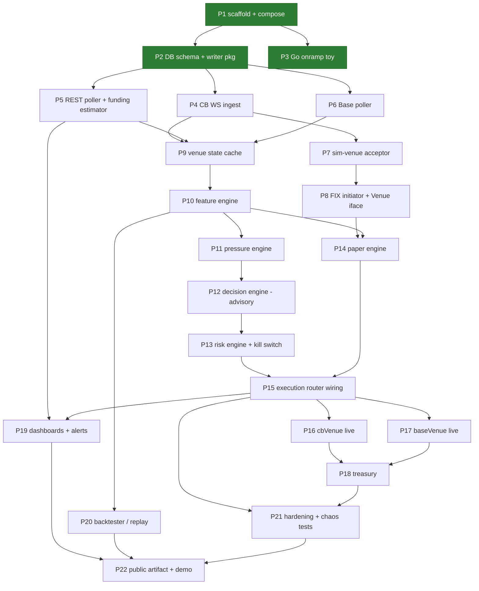

# Build Plan — Basis Carry System

**Source of truth:** [`basis-carry-build-spec.md`](basis-carry-build-spec.md) (v3.1)
**Companion docs:** [Architecture](architecture.md) · [API Spec](api-spec.md) · [PRD](prd.md) · [Venue Facts](venue-coinbase-perps.md)

This is the execution document. The build is decomposed into **numbered parts** small enough to complete and review in one sitting, sequenced so every part starts with its dependencies already merged. Each part lists objective, deliverables (file-level), tasks, acceptance criteria, and tests. Point at a part ("do Part 7") and it should be executable from this document plus the spec, without re-deriving design.

Working rules for every part (spec §1–2):

- AI writes the code; **every diff is read before commit**. Anything unexplainable is rewritten.
- Go services, Python research. Idiomatic patterns are deliverables in themselves: one writer goroutine, `context` cancellation through the stack, consumer-defined interfaces, error wrapping (not log-and-continue) except on feed loops, graceful shutdown.
- Public/private split respected from Part 1 (`.env.private` gitignored before any secret exists).
- Prices and quantities are `decimal`/`numeric` end to end — no float money.
- **Acceptance is demonstrated, not asserted.** Where a criterion can be executed — run the binary, induce the failure, scrape the metric, show the rows — it is executed, and the Evidence paragraph records what was observed rather than what was expected. Prose acceptance hides bugs that executable acceptance finds: the Part 3 backpressure claim was written as a confident sentence first, and running it instead exited 1 on a defect that also existed in Part 2's accepted writer. A regression test for a bug is run against the *unfixed* code to prove it fails there.

---

## Part index and dependencies

**Status key:** green in the diagram above = complete. A completed part carries a **Status** line under its heading and an **Evidence** paragraph under its acceptance criteria recording what was actually observed, plus a dated entry in the [changelog](#changelog--decision-record).

Mapping to spec §10 weeks: P1–P3 ≈ wk 0, P4–P6 ≈ wk 1, P7–P8 ≈ wk 2, P9–P12 ≈ wk 3, P13–P15 ≈ wk 4, P16–P18 ≈ wk 5, P19–P20 ≈ wk 6, P21–P22 ≈ wk 7–8.

**Parallel wallet track (manual, not code — never blocked by parts; procedure and log template in the [manual carry playbook](manual-carry-playbook.md)):** wk 0a wallet bootstrap → wk 0b manual carry #1 (the reference sequence) → manual carry #2 opened wk 1, closed wk 2 → manual carry #3 timed by Part-12 advisory signals wk 3 → first automated cycle after P16–P17 → continuous small-size after P19. If a part slips, the week's manual carry still happens.

---

## Phase A — Foundations (wk 0)

### Part 1 — Repo scaffold, Compose stack, config

> **Status: ✅ complete** — accepted 2026-08-16 (`8ec21d5` scaffold, `f3d51cc` decimal hardening).

**Objective:** a running empty system: three placeholder binaries, full infra stack, config loading, metrics endpoints.

**Deliverables**
- `go.mod` (single module), layout: `cmd/{ingest,carry,sim-venue}`, `internal/{ingest,venue,features,pressure,carry,risk,exec,fix,metrics,treasury,db}`, `research/`, `deploy/`, `docs/`.
- `deploy/docker-compose.yml`: `ingest`, `carry`, `sim-venue`, `timescaledb`, `prometheus`, `grafana`, `alertmanager`; Dockerfiles; Prometheus scrape config for all three binaries.
- `Makefile`: `up`, `down`, `test`, `lint`, `migrate`, `replay` (stub).
- `internal/metrics`: Prometheus registry + `/metrics` HTTP server helper used by all binaries.
- Config loader (env → typed struct per binary), `.env.example` with every variable from [API spec §7](api-spec.md#7-configuration-surface) (synthetic values), `.gitignore` covering `.env.private`, FIX stores/logs, data dirs.
- Logging: stdlib `log/slog`, JSON in containers.
- `golangci-lint` config; CI stub optional.

**Acceptance**
- `make up` → all 7 services healthy; each binary serves `/metrics`; Grafana reaches Prometheus and TimescaleDB datasources.
- `make lint` and `make test` pass (trivially).

**Evidence (2026-08-16).** `make up` brings all 7 services to healthy (`--wait` gates on each container's health check); each binary serves 39 metric families on `/metrics` and Prometheus reports `up=1` for all three jobs; both provisioned Grafana datasources return `status: OK` from the health API. `make lint` reports 0 issues; `make test` is green under `-race`, with `goleak` on the metrics server and the module-wide decimal guard. Beyond the letter of the criteria: `SIGTERM` drains the metrics server and exits 0, and the three config safety rails (intraday margin, leverage cap, delta tolerance) were each demonstrated refusing to start the binary.

**Carried forward:** the `decimal` ↔ `numeric` round trip and the `jsonb` snapshot encoding are the two precision boundaries `internal/guard` cannot see — both are Part 2 acceptance items ([API spec §3.5](api-spec.md#35-decimal-rules)).

### Part 2 — Database schema, migrations, writer package

> **Status: ✅ complete** — accepted 2026-08-17.

**Objective:** the full v1 schema and the shared one-writer persistence layer.

**Deliverables**
- `internal/db/migrations/*.sql`: every hypertable and state table from [API spec §5](api-spec.md#5-database-schema), TimescaleDB extension + hypertable creation, indexes on `(product_id, ts desc)` for series tables; `make migrate` applies (golang-migrate or equivalent).
- `internal/db`: pgx pool setup; `Writer` — a goroutine owning batched inserts fed by a channel of typed rows (interval + size flush triggers, per-table batches); insert helpers per table; graceful `Close` that flushes.
- Seed: `cb_products` row for the perp product (placeholder contract size / tick until Part 5 fills it from the products endpoint).
- Includes `cb_account_state` (polled margin/balance snapshot) and the `funding_events.kind` accrual-vs-settlement split — both are load-bearing for reconciliation, not later additions.

**Acceptance**
- Fresh `make up && make migrate` creates all tables; hypertables confirmed via `timescaledb_information`.
- Writer test: 10k rows across 3 tables through one writer, all persisted, one flush on close, no goroutine leaks (`goleak`).
- **Precision round trip** (carried forward from Part 1): a value with more significant digits than a `float64` can represent survives `decimal → numeric → decimal` byte-identical, proving the pgx codec is not routing through a float. The `decisions.input_snapshot` `jsonb` encoding is decided and tested the same way — a decimal marshalled as a JSON number can be read back as a float by any other consumer, so this is a contract choice, not a detail ([API spec §3.5](api-spec.md#35-decimal-rules)).

**Evidence (2026-08-17).** From an empty volume, `make up && make migrate` creates all 14 tables plus `schema_migrations` and reports `schema_version=3`; `timescaledb_information.hypertables` lists exactly the seven series tables from API spec §5.1; the seed row reads `ETP-20DEC30-CDE / 0.10 / UNVERIFIED` with every unverified venue number NULL, and a second `make migrate` logs "schema already up to date" and "perp product already present, left untouched". The integration suite (`make test-integration`, 24 tests + 28 subtests, green under `-race`) drives the acceptance items: 10,000 rows across `cb_venue_state`, `cb_bars` and `base_state` through one writer land as 3,334 / 3,333 / 3,333 rows with the pending remainder flushed on `Close`, and `goleak` covers the writer goroutine. Precision: `9007199254740993` (2^53 + 1), `9007199254740993.0000000000000001`, `0.1000000000000000055511151231257827`, `123456789012345678901234567890.123456` and `-0.0000000000000000000000000001` all round trip byte-identical through `numeric`; a `float64` path would have failed the first value. The `jsonb` snapshot stores `"9007199254740993.0000000000000001"` as a quoted string ([ADR-0011](decisions/0011-decimal-json-encoding.md)). Beyond the letter of the criteria: a schema-versus-row-type test walks `information_schema` for all 14 tables so the migrations and the Go structs cannot drift; re-inserting a candle, a trade bucket or a backfilled funding row is a no-op; the `CHECK` constraints reject an unknown `funding_source` and a `SETTLEMENT` carrying an hourly rate; and `make lint` reports 0 issues with the integration build tag included.

**Correction (2026-08-18, found in Part 3).** This part was accepted with a shutdown defect in `internal/db.Writer`: flushes triggered by batch size or the interval ran on the root context, so a cancellation landing mid-batch skipped the drain and final flush and lost accepted rows. Fixed under Part 3 — see that part's changelog entry. The acceptance evidence above stands; what it did not cover was the one shutdown in which a write is already in flight.

### Part 3 — Go onramp toy *(collaborative part — hand-written first, waived by the PO)*

> **Status: ✅ complete** — accepted 2026-08-18. Built by AI on PO instruction; see the deviation below.

**Objective:** spec wk-0 learning exercise: Jason hand-writes it, then it is refactored with review. Not production code; lives in `research/onramp/` or a branch.

**Scope:** two goroutines read a fake WS feed, fan into a channel, one writer inserts to Postgres via pgx, `/metrics` exposed. Read *Go by Example*: goroutines, channels, `select`, `context`, errors, interfaces.

**Acceptance:** it runs; the refactor diff is read and each change explainable. This part is **pointed at explicitly by Jason when he's written his version** — do not pre-write it.

**Deviation (2026-08-18, PO-directed).** The hand-written-first rule was waived mid-session: the exercise was started, and the Go distance to a working version was judged not worth the time. The half of the acceptance criterion that depends on it — "the refactor diff is read and each change explainable" — cannot be met as written, because there is no before-version to diff against. It is replaced by [`research/onramp/README.md`](../research/onramp/README.md), a walkthrough that reads the code in dependency order, names the Go concept behind each construct, and ends with a table of deliberate breakages that each demonstrate one invariant. "Each line explainable" survives; "each change explainable" does not apply. The learning goal itself is not closed by this part — it moves to reading the Part 4 diffs, which are the same patterns against a real socket.

**Evidence (2026-08-18).** `go run ./research/onramp -run-for 12s -interval 100ms` writes 238 rows to `onramp_ticks`, 119 per product, from two feed goroutines fanning into one buffered channel and one writer goroutine. Prices land exact against `numeric` (`3448.70`–`3453.70` perp, `3449.00`–`3451.00` spot) through the shopspring codec `db.Connect` registers, with no float in the path. A mid-run scrape of `:9109/metrics` shows both `onramp_ticks_produced_total` series advancing together, `onramp_rows_written_total` behind them by the unflushed batch, `onramp_write_queue_depth` at 0, and the Go runtime collectors present; `/healthz` returns `ok`. The shutdown log is the ordering proof: both feeds stop on context cancellation, then `writer stopped final_flush_rows=19`, then the metrics server — the writer outlives cancellation by design, and the endpoint outlives the writer so the final flush is still scrapeable. `go test -race -count=1 ./research/onramp` is green: batching at the size threshold, the partial final flush, the final flush on an already-canceled context, positional insert arguments, a wrapped insert failure, a table-driven price walk compared with `.Equal`, a feed parked on a full channel that still observes cancellation, and `goleak` over the package. Backpressure was demonstrated separately rather than asserted, and it found a bug: at `-interval 1ms -batch-size 1 -queue 4`, one round trip per row makes the writer the bottleneck, and the first run of that scenario exited 1 with `insert 1 ticks: timeout: context deadline exceeded` — the `-run-for` deadline had landed while a batch was in flight, and only the *final* flush was protected from cancellation. Every write now runs on `context.WithoutCancel` bounded by its own timeout, because cancellation is meant to stop the feeds, not to kill a round trip already in progress; `TestWriterNeverWritesOnACanceledContext` is the regression. The re-run exits 0 with `onramp_write_queue_depth` pinned at the queue ceiling and the feeds throttled from 1000 ticks/s to roughly 270 — producers blocking on a full channel instead of memory growing. `make lint` reports 0 issues.

---

## Phase B — Ingestion (wk 1)

### Part 4 — Coinbase WS ingest

**Objective:** live ETH market data flowing into TimescaleDB with reliability plumbing.

**Deliverables**
- `internal/ingest/ws.go` + per-channel handlers: `ticker`, `level2`, `market_trades`, `candles` (1m), `status` — subscribed for both the perp product and the spot reference product, one goroutine each, typed channel out ([API spec §3.6](api-spec.md#36-ingest-channel-messages) message structs). JWT refreshed before expiry and on reconnect.
- Reconnect loop per stream: exponential backoff + jitter, resubscribe, `ingest_ws_reconnects_total`.
- Gap detection per stream (candle-time discontinuity, trade-time regression, silence threshold) → `ingest_ws_gaps_total`; `ingest_last_seen_timestamp_seconds` gauge per stream.
- Persistence policy: completed candles → `cb_bars`; top-N book snapshot every `BOOK_SNAP_SECS` (with imbalance + impact px) → `cb_book_snapshots`; trade aggregates per bucket → `cb_trades_agg` (these feed the 3-minute VWAP marks the funding estimator needs); mids and marks sampled into `cb_venue_state` alongside Part-5 sampling.
- `cmd/ingest` wiring: root context, signal handling, graceful shutdown (cancel → drain → writer flush → close).
- **[verify]** live WS payload shapes and that every channel accepts the perp product id; adjust structs. Close the relevant `TODO(verify)` items in [venue-coinbase-perps.md](venue-coinbase-perps.md).

**Acceptance**
- [ ] **The ingest diff was walked line by line and each change explained.** Carried over from Part 3, whose hand-written-first mechanism was waived (see that part's deviation note). The goal the waived criterion existed to serve — reading Go written by someone else and being able to explain every line of it — is met here instead, against a real socket and the same patterns. Per spec §1, anything unexplainable is rewritten; `context.WithoutCancel` and why a write timeout has to be per-call are the specific things to be able to explain, since Part 3 turned both into rules ([architecture §8](architecture.md#8-reliability-design)).
- 1h run: rows accruing in all four tables; zero writer errors; kill -TERM flushes cleanly.
- Pull network mid-run: reconnect metric increments, streams resume, gap recorded.
- Unit tests with a fake WS server: reconnect, gap detection, candle-close-only persistence.

### Part 5 — REST poller, funding estimator, backfill

**Objective:** the funding / futures-mark / spot-mark series — the system's primary asset — recorded, computed where the venue does not publish it, and backfilled.

**Deliverables**
- REST poller goroutine (`POLL_REST_SECS`): products endpoint → `cb_products` upsert (contract size, tick, status, fee tier, max leverage); market data → `cb_venue_state` rows (futures_mark, spot_mark, mid, premium_proxy, spread, OI, maintenance flag).
- **Local funding-rate estimator** (the headline of this part): 3-min futures mark (VWAP, mid-TWAP fallback) and spot mark, 1-hour TWAP of `(futures_mark − spot_mark)/spot_mark/24`, then `0.75 × premium + 0.25 × previous`. Writes `funding_rate_est` hourly; sets `funding_rate_hourly` from the venue if it publishes one, else copies the estimate and sets `funding_source='computed'`. No rate is written for the Friday maintenance hour — that hour is a gap, not a zero.
- Observed funding ledger: hourly-boundary rows into `funding_events` (position_id NULL).
- Backfill: on first run (empty table), pull `fundingHistory` as far back as the API allows; idempotent on re-run.
- `cfm/balance_summary` and `cfm/positions` polls → **`cb_account_state`** rows (`available_margin`, `liquidation_threshold`, derived `margin_ratio`, CBI/CFM balances, buying power, contracts held, avg entry, unrealized P&L). This table is what the risk engine reads margin ratio from and what treasury reconciles against. Assert intraday margin is **off** via `cfm/intraday/margin_setting` and record it on the row.
- Decision point (open item #1): read the CDP JWT auth flow and any community Go package; **record the client decision (hand-rolled vs community) in this doc's changelog and an ADR before Part 16.** No official Go SDK exists.

**Acceptance**
- `cb_venue_state` rows every poll tick with plausible marks and funding; funding/candle history backfilled as far as the API allows (record the depth actually available).
- Estimator sanity: over a 24h window the computed hourly series is stable, bounded, and — if the venue publishes a rate — tracks it within a documented tolerance.
- `cb_account_state` rows accrue every poll and match the account UI at a spot check; `intraday_margin_enabled` reads false.
- Funding rows are written as `kind='ACCRUAL'`; an observed cash adjustment writes a `kind='SETTLEMENT'` row and links the accruals it cleared.
- Backfill re-run inserts nothing new. Poller failure degrades to staleness, never crashes the binary.

### Part 6 — Base poller

**Objective:** the spot side of the book: wallet balances, reference price, gas.

**Deliverables**
- `internal/ingest/base.go`: poll (`POLL_BASE_SECS`) wallet ETH via `eth_getBalance`, USDC via `balanceOf`, `eth_gasPrice`, ETH/USDC reference px (DEX aggregator quote; Coinbase spot as configured fallback) → `base_state`.
- Wallet address from config; works against any address (use the named wallet).

**Acceptance:** `base_state` rows accruing with correct balances (cross-checked against a block explorer once); RPC failure → staleness, not crash.

---

## Phase C — Order entry (wk 2)

### Part 7 — sim-venue (FIX acceptor)

**Objective:** the exchange simulator: quickfixgo acceptor with a realistic fill model.

**Deliverables**
- `cmd/sim-venue` + `internal/fix/acceptor`: FIX 4.4 acceptor per [API spec §4](api-spec.md#4-fix-44-specification) (session settings, FileStore, FileLog).
- Message handling: NOS (D) → ExecutionReport(NEW) then fill reports; OrderCancelRequest (F) → ER(CANCELED) or OrderCancelReject (9); malformed → Reject (3).
- Fill model: fills against last top-of-book read from TimescaleDB; configurable latency (jittered), slippage bps, partial fills above `SIM_PARTIAL_THRESHOLD` (N slices); deterministic under seed.
- Fills persisted to `fills` (venue='sim'); session state to `fix_sessions`; `fix_*` metrics.

**Acceptance**
- Bring-up with a scripted FIX client: D→8(NEW)→8(FILLED) round trip; oversized order produces partials summing to full qty; cancel works both pre-fill and mid-partial.
- Restart sim-venue: sequence numbers persist, session resumes without reset.

### Part 8 — FIX initiator + `Venue` interface

**Objective:** `carry`'s order-entry stack: the interface every venue implements, the exec-report state machine, and the FIX implementation.

**Deliverables**
- `internal/carry/venue.go`: `Venue` interface + `Order`/`Ack`/`ExecReport` types exactly per [API spec §3](api-spec.md#3-internal-go-contracts).
- `internal/exec/statemachine.go`: order-state tracking (NEW→PARTIAL→FILLED|CANCELED|REJECTED), CumQty-monotonic sequencing, idempotent duplicates, per-order timeout.
- `internal/fix/initiator.go`: `fixVenue` — quickfixgo initiator, Order→NOS mapping, ER→ExecReport mapping, session-state metric, ClOrdID = ULID.
- Round-trip latency histogram (`carry_order_roundtrip_seconds`).

**Acceptance** *(spec wk-2 done-when)*
- `carry` (temporary CLI trigger) sends NOS → sim-venue → ExecReports arrive on the channel, state machine terminal.
- **Kill and restart `carry` mid-session: sequence numbers survive, resend recovery completes, no ExecReport lost** — proven by a test that fills while the initiator is down.
- Unit tests: state machine transitions incl. out-of-order and duplicate reports.

---

## Phase D — The brain (wk 3)

### Part 9 — Venue state cache

**Objective:** `carry`'s read model: latest venue + wallet state refreshed from TimescaleDB on a ticker (same read path live and replay — architecture §2).

**Deliverables**
- `internal/venue/state.go`: cache struct per spec §6.2 (funding now and estimated next, futures mark, spot mark, mid, premium proxy, spread bps, contract size, margin ratio, leverage/max leverage, tick, fee tier, OI, maintenance-window flag; Base inventory, gas, venue status flags); `Refresh(ctx)` pulling latest rows; staleness computed per source.
- Staleness exposed as typed flags (`FeedOK`, per-stream ages) consumed later by risk.

**Acceptance:** with ingest running, cache refresh returns current values in <50ms; with ingest stopped, staleness flags trip at `STALE_FEED_SECS`. Unit tests against seeded DB rows.

### Part 10 — Feature engine

**Objective:** Tier 1–3 + risk features computed each tick and persisted.

**Deliverables**
- `internal/features/`: computation per spec §6.3 — Tier 1 (funding_rate_hourly, funding_rate_est, funding_source, funding_annualized, funding_zscore over rolling window, cumulative_funding, expected_carry_N_hours, futures_mark, spot_mark, basis, trade_premium, time_to_next_funding), Tier 2 (spread bps, ToB imbalance, impact imbalance, trade imbalance, sweep intensity, mid-vs-mark, slippage estimate), Tier 3 (log returns, EMAs, ATR, realized vol, VWAP, momentum slope), risk features (margin ratio at current + proposed size, effective leverage, net delta, residual delta, contracts held, notional).
- Rolling windows fed from DB history at startup (warm start), then incrementally.
- Persist full row to `cb_features` each tick; tick driver in `cmd/carry` (fast ticker + funding-boundary alignment).
- Formula fidelity to spec §8 table; window lengths and all bands from config.

**Acceptance** *(spec wk-3 done-when, first half)*
- `cb_features` rows land every tick with all columns non-null (Tier gaps explicit as NULL where data insufficient, e.g. z-score before window fills).
- Golden tests: fixed input series → expected feature values (hand-computed fixtures).
- Z-score after restart matches z-score without restart (warm-start correctness).

### Part 11 — Funding-pressure engine

**Objective:** the brain's summary judgment per spec §6.4.

**Deliverables**
- `internal/pressure/`: inputs funding_rate, funding_zscore, cumulative_funding, basis, imbalance → `PressureOut{crowded_side, pressure_level, expected_pain, exhaustion_flag}`; z-band mapping (|z|<1 / 1–2 / 2–3 / ≥3 → NORMAL/ELEVATED/EXTREME/FORCED); pressure score `w1·z + w2·cum + w3·basis` with weights from config.
- Outputs appended to the `cb_features` row + `carry_pressure_level` metric.

**Acceptance:** table-driven tests covering each band and the exhaustion condition (|imbalance| > threshold AND momentum slope flattening); visible in Grafana explore.

### Part 12 — Decision engine (advisory mode)

**Objective:** ENTER/HOLD/REBALANCE/EXIT/BLOCKED per spec §8, emitted and persisted — **advisory only**: signals logged and alerted, human executes (this times manual carry #3).

**Deliverables**
- `internal/carry/decision.go`: rule evaluation exactly per spec §8 v1 rules; closed reason-code enum; `TargetPosition` emission on funding ticks + risk events; sizing per §8 (perp `min(notional_cap, margin_avail × leverage)/mark`, spot to net delta ≈ 0).
- Persist every decision to `decisions` with full `input_snapshot` JSON.
- Advisory surface: decision-state metric, log line, and an Alertmanager route for ENTER/EXIT transitions (so a human can act on it).

**Acceptance** *(spec wk-3 done-when, second half)*
- Replaying a seeded day of features produces a deterministic, explainable decision sequence; every §8 rule reachable in table-driven tests (one test per reason code).
- Two identical runs over the same data → identical decisions (reproducibility NFR).

---

### Research task R1 — carry break-even study *(before Part 13; notebook, not code)*

**Question:** at 0.10 ETH per contract and `k ≥ 2`, how many hours of positive funding does one carry need to clear round-trip perp fees, DEX slippage, and gas?

**Why it gates Part 13:** costs are a one-time round-trip toll while funding accrues hourly, so break-even time is set by cost-rate vs funding-rate — it is **independent of position size** (only gas is fixed, and on Base it is small). The lever is therefore `CARRY_HORIZON_HOURS`, not `MAX_NOTIONAL_USD`. Set the horizon too short and the ENTER rule is arithmetically unsatisfiable at any size; the engine would look healthy and simply never trade.

**Deliverable:** a notebook computing break-even hours across fee/slippage scenarios and funding APRs, using the fee tier and contract spec confirmed in Part 5 (venue doc `TODO(verify)`), plus the realized slippage and gas from manual carries #1–#3. Output: a recommended `CARRY_HORIZON_HOURS`, and the funding APR below which entering is never worth it (a candidate `z_enter` floor).

**Also check:** whether the EXIT rule (`funding_z ≤ z_exit`) tends to fire *before* break-even at that horizon. If it does, entry and exit thresholds are fighting each other and one of them needs to move — better to learn that in a notebook than from a month of tiny realized losses.

---

## Phase E — Risk and paper (wk 4)

### Part 13 — Risk engine + hard stops + kill switch

**Objective:** the only component allowed to emit orders; everything that can flatten the book.

**Deliverables**
- `internal/risk/`: position/delta/residual-delta/notional/margin-ratio/accrued-and-pending-funding/P&L-split state (from fills + funding_events + marks + balance summary); pre-trade checks (FR-4.2) including the maintenance-window guard and the "at least one whole contract affordable" test; hard stops (FR-4.3, margin-ratio floor replacing any liquidation-price estimate) → flatten + `risk_events` row + alert; rebalance trigger on |residual delta| > tolerance, trimmed on the spot leg; daily loss limit with UTC day roll.
- Contract quantization helper: desired notional → whole contracts, **truncating** toward zero (`Truncate`/`IntPart`, never `Floor` — a short is negative and `Floor(-7.9) = -8` rounds up into more risk); spot target derived from the resulting contract count. Table test covers both signs and the exact-boundary case ([API spec §3.5](api-spec.md#35-decimal-rules)).
- Intent → approved order deltas: converts `TargetPosition` into leg orders (spot-first on entry, perp-first on exit sizing per unwind safety), or BLOCKED with reason.
- Kill switch: config flag + SIGUSR-style runtime trigger → cancel all, flatten, halt all venues; engaged state metric.
- Persistence to `positions`, `fills` linkage, `funding_events` (position-linked), `risk_events`.

**Acceptance** *(spec wk-4 done-when, risk half)*
- Every hard stop demonstrated firing in tests (seeded conditions per stop); flatten orders generated correctly from arbitrary open state.
- Kill switch test: with open paper position and resting orders → everything canceled, flattened, submissions refused until reset.
- Restart with open position: state rebuilt from DB matches pre-restart state exactly.

### Part 14 — Paper engine

**Objective:** the second `Venue`: realistic fills for both legs without a network.

**Deliverables**
- `internal/exec/paper.go`: implements `Venue` for perp + spot legs per FR-5.3 — perp orders quantized to whole contracts; marketable orders consume recorded book depth; passive orders queue-aware slippage; maker/taker fees from `cb_products`; funding accrued hourly (`contracts × contract_size × mark × funding_rate`) into `funding_events` and cash-settled on the venue's twice-daily schedule (`settled_at`); unrealized P&L on futures mark; spot leg vs `base_state.spot_px` + configured DEX slippage + gas.
- Fills → `fills` (venue='paper'); positions bucket venue='paper'.

**Acceptance:** scripted scenario test — enter carry, hold across 3 funding boundaries, exit — produces hand-checkable P&L decomposition (price/funding/fees/slippage each verified); partial-fill behavior on thin seeded books.

### Part 15 — Execution router wiring (full loop)

**Objective:** close the loop: decisions drive orders through both FIX and paper simultaneously; this is spec wk-4's headline.

**Deliverables**
- `internal/exec/router.go`: routes approved orders to configured venues (perp leg → fixVenue and/or paperVenue; spot leg → paper), merges ExecReport streams into risk state; leg-sequencing (spot-first entry, timeout unwind) per architecture §6.4.
- `cmd/carry` final wiring: state cache → features → pressure → decision → risk → router, all under one root context, graceful shutdown order per architecture §8.
- Config: advisory / paper / sim / live mode switch per leg.

**Acceptance** *(spec wk-4 done-when)*
- End-to-end soak on live data (paper + sim): decisions → orders → fills → delta tracked ≈ 0; runs 24h unattended; hard stop injected mid-soak flattens both paths.
- Leg-failure drill: sim-venue configured to reject perp leg → spot leg unwound within timeout, risk event recorded.

---

## Phase F — Live (wk 5) — *gated on Part 13 & 15 acceptance*

> Live parts sign real transactions from the named wallet. Notional cap hard-coded low. Credentials only in `.env.private`. The manual carries (wallet track) have already exercised every step by hand — the code reproduces the reference sequence from wk 0b.

### Part 16 — `cbVenue` (Coinbase live adapter)

**Deliverables**
- `internal/exec/cb.go`: `Venue` impl over Advanced Trade — CDP JWT auth (per the Part-5 client decision), order place/cancel with tick rounding and **integer contract sizes**, client order id = ClOrdID, fills via WS `user` channel → ExecReports; leverage ≤ 3× overnight enforced and intraday opt-in asserted off; maintenance-window guard; kill-switch check before every submit.
- Reconciliation: positions and margin from `cfm/positions` + `cfm/balance_summary` vs internal state; divergence → risk event. Funding actually applied vs accrued → `carry_funding_reconciliation_error`.

**Acceptance:** full order lifecycle exercised at minimum size (place, partial where reachable, cancel, reject) — a far-from-market limit order proves place/cancel without taking risk; then one tiny real round trip in the perp product; positions, margin ratio, and funding accrual all reconcile against the venue. Fractional-contract submission is rejected by our own guard before it reaches the API.

### Part 17 — `baseVenue` (Base spot live adapter)

**Deliverables**
- **Session-key provisioning first, as its own reviewed step:** create the key from the owner wallet on-chain — scoped to the DEX router, capped allowance, explicit expiry — recording address, scope, allowance, and expiry in `.env.private`. This is a wallet operation the PO performs, and it is itself a legible on-chain event under the ENS name.
- `internal/exec/base.go`: `Venue` impl — USDC↔ETH swap via DEX aggregator (per wk-4 decision, open item #2) from the Alchemy Smart Wallet: build swap calldata, wrap in UserOp, sign with session key, Gas Manager sponsorship, submit via bundler RPC, receipt → ExecReport with effective px + gas; slippage bound from config; kill-switch gated.
- Session-key preflight: refuse to construct `baseVenue` with a missing or past `SESSION_KEY_EXPIRY`, and re-check before every submit; export `carry_session_key_expiry_timestamp_seconds` and wire the `SessionKeyExpiring` alert (7 days out). A lapsed key must fail loudly, never as an opaque bundler error mid-carry.

**Acceptance:** Base Sepolia swap round trip; then one tiny mainnet swap from the named wallet; effective price within slippage bound; receipt persisted. **Expiry drill:** with the expiry set in the past, `baseVenue` refuses to start with a clear error and the perp leg is never opened one-sided; with expiry inside 7 days, `SessionKeyExpiring` fires.

### Part 18 — Treasury reconciliation

**Deliverables**
- `internal/treasury/`: balance reconciliation across the Coinbase spot (CBI) account, futures (CFM) margin account, and the Base wallet, reading `cb_account_state`. Four tracked transitions, each with its own timeout from config per [spec §6.8](basis-carry-build-spec.md#68-treasury-internaltreasury--week-5): CBI→CFM auto-transfer (`TREASURY_TRANSFER_TIMEOUT`), CFM→CBI sweep (`TREASURY_SWEEP_TIMEOUT`), funding cash adjustment vs expected settlement time (`TREASURY_SETTLEMENT_TIMEOUT`), Base tx submitted→confirmed (`TREASURY_BASE_TX_TIMEOUT`). Breach or mismatch → risk event + alert; a missed settlement also feeds `carry_funding_reconciliation_error`. Snapshot table + metrics.

**Acceptance:** a deliberate test transfer between Coinbase spot and futures margin, and a Base wallet funding move, each tracked through every state; a funding settlement observed and reconciled; a synthetic mismatch (edited row) alarms. **Milestone: first fully automated carry entry + exit** — spot leg via P17 (on-chain from the named wallet), perp via P16, tracked by treasury.

---

## Phase G — Observe and validate (wk 6)

### Part 19 — Dashboards + alert rules

**Deliverables**
- `deploy/grafana/`: provisioned four-panel dashboard per spec §6.9 — (1) funding & basis, (2) position & delta, (3) P&L decomposition by venue bucket, (4) system health (staleness, gaps, FIX state, round-trip latency); headline stat: *"Who is paying whom, how much, and is the crowd getting exhausted?"*
- `deploy/prometheus/alerts.yml`: the six rules from [API spec §6](api-spec.md#6-prometheus-metrics); Alertmanager routing (start: log/webhook receiver).

**Acceptance:** dashboards render from provisioning on fresh `make up`; each alert proven by inducing its condition (stop ingest → FeedStale, etc.).

### Part 20 — Backtester / replay

**Deliverables**
- `research/backtest/`: Python (polars/duckdb) chronological replay per FR-8; same decision rules imported as config-parity (thresholds read from the same env); funding at hourly boundaries; report per FR-8.2; results → `bt_runs`/`bt_results` for Grafana.
- `make replay`: 30 days end-to-end + dashboard refresh.
- Parity check: replay over a period the paper engine also traded → decisions match.

**Acceptance** *(spec wk-6 done-when)*: `make replay` runs 30 days clean; **PnL decomposition matches on-chain reality for the live book** within tolerance (fees/gas exact, slippage modeled); acceptance rule wired: report prints ACCEPTED/REJECTED per the profitable-after-costs rule.

---

## Phase H — Hardening and artifact (wk 7–8)

### Part 21 — Hardening + chaos tests

**Deliverables**
- Fault-injection test suite: WS drop/flap mid-decision, DB outage (writer backpressure), FIX disconnect mid-partial-fill, sim-venue reject storms, cancel/replace races, clock-skew on funding boundary, maintenance-window entry and exit, funding-settlement reconciliation mismatch, crash-restart during an open live position.
- Fixes for everything found; runbook notes in `docs/runbook.md` (new): start/stop, kill switch, manual flatten, credential rotation, "feed is stale" triage.
- Optional (open item #3): investigate Coinbase Exchange FIX sandbox for spot leg; record findings; wire initiator config if viable.

**Acceptance:** chaos suite green in CI/`make test`; 1-week continuous run at small size with zero unexplained alerts.

### Part 22 — Public artifact + demo

**Deliverables**
- Public/private scrub: verify no real thresholds/credentials in history; synthetic `.env.example` complete; `positions`/P&L exports excluded.
- README finalized: wallet address (ENS + .base.eth), architecture diagram, demo script (`docs/demo.md`): 10-minute walkthrough — dashboard tour, a decision row with its snapshot, FIX resend demo, kill-switch demo, wallet-history walkthrough matching on-chain reality.
- Interview-surface checklist (spec §11) — each item mapped to where it's demonstrable in the repo/system.

**Acceptance:** a cold reader can run `make up`, follow the demo script, and audit the wallet against the decision log.

---

## Changelog / decision record

Record here as parts complete (date, part, decisions made, deviations from plan). This is the chronological index; anything structural also gets an ADR in [`decisions/`](decisions/README.md). Test conventions for all parts: [testing strategy](testing-strategy.md).

- *2026-08-16 — plan created from spec v3.0. Open decisions pending: Base spot venue (before P17, wk-4), FIX beyond sim-venue (P21).*
- *2026-08-16 — **CHANGE-001 applied**: perp venue migrated from Hyperliquid to Coinbase US perpetual-style futures. See [CHANGELOG](../CHANGELOG.md) and [ADR-0009](decisions/0009-perp-venue-coinbase.md). Adds contract quantization, local funding estimator, margin-ratio hard stop, and the Friday maintenance guard across P5, P9–P16. Open decision: Advanced Trade Go client (hand-rolled vs community, before P16, informed in P5).*
- *2026-08-16 — ADRs 0001–0008 backfilled for decisions already embedded in spec/architecture; testing strategy and manual carry playbook added.*
- *2026-08-16 — **Part 1 complete.** Decisions and deviations:*
  - *Module path `github.com/Jason-Dorman/funding-carry`; Go 1.26.6.*
  - ***Added `internal/config`**, which the Part 1 package list does not name. The deliverable asks for a typed config loader per binary but gives it no home; the alternative was parsing the environment three times in three `main.go` files. Not structural enough for an ADR — recorded here and in [architecture §2](architecture.md#2-process-model).*
  - ***`.env.example` is the committed file, `.env` is a gitignored working copy** created by `make env`. [API spec §7](api-spec.md#7-configuration-surface) previously described `.env` itself as the committed public file, which conflicted with this part's deliverable list and put a file that will sit next to real values inside the repo. §7 updated to match.*
  - ***Three config values fail the load rather than being checked at trade time**: `INTRADAY_MARGIN_OPT_IN` true, `MAX_LEVERAGE` outside (0, 3], and `DELTA_TOLERANCE_ETH` above half a contract. Each is an existing documented rail (spec §9, architecture §12); enforcing them at startup makes them unbypassable rather than conditional on a later code path being reached.*
  - ***New config variables**, added to §7 and `.env.example`: `INGEST_METRICS_ADDR` / `CARRY_METRICS_ADDR` / `SIM_METRICS_ADDR`, `LOG_LEVEL`, `LOG_FORMAT`, and the deploy-scope `POSTGRES_USER` / `POSTGRES_PASSWORD` / `POSTGRES_DB`.*
  - ***`make migrate` and `make replay` exit non-zero** with a pointer to the part that implements them (2 and 20). A stub that exits 0 would report success for work that did not happen.*
  - *`MAINTENANCE_BREAK` is parsed into a weekday plus a local time range in a named location, not fixed UTC hours, so the Friday break follows US Eastern across daylight saving. The IANA database is embedded in the binaries (`time/tzdata`) rather than installed in the image.*
- *2026-08-16 — **decimal correctness hardened** (post-Part-1, prompted by a PO review question). Three failure modes in `shopspring/decimal` are silent when violated, so each now has a mechanism rather than a convention — see [API spec §3.5](api-spec.md#35-decimal-rules):*
  - ***`==` on a decimal is always false***, *even for two values parsed from the same string, which makes `x == decimal.Zero` a check that can never fire. No linter catches it, so **`internal/guard`** (new, test-only package) type-checks the whole module and fails on `==`/`!=` against `decimal.Decimal` and on any `NewFromFloat*` call. Verified by planting violations and watching it fail.*
  - ***`make test` and CI now run `-count=1`.*** *The guard's result depends on every package in the module, which the Go test cache cannot represent — it reported a stale pass after a violation was planted. Caching off is the cost of the guard being trustworthy.*
  - ***`decimal.DivisionPrecision` is pinned to 16*** *in `internal/config`'s `init`. It is a mutable package global; leaving it at the library default meant any dependency could silently change rounding, which the reproducibility NFR cannot tolerate. `Div` is for ratios only.*
  - ***Quantization is `Truncate`, not `Floor`.*** *A short is a negative contract count and `Floor(-7.9) = -8` rounds up into more risk — the one thing the sizing rule forbids. API spec §3.3 and Part 13's deliverable reworded, with a table test over both signs required at Part 13 acceptance.*
  - *New test-only dependency: `golang.org/x/tools` (go/packages), used by the guard.*
- *2026-08-17 — **Part 2 complete.** Decisions and deviations:*
  - ***Migrations are embedded and applied by a new fourth binary, `cmd/migrate`*** *— [ADR-0010](decisions/0010-embedded-migrations.md). golang-migrate as a library over a `//go:embed` of the SQL, with its `pgx/v5` driver. `make migrate` runs it as a one-shot Compose service behind a profile, so `make up` never migrates as a side effect. The part's file list does not name a binary; the alternative was migrating on service startup, which makes a schema change a side effect of a restart and races three services against each other.*
  - ***Decimals in `jsonb` are JSON strings*** *— [ADR-0011](decisions/0011-decimal-json-encoding.md), closing the second Part-1 carry-forward. Pinned in `internal/config`, re-checked at the point of encoding in `internal/db`, and proven by a round trip through a real column.*
  - ***`decimal` ↔ `numeric` goes through the registered shopspring pgx codec***, *set on every connection in `db.Connect`, rather than pgx's generic `pgtype.Numeric`. This is the mechanism behind the precision acceptance item.*
  - ***The build plan said `(coin, ts desc)`; the schema has no `coin` column.*** *Left over from the Hyperliquid-era naming (CHANGE-001 renamed `hl_*` → `cb_*` and keyed on `product_id`). Corrected here and in the architecture ER diagram, which still declared `text coin` on `cb_venue_state` and `cb_features`.*
  - ***Indexes and constraints added beyond the §5 column lists***, *now documented as [API spec §5.3](api-spec.md#53-constraints-and-indexes): unique keys on `cb_bars`, `cb_trades_agg` and observed `funding_events` rows (what makes the Part-5 backfill idempotent), a partial unique key on `fills (venue, venue_exec_id)` (what makes a Part-8 FIX resend idempotent), `CHECK` constraints for every closed vocabulary, and a cross-column check that a `SETTLEMENT` carries no rate. Each one exists because a later part's acceptance criterion depends on it.*
  - ***TimescaleDB published on host port 15432, not 5432.*** *A developer machine usually already has a Postgres on the default port — this one did, and the integration suite silently authenticated against it. Inside the Compose network the port is unchanged.*
  - ***`make test-integration` added*** *(the testing strategy already referenced it). It creates and drops its own `carry_integration` database beside the working one: the recorded market history is the system's primary asset, and a test suite must not be able to delete it. CI gained a matching job against the same TimescaleDB image, and `golangci-lint` now lints with the `integration` build tag.*
  - ***`cb_products` is seeded with only what configuration knows*** *— product id and contract size, `status='UNVERIFIED'`, everything else NULL, `ON CONFLICT DO NOTHING`. A plausible placeholder in a fee or tick column would be used by later parts with nothing saying it had never been verified.*
  - ***Open question for Part 13: how a generated `positions.id` reaches the rows that reference it.*** *The writer is append-only and does not read ids back, which is what keeps the one-writer rule intact. Part 13 either adds a request/response path to the writer or switches `positions.id` to a client-minted ULID (the same convention as `ClOrdID`). Recommendation: the ULID — it keeps every insert on the batch path. Deciding it now would be guessing at a risk engine that does not exist; the table is empty, so the migration is free either way.*
- *2026-08-18 — **Part 3 complete.** Decisions and deviations:*
  - ***The hand-written-first rule was waived by the PO mid-session*** *and the exercise was built by AI. This is a deviation from the part as written and from CLAUDE.md; it is recorded here rather than silently absorbed. The unmet half of the acceptance criterion and what replaced it are described in the part's deviation note. No ADR: nothing structural changed, only who typed it.*
  - ***The toy creates its own `onramp_ticks` table at startup instead of a migration.*** *The migrated schema is a contract owned by [API spec §5](api-spec.md#5-database-schema); a learning exercise must not be able to widen it. The table is unindexed, is not a hypertable, and can be dropped at any time.*
  - ***Configured by flags, not `internal/config`.*** *Same reasoning against the other contract: none of `-interval`, `-batch-size`, `-queue`, `-flush-every` or `-run-for` belongs in [API spec §7](api-spec.md#7-configuration-surface), and they exist to make the concurrency observable by hand. `DATABASE_URL` is read from the environment as the default for `-database-url`, so `make up` is the only setup.*
  - ***`onramp_*` metrics are deliberately outside the [§6](api-spec.md#6-prometheus-metrics) catalogue*** *and nothing scrapes them; noted in §6 so the exception is visible rather than looking like drift.*
  - ***It reuses `internal/db.Connect` and `internal/metrics`, but hand-rolls its own writer*** *rather than using `internal/db.Writer`. Reusing the pool gets the decimal codec, which is the one thing the exercise must not get wrong; hand-rolling the writer is the exercise. The differences from the production writer — no retry, no per-table batching, a single channel-close stop signal instead of stop/done channels — are called out in the walkthrough.*
  - ***Writes do not inherit cancellation.*** *Found by running the toy, not by reading it: a shutdown landing mid-flush killed the round trip and failed the run. `flush` now derives `context.WithoutCancel` with its own timeout for every batch, not just the last one. Cancellation stops producers; a write already in flight gets a bounded life of its own.*
  - ***Part 2 defect found and fixed in Part 3: `internal/db.Writer` lost rows on shutdown.*** *The same bug the toy hit, in production code. Its size- and interval-triggered flushes called `flush(ctx)` with the root context, and `send`'s retry loop returned `abandoned` at its first `ctx.Done()` check, so a `SIGTERM` landing while a batch was in flight made `Run` return fatal and skipped `shutdown` entirely — the drain and final flush that [architecture §8](architecture.md#8-reliability-design) promises, on the one path that exists to stop rows being lost. Every flush now runs on `context.WithoutCancel` bounded by `FlushTimeout`. The PO rejected deferring this to a later part: a known shutdown-corruption bug in accepted code does not get to wait for a phase boundary, because the window it fires in is a live carry.*
  - ***The test for this already existed and passed anyway.*** *`TestWriterFlushesOnContextCancel` was written to cover exactly this promise, but the fake database ignored the context it was handed, so a canceled write still "succeeded". The fake now fails a dead context the way a driver does, and that test fails against the unfixed writer along with the two new ones — `TestWriterNeverWritesOnACanceledContext` (ported from the toy) and `TestWriterDrainsAndFinalFlushesAfterCancellationMidBatch` (a cancellation landing mid-batch still drains the queue and writes every row). Both were run against the reverted fix to confirm they fail. **The lesson is about fakes, not about contexts:** a fake that is more forgiving than the real dependency converts a test into a decoration.*
  - ***One-pass audit of the generic pattern*** *("cancellation of the parent kills in-flight I/O that should complete"), since the bug is not specific to writers. `db.Writer.send` was the only instance. `db.Connect`'s `Ping` and `SeedPerpProduct` are startup calls where cancellation loses nothing — the seed is `ON CONFLICT DO NOTHING` and re-runs. `Migrate` takes no context at all, and each file is an implicit transaction behind an advisory lock. `metrics.Server` already used `WithoutCancel` for its shutdown grace. The rule is now written down in [architecture §8](architecture.md#8-reliability-design) so Parts 4–6, which all perform I/O during shutdown, are bound by it rather than rediscovering it.*
  - *Test-only note: the flush-on-interval case injects a `<-chan time.Time`, the same technique `internal/db.Writer` uses, so no test in the package sleeps to wait for a timer.*
  - *New dependencies: `github.com/jackc/pgx/v5`, `github.com/jackc/pgx-shopspring-decimal`, `github.com/golang-migrate/migrate/v4`.*
