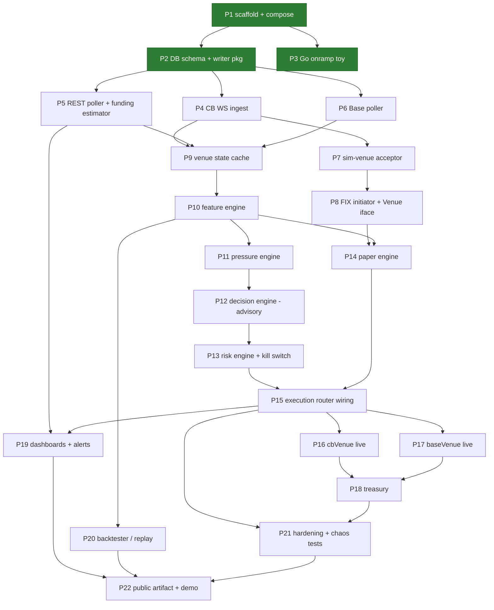

# Build Plan — Basis Carry System

**Source of truth:** [`basis-carry-build-spec.md`](basis-carry-build-spec.md) (v3.1)
**Companion docs:** [Architecture](architecture.md) · [API Spec](api-spec.md) · [PRD](prd.md) · [Venue Facts](venue-coinbase-perps.md)

This is the execution document. The build is decomposed into **numbered parts** small enough to complete and review in one sitting, sequenced so every part starts with its dependencies already merged. Each part lists objective, deliverables (file-level), tasks, acceptance criteria, and tests. Point at a part ("do Part 7") and it should be executable from this document plus the spec, without re-deriving design.

Working rules for every part (spec §1–2):

- AI writes the code; **every diff is read before commit**. Anything unexplainable is rewritten.
- Go services, Python research. Idiomatic patterns are deliverables in themselves: one writer goroutine, `context` cancellation through the stack, consumer-defined interfaces, error wrapping (not log-and-continue) except on feed loops, graceful shutdown.
- Public/private split respected from Part 1 (`.env.private` gitignored before any secret exists).
- Prices and quantities are `decimal`/`numeric` end to end — no float money.
- **Acceptance is demonstrated, not asserted.** Where a criterion can be executed — run the binary, induce the failure, scrape the metric, show the rows — it is executed, and the Evidence paragraph records what was observed rather than what was expected. Prose acceptance hides bugs that executable acceptance finds: the Part 3 backpressure claim was written as a confident sentence first, and running it instead exited 1 on a defect that also existed in Part 2's accepted writer. **Every fix ships with a test that fails against the old code, and the failure is shown.** A regression test that was never run against the defect is a guess about what it would have caught; running it there is the only thing that turns it into evidence. This has paid for itself repeatedly — a redaction test that covered four paths, all of which already worked, while three that leaked went unasserted; a test named for catching a swapped column binding that could not catch one; a rejection test that would have hung rather than failed. The same habit applies to claims in comments and docs: `TestBatchIsAtomic` and the codec-registration experiment both started as sentences that turned out to be wrong or unprovable as written.

---

## Part index and dependencies

**Status key:** green in the diagram above = complete. A completed part carries a **Status** line under its heading and an **Evidence** paragraph under its acceptance criteria recording what was actually observed, plus a dated entry in the [changelog](#changelog--decision-record).

Mapping to spec §10 weeks: P1–P3 ≈ wk 0, P4–P6 ≈ wk 1, P7–P8 ≈ wk 2, P9–P12 ≈ wk 3, P13–P15 ≈ wk 4, P16–P18 ≈ wk 5, P19–P20 ≈ wk 6, P21–P22 ≈ wk 7–8.

**Parallel wallet track (manual, not code — never blocked by parts; procedure and log template in the [manual carry playbook](manual-carry-playbook.md)):** wk 0a wallet bootstrap → wk 0b manual carry #1 (the reference sequence) → manual carry #2 opened wk 1, closed wk 2 → manual carry #3 timed by Part-12 advisory signals wk 3 → first automated cycle after P16–P17 → continuous small-size after P19. If a part slips, the week's manual carry still happens.

---

## Phase A — Foundations (wk 0)

### Part 1 — Repo scaffold, Compose stack, config

> **Status: ✅ complete** — accepted 2026-08-16 (`8ec21d5` scaffold, `f3d51cc` decimal hardening).

**Objective:** a running empty system: three placeholder binaries, full infra stack, config loading, metrics endpoints.

**Deliverables**
- `go.mod` (single module), layout: `cmd/{ingest,carry,sim-venue}`, `internal/{ingest,venue,features,pressure,carry,risk,exec,fix,metrics,treasury,db}`, `research/`, `deploy/`, `docs/`.
- `deploy/docker-compose.yml`: `ingest`, `carry`, `sim-venue`, `timescaledb`, `prometheus`, `grafana`, `alertmanager`; Dockerfiles; Prometheus scrape config for all three binaries.
- `Makefile`: `up`, `down`, `test`, `lint`, `migrate`, `replay` (stub).
- `internal/metrics`: Prometheus registry + `/metrics` HTTP server helper used by all binaries.
- Config loader (env → typed struct per binary), `.env.example` with every variable from [API spec §7](api-spec.md#7-configuration-surface) (synthetic values), `.gitignore` covering `.env.private`, FIX stores/logs, data dirs.
- Logging: stdlib `log/slog`, JSON in containers.
- `golangci-lint` config; CI stub optional.

**Acceptance**
- `make up` → all 7 services healthy; each binary serves `/metrics`; Grafana reaches Prometheus and TimescaleDB datasources.
- `make lint` and `make test` pass (trivially).

**Evidence (2026-08-16).** `make up` brings all 7 services to healthy (`--wait` gates on each container's health check); each binary serves 39 metric families on `/metrics` and Prometheus reports `up=1` for all three jobs; both provisioned Grafana datasources return `status: OK` from the health API. `make lint` reports 0 issues; `make test` is green under `-race`, with `goleak` on the metrics server and the module-wide decimal guard. Beyond the letter of the criteria: `SIGTERM` drains the metrics server and exits 0, and the three config safety rails (intraday margin, leverage cap, delta tolerance) were each demonstrated refusing to start the binary.

**Carried forward:** the `decimal` ↔ `numeric` round trip and the `jsonb` snapshot encoding are the two precision boundaries `internal/guard` cannot see — both are Part 2 acceptance items ([API spec §3.5](api-spec.md#35-decimal-rules)).

### Part 2 — Database schema, migrations, writer package

> **Status: ✅ complete** — accepted 2026-08-17.

**Objective:** the full v1 schema and the shared one-writer persistence layer.

**Deliverables**
- `internal/db/migrations/*.sql`: every hypertable and state table from [API spec §5](api-spec.md#5-database-schema), TimescaleDB extension + hypertable creation, indexes on `(product_id, ts desc)` for series tables; `make migrate` applies (golang-migrate or equivalent).
- `internal/db`: pgx pool setup; `Writer` — a goroutine owning batched inserts fed by a channel of typed rows (interval + size flush triggers, per-table batches); insert helpers per table; graceful `Close` that flushes.
- Seed: `cb_products` row for the perp product (placeholder contract size / tick until Part 5 fills it from the products endpoint).
- Includes `cb_account_state` (polled margin/balance snapshot) and the `funding_events.kind` accrual-vs-settlement split — both are load-bearing for reconciliation, not later additions.

**Acceptance**
- Fresh `make up && make migrate` creates all tables; hypertables confirmed via `timescaledb_information`.
- Writer test: 10k rows across 3 tables through one writer, all persisted, one flush on close, no goroutine leaks (`goleak`).
- **Precision round trip** (carried forward from Part 1): a value with more significant digits than a `float64` can represent survives `decimal → numeric → decimal` byte-identical, proving the pgx codec is not routing through a float. The `decisions.input_snapshot` `jsonb` encoding is decided and tested the same way — a decimal marshalled as a JSON number can be read back as a float by any other consumer, so this is a contract choice, not a detail ([API spec §3.5](api-spec.md#35-decimal-rules)).

**Evidence (2026-08-17).** From an empty volume, `make up && make migrate` creates all 14 tables plus `schema_migrations` and reports `schema_version=3`; `timescaledb_information.hypertables` lists exactly the seven series tables from API spec §5.1; the seed row reads `ETP-20DEC30-CDE / 0.10 / UNVERIFIED` with every unverified venue number NULL, and a second `make migrate` logs "schema already up to date" and "perp product already present, left untouched". The integration suite (`make test-integration`, 24 tests + 28 subtests, green under `-race`) drives the acceptance items: 10,000 rows across `cb_venue_state`, `cb_bars` and `base_state` through one writer land as 3,334 / 3,333 / 3,333 rows with the pending remainder flushed on `Close`, and `goleak` covers the writer goroutine. Precision: `9007199254740993` (2^53 + 1), `9007199254740993.0000000000000001`, `0.1000000000000000055511151231257827`, `123456789012345678901234567890.123456` and `-0.0000000000000000000000000001` all round trip byte-identical through `numeric`; a `float64` path would have failed the first value. The `jsonb` snapshot stores `"9007199254740993.0000000000000001"` as a quoted string ([ADR-0011](decisions/0011-decimal-json-encoding.md)). Beyond the letter of the criteria: a schema-versus-row-type test walks `information_schema` for all 14 tables so the migrations and the Go structs cannot drift; re-inserting a candle, a trade bucket or a backfilled funding row is a no-op; the `CHECK` constraints reject an unknown `funding_source` and a `SETTLEMENT` carrying an hourly rate; and `make lint` reports 0 issues with the integration build tag included.

**Correction (2026-08-18, found in Part 3).** This part was accepted with a shutdown defect in `internal/db.Writer`: flushes triggered by batch size or the interval ran on the root context, so a cancellation landing mid-batch skipped the drain and final flush and lost accepted rows. Fixed under Part 3 — see that part's changelog entry. The acceptance evidence above stands; what it did not cover was the one shutdown in which a write is already in flight.

### Part 3 — Go onramp toy *(collaborative part — hand-written first, waived by the PO)*

> **Status: ✅ complete** — accepted 2026-08-18. Built by AI on PO instruction; see the deviation below.

**Objective:** spec wk-0 learning exercise: Jason hand-writes it, then it is refactored with review. Not production code; lives in `research/onramp/` or a branch.

**Scope:** two goroutines read a fake WS feed, fan into a channel, one writer inserts to Postgres via pgx, `/metrics` exposed. Read *Go by Example*: goroutines, channels, `select`, `context`, errors, interfaces.

**Acceptance:** it runs; the refactor diff is read and each change explainable. This part is **pointed at explicitly by Jason when he's written his version** — do not pre-write it.

**Deviation (2026-08-18, PO-directed).** The hand-written-first rule was waived mid-session: the exercise was started, and the Go distance to a working version was judged not worth the time. The half of the acceptance criterion that depends on it — "the refactor diff is read and each change explainable" — cannot be met as written, because there is no before-version to diff against. It is replaced by [`research/onramp/README.md`](../research/onramp/README.md), a walkthrough that reads the code in dependency order, names the Go concept behind each construct, and ends with a table of deliberate breakages that each demonstrate one invariant. "Each line explainable" survives; "each change explainable" does not apply. The learning goal itself is not closed by this part — it moves to reading the Part 4 diffs, which are the same patterns against a real socket.

**Evidence (2026-08-18).** `go run ./research/onramp -run-for 12s -interval 100ms` writes 238 rows to `onramp_ticks`, 119 per product, from two feed goroutines fanning into one buffered channel and one writer goroutine. Prices land exact against `numeric` (`3448.70`–`3453.70` perp, `3449.00`–`3451.00` spot) through the shopspring codec `db.Connect` registers, with no float in the path. A mid-run scrape of `:9109/metrics` shows both `onramp_ticks_produced_total` series advancing together, `onramp_rows_written_total` behind them by the unflushed batch, `onramp_write_queue_depth` at 0, and the Go runtime collectors present; `/healthz` returns `ok`. The shutdown log is the ordering proof: both feeds stop on context cancellation, then `writer stopped final_flush_rows=19`, then the metrics server — the writer outlives cancellation by design, and the endpoint outlives the writer so the final flush is still scrapeable. `go test -race -count=1 ./research/onramp` is green: batching at the size threshold, the partial final flush, the final flush on an already-canceled context, positional insert arguments, a wrapped insert failure, a table-driven price walk compared with `.Equal`, a feed parked on a full channel that still observes cancellation, and `goleak` over the package. Backpressure was demonstrated separately rather than asserted, and it found a bug: at `-interval 1ms -batch-size 1 -queue 4`, one round trip per row makes the writer the bottleneck, and the first run of that scenario exited 1 with `insert 1 ticks: timeout: context deadline exceeded` — the `-run-for` deadline had landed while a batch was in flight, and only the *final* flush was protected from cancellation. Every write now runs on `context.WithoutCancel` bounded by its own timeout, because cancellation is meant to stop the feeds, not to kill a round trip already in progress; `TestWriterNeverWritesOnACanceledContext` is the regression. The re-run exits 0 with `onramp_write_queue_depth` pinned at the queue ceiling and the feeds throttled from 1000 ticks/s to roughly 270 — producers blocking on a full channel instead of memory growing. `make lint` reports 0 issues.

---

## Phase B — Ingestion (wk 1)

### Part 4 — Coinbase WS ingest

> **Status: 🟢 every executable acceptance item demonstrated 2026-08-21; awaiting the PO's diff review.** The soak, the SIGTERM flush and the network pull all ran against the live venue and a real TimescaleDB. The one criterion still open is the first one, which is Jason's to close by reading the diff.

**Objective:** live ETH market data flowing into TimescaleDB with reliability plumbing.

**Deliverables**
- `internal/ingest/ws.go` + per-channel handlers: `ticker`, `level2`, `market_trades`, `candles` (**5m — the channel serves nothing else**, see the deviation below), `status` — subscribed for both the perp product and the spot reference product where the spot carries information, **one connection and one goroutine each**, plus `heartbeats` on every connection ([API spec §3.6](api-spec.md#36-ingest-channel-messages)). ~~JWT refreshed before expiry and on reconnect~~ — **not needed and not built:** market data is unauthenticated (deviation below).
- Reconnect loop per stream: exponential backoff + jitter, resubscribe, `ingest_ws_reconnects_total`.
- Gap detection per stream (envelope `sequence_num` discontinuity, candle-time discontinuity, trade-time regression, silence threshold) → `ingest_ws_gaps_total`; `ingest_last_seen_timestamp_seconds` gauge per stream.
- Persistence policy: completed candles → `cb_bars`; top-N book snapshot every `BOOK_SNAP_SECS` (with imbalance + impact px) → `cb_book_snapshots`; trade aggregates per bucket → `cb_trades_agg` (these feed the 3-minute VWAP marks the funding estimator needs); mids sampled into `cb_venue_state` by the sampler Part 5's poller also feeds ([ADR-0014](decisions/0014-one-sampler-owns-venue-state.md)).
- `cmd/ingest` wiring: root context, signal handling, graceful shutdown (cancel → streams stop → drain → writer flush → close).
- **[verify]** live WS payload shapes and that every channel accepts the perp product id; adjust structs. Close the relevant `TODO(verify)` items in [venue-coinbase-perps.md](venue-coinbase-perps.md).

**Acceptance**
- [ ] **The ingest diff was walked line by line and each change explained.** Carried over from Part 3, whose hand-written-first mechanism was waived (see that part's deviation note). The goal the waived criterion existed to serve — reading Go written by someone else and being able to explain every line of it — is met here instead, against a real socket and the same patterns. Per spec §1, anything unexplainable is rewritten; `context.WithoutCancel` and why a write timeout has to be per-call are the specific things to be able to explain, since Part 3 turned both into rules ([architecture §8](architecture.md#8-reliability-design)).
- [x] 1h run: rows accruing in all four tables; zero writer errors; kill -TERM flushes cleanly.
- [x] Pull network mid-run: reconnect metric increments, streams resume, gap recorded.
- [x] Unit tests with a fake WS server: reconnect, gap detection, candle-close-only persistence.
- [x] **[verify]** live payload shapes and perp-product acceptance on every channel.

**Evidence — the 1-hour soak (2026-08-21, 20:16:14–21:17 UTC).** `make up && make migrate`, then `cmd/ingest` in Compose against the live venue and the stack's TimescaleDB. Rows in the hour: **`cb_venue_state` 1372, `cb_bars` 20, `cb_book_snapshots` 298, `cb_trades_agg` 124** — all four accruing, **zero writer errors**, `ingest_write_queue_depth` never above 1. Stability, which is what a soak is actually for: goroutines flat at 18–21 across 332 ten-second samples, RSS 20.8 → 23.9 MB, no trend in either.

*The soak earned its hour by finding a bug that no amount of reading had.* At T+35 `cb_bars` had gained **one** row where it should have gained twelve, and ETH-USD none — silently, with nothing in the logs. Measuring the channel explained it: the venue sends a 100-candle `snapshot` on subscribe and then `update` messages carrying **exactly one** candle, the one still forming. The completion rule looked for a newer candle *in the same message*, so on the five-minute roll the update carried only the new candle and the one that had just closed was never mentioned again. Every unit fixture had carried several candles — the shape of a snapshot, not an update — and the 150-second live test never crossed a boundary. The rule now tracks the newest start seen *across* messages and writes a candle once a strictly newer one appears, carrying its final values rather than whichever snapshot happened to mention it. It was self-healing on restart, which is the uncomfortable part: the fixed binary immediately wrote the missing bars out of the replayed window (ETH-USD 99 → 132, ETP 100 → 133), so an outage longer than that ~8-hour window would have left a permanent hole in a series that looked complete. The soak clock was restarted on the fixed binary; an hour spent proving the stability of code known to be wrong proves nothing.

*Two thresholds were retuned from measurement rather than a second guess.* Over 30 minutes the perp book was fresh in 95% of samples but went quiet for up to **51 seconds** three times — a nano contract's book stops changing when its market makers are idle. `level2Silence = 30s` counted two false gaps in half an hour, and the `maxBookAge` bound added by the 2026-08-20 review punched holes in `cb_book_snapshots` during healthy periods. Both now derive from one constant, `Level2Quiet = 2m`. The re-run vindicates it: **zero level2 gaps across 44 minutes of open market**, and the two that did fire were at 21:02 and 21:07 — after the market closed and the book genuinely stopped.

*The maintenance window validated itself against a real market close.* The soak happened to span Friday 17:00 ET. `cb_venue_state.maintenance_window` reads `f` through 20:59:55 and `t` from 21:00:05 — the configured calendar matching the venue exactly. The rows around it are the more interesting evidence, because they exercise two fixes from the previous day's review in production: the spread blows out from 4.10 bps to **65.6 bps** at 20:59:55 as makers pull, the quote then freezes, and from 21:00:25 `mid` and `spread_bps` go **NULL while `maintenance_window` stays `t`**. Before that review the whole row would have been suppressed by the stale quote — no record at all of the hour the market was shut — and `mid` would have fallen back to the last trade price and written a print into a column documented as a midpoint.

**Evidence — reconnect and gap, unprompted (20:35:24).** The `status` stream took an `EOF` from the venue mid-soak, logged `reconnecting attempt=1 in=440.4ms`, resubscribed and re-reported `status=online` **0.6 s later**, with `ingest_ws_reconnects_total{stream="status"}` at 1. That is the network-pull criterion demonstrated by the venue itself, against the real socket, rather than by a simulation.

**Evidence — full network loss (21:18:53, induced).** `docker network disconnect` on the running container cuts the venue *and* the database, so this exercises the whole reliability chain rather than just the feeds. In order, from the log: the writer's batch fails (`context deadline exceeded`), `ingest streams stopped`, `metrics server stopped`, and the process exits reporting `batch insert of 2 rows abandoned after 1 attempts`. **That first line is the fix from the 2026-08-20 review working in production** — the ticker and status streams never call `Submit`, so before it they would have read a dead socket forever, `Ingest.Run` would never have returned, and the fatal error would never have been surfaced. Compose's restart policy then fired five times, each attempt failing at startup with `ping database: … network is unreachable` rather than coming up half-alive, and the binary recovered cleanly the moment the network returned (`21:19:15`, all five streams resubscribed).

**Evidence — SIGTERM (21:19:58).** With `ingest_write_queue_depth` at **2**, `docker compose stop` produced exactly the order [architecture §8](architecture.md#8-reliability-design) promises — `ingest streams stopped` → `writer stopped final_flush_rows=2` → `metrics server stopped` — and exit code **0**. `cb_venue_state` went from 2182 rows to **2184**: the two rows the producers had been told were accepted were written, not dropped. This is the criterion the previous day's review made non-trivial, since the writer now stops only at `Close`, after every producer has returned.

**Evidence — unit and static.** `go test -race -count=1 ./...` green; `internal/ingest` carries 73 tests and 8 subtests with `goleak` over the package, `cmd/ingest` 2, `internal/db` 26. `make lint` reports 0 issues with the `integration` and `live` tags included. The `[verify]` work is committed as golden fixtures in `internal/ingest/testdata/` — one frame per channel from the live socket, raw except `l2_data.json`, which is the same 74 KB frame cut down to the top twenty levels a side.

**Deviations (2026-08-20, PO-approved).**
1. ***The `candles` channel serves 5-minute candles only***, so the deliverable's "candles (1m)" cannot be met from the WebSocket. Subscribing with `granularity: "ONE_MINUTE"`, with `60`, and with nothing at all all returned candles 300 seconds apart. WS candles are written with `tf='5m'`; one-minute bars come from `GET products/{id}/candles`, which does honour the parameter, with the rest of the backfill in **Part 5**. `cb_bars` keys on `(product_id, tf, ts)`, so the two series coexist rather than colliding.
2. ***No JWT.*** All five market-data channels serve the perp product unauthenticated, so `cmd/ingest` mints no token and holds no credential. JWT is built where it is first actually needed and can be tested against a real key — the `cfm/*` account endpoints in Part 5 and order entry in Part 16. Building it here would have shipped dead code that no test could exercise.
3. ***`cb_venue_state` gets a single sampler*** rather than each producer writing its own rows ([ADR-0014](decisions/0014-one-sampler-owns-venue-state.md)). **This binds Part 5:** the REST poller and funding estimator add their observations to `internal/ingest.VenueState`; they do not construct `db.VenueStateRow`.
4. ***[API spec §3.6](api-spec.md#36-ingest-channel-messages) rewritten.*** It called for a parallel set of per-stream structs (`MidTick`, `BookSnap`, …) that the writer would map to inserts. Part 2 had already put that mapping in `internal/db`'s row types, whose interface method is unexported precisely so producers cannot invent shapes — so the section described a layer that could not exist as written. It now describes what the two timestamps it asked for are actually used for, and documents the `TimeKeeper` hook that replaces a per-handler timer.

### Part 5 — REST poller, funding estimator, backfill

> **Status: 🟢 delivered 2026-08-24; one criterion carved out with reasons (see **Carve-out** below) and one awaiting a 24h live window.** The funding series exists, 45 days of it reconstructed and verified against an independent reimplementation (1,000 of 1,002 hours to 1e-9), and the account half is live against a real futures account. The backfill is **self-healing**: it runs on every start, downloads only what is missing, and costs ~1s when nothing is. Any future backfill follows the same six steps — [architecture §7](architecture.md#71-historical-recovery--the-backfill-pattern).

**Objective:** the funding / futures-mark / spot-mark series — the system's primary asset — recorded, computed where the venue does not publish it, and backfilled.

**Deliverables**
- REST poller goroutine (`POLL_REST_SECS`): products endpoint → `cb_products` upsert; open interest and the venue's own trading session → `cb_venue_state` via the sampler. Fee and leverage columns stay NULL — the public payload carries neither.
- **Local funding-rate estimator** (the headline of this part): 3-min futures mark (VWAP, mid-TWAP fallback, carried-gap last resort) and spot mark, mean of the hour's 20 sample premiums, then `0.75 × premium + 0.25 × previous`. Writes `funding_rate_est`. **As built (deviation from this line, 2026-08-24):** the venue *does* publish an hourly rate, so `funding_rate_hourly` takes the venue's value with `funding_source='venue'` and the estimator is recorded beside it in `funding_rate_est` — the plan assumed a single column serving double duty because it was written when the published field was believed empty. Rows the estimator itself writes to `funding_events` remain `funding_source='computed'`; backfilled history is `'backfilled'` ([ADR-0015](decisions/0015-backfilled-funding-provenance.md)). No rate for the Friday maintenance hour — that hour is a gap, not a zero.
- Observed funding ledger: hourly rows into `funding_events` (`position_id` NULL, `amount` 0 — nothing was held, so nothing accrued to anyone).
- Backfill: candle history → `cb_bars` at `tf='1m'`, then the funding series reconstructed from it and marked `backfilled` ([ADR-0015](decisions/0015-backfilled-funding-provenance.md)). `fundingHistory` does not publish for this product; candles do.
- `cfm/balance_summary`, `cfm/positions` and `cfm/intraday/margin_setting` → **`cb_account_state`**, with intraday margin asserted off on every poll.
- Decision point (open item #1): **closed** — [ADR-0016](decisions/0016-hand-rolled-coinbase-client.md), hand-rolled, with the credential isolated in `internal/coinbase`.

**Acceptance**
- [x] `cb_venue_state` rows every poll tick with plausible marks and funding; funding/candle history backfilled as far as the API allows (depth recorded).
- [x] Estimator sanity: over a 24h window the computed hourly series is stable and bounded — **met live 2026-08-25** (see *Live estimator window* below), having previously been demonstrated over reconstructed history.
- [x] `cb_account_state` rows accrue every poll; `intraday_margin_enabled` reads false. *(The "match the account UI" spot check is the PO's to eyeball — this session never printed a balance.)*
- [x] Funding rows are written as `kind='ACCRUAL'`.
- [→] An observed cash adjustment writes a `kind='SETTLEMENT'` row and links the accruals it cleared — **moved to [Part 18](#part-18--treasury-reconciliation), PO-approved 2026-08-24.** Not removed: the criterion is inherited there verbatim, with an addition. The ACCRUAL side keeps running and accumulating here.
- [x] Backfill re-run inserts nothing new. Poller failure degrades to staleness, never crashes the binary.

**Evidence (2026-08-24).** From an empty funding table, one startup reconstructed **45 days in 67 seconds**: 45,493 perp and 64,801 spot one-minute candles → **110,294 `cb_bars` rows at `tf='1m'`**, and **981 funding hours** with 92 unmarkable and the maintenance hours skipped (981 + 92 + the skipped hours = the 1,080 in the window, so every hour is accounted for). The series averages **+8.80% annualised** over the 45 days, ranging −52.71% to +41.27% — the right order of magnitude for ETH perp funding, and independently corroborated by a throwaway Python reconstruction run before any of this code existed, which produced 5–13% over a different day. Estimator sanity over the most recent 24 hours: **standard deviation 3.23 points annualised, largest hour-to-hour move 12.03 points** — stable and bounded, which is the 0.75 smoothing doing its job. Idempotency is structural rather than asserted: every insert carries `ON CONFLICT … DO NOTHING` against the natural key, so a re-run lands as conflicts, and the same property settles precedence in the right direction — a recorded row always beats a reconstructed one.

The account half runs against a real futures account with a view-only Ed25519 CDP key: `cb_account_state` rows every 5 s, `intraday_margin_enabled` **false**, `available_margin` and `liquidation_threshold` present, and **zero warnings or errors** since the fix below. `go test -race -count=1 ./...` is green; `make lint` reports 0 issues with the `integration` and `live` tags included.

**Live estimator window (closed 2026-08-25).** The reconstructed-history evidence above exercised the backfill path; this criterion asks about the live runner, which had never emitted a row until the record was reset. It has now produced **30 consecutive hourly rows** (2026-08-24 14:00 → 2026-08-25 19:00 UTC) with **zero gaps**, over ~30 h of unbroken uptime and **0 error lines**. Stability against the benchmark already recorded for the reconstructed series (sd 3.23 pp, largest move 12.03 pp): live **sd 3.93 pp annualised, largest hour-to-hour move 5.99 pp**, range +12.30% to +28.32% annualised — comparable scatter, materially tighter jumps, and the right order of magnitude throughout.

The stronger check is external. Now that the venue's own published rate is recorded beside the estimate, the two can be differenced directly: over the same 30 hours the estimator sits **+0.22 pp annualised** from the venue's number with **sd 1.91 pp** — under 1% relative on rates of 12–28%, i.e. no material persistent bias. That figure needed the full window to be trustworthy: at 9 hours it read +1.10 pp, which was an artifact of a monotonically rising regime rather than a bias, and it decayed as the series covered both directions.

The residual is **regime-dependent**, and that is diagnostic rather than alarming: +1.74 pp while the venue's rate is rising, +0.14 pp while falling, −0.65 pp while flat. A scale error would hold one sign and magnitude across all three; a *phase* difference produces exactly this ordering. It corroborates the one-hour offset recorded in [venue doc §3](venue-coinbase-perps.md) — our `ts = H` aligns with the venue's value published at *H+1* — which also cuts the scatter from 2.90 to 1.91 pp. **Part 12 must apply that alignment before treating any difference as `carry_funding_reconciliation_error`**, or it will report roughly double the true divergence and inherit a rising-market bias on top.

**Venue findings that cost a poll each until they were found.** The REST trades endpoint is `products/{id}/ticker`; `market_trades` — the obvious name, and the WebSocket channel's name — 404s. `cfm/intraday/margin_setting` returns `setting` as a **bare string**, not the nested object the field name implies: decoding it as an object failed on every single poll, and because the poller degrades rather than crashes, the only symptom was `intraday_margin_enabled` sitting NULL — which is to say nobody checking the one setting v1 requires to be off. Both shapes are now accepted. And **`margin_ratio` is NULL, not zero, for an account with no position**: the venue reports `liquidation_threshold = 0`, so the ratio is undefined. Part 13's floor must read NULL as "nothing at risk"; reading it as zero would look like imminent liquidation on an empty account.

**Carve-out: `SETTLEMENT` rows and accrual linking move to Part 18.** The mechanism cannot be built here, for two reasons that are structural rather than scheduling:

1. **There is nothing to observe.** Funding settles as a cash adjustment against an *open position*. This account holds none, so no settlement exists to record, and a test against a fabricated one would prove only that the fabrication round-trips.
2. **`settled_by` needs an update path the writer does not have.** It is a foreign key to `funding_events.id`, which the database generates; `internal/db.Writer` is append-only and deliberately never reads generated ids back, because a producer that did would be a second writer ([ADR-0012](decisions/0012-idempotent-inserts-natural-keys.md)). Linking an accrual to the settlement that cleared it is an `UPDATE`, and inventing one inside the one-writer layer to satisfy a criterion that has no data behind it is the wrong order to do things in.

Part 18 owns treasury reconciliation, holds the position that generates settlements, and is where the twice-daily cash adjustment is observed. The criterion moves there intact rather than being weakened here.

**PO-approved 2026-08-24**, on two conditions, both met or carried:

1. **The ACCRUAL side keeps running.** Only the settlement *linkage* is deferred; hourly accrual recording continues here and accumulates rows in the meantime. Nothing about `kind='ACCRUAL'` is affected.
2. **Part 18 inherits the criterion verbatim, plus one addition:** the first real observed settlement must reconcile against the accruals it cleared *within tolerance*, and that reconciliation is the test. Recorded in Part 18's acceptance.

Same mechanism as the Part 3 hand-written-first waiver and the Part 4 JWT deferral: a deferred criterion gets a recorded new home, never a silent removal.

### Part 6 — Base poller

**Objective:** the spot side of the book: wallet balances, reference price, gas.

**Deliverables**
- `internal/ingest/base.go`: poll (`POLL_BASE_SECS`) wallet ETH via `eth_getBalance`, USDC via `balanceOf`, `eth_gasPrice`, ETH/USDC reference px (DEX aggregator quote; Coinbase spot as configured fallback) → `base_state`.
- Wallet address from config; works against any address (use the named wallet).

**Acceptance:** `base_state` rows accruing with correct balances (cross-checked against a block explorer once); RPC failure → staleness, not crash.

**No backfill.** `base_state` is point-in-time wallet and gas state and belongs in the "not recoverable" row of the [backfill pattern](architecture.md#71-historical-recovery--the-backfill-pattern): balances only exist from when polling starts. Historical balances *are* technically reconstructable from archive-node state at past blocks, but that needs an archive RPC tier and buys history for a wallet that had no position before this system existed — so it is deliberately not done. If that ever changes, it follows the six steps in that section rather than inventing its own shape.

---

## Phase C — Order entry (wk 2)

### Part 7 — sim-venue (FIX acceptor)

**Objective:** the exchange simulator: quickfixgo acceptor with a realistic fill model.

**Deliverables**
- `cmd/sim-venue` + `internal/fix/acceptor`: FIX 4.4 acceptor per [API spec §4](api-spec.md#4-fix-44-specification) (session settings, FileStore, FileLog).
- Message handling: NOS (D) → ExecutionReport(NEW) then fill reports; OrderCancelRequest (F) → ER(CANCELED) or OrderCancelReject (9); malformed → Reject (3).
- Fill model: fills against last top-of-book read from TimescaleDB; configurable latency (jittered), slippage bps, partial fills above `SIM_PARTIAL_THRESHOLD` (N slices); deterministic under seed.
- Fills persisted to `fills` (venue='sim'); session state to `fix_sessions`; `fix_*` metrics.

**Acceptance**
- Bring-up with a scripted FIX client: D→8(NEW)→8(FILLED) round trip; oversized order produces partials summing to full qty; cancel works both pre-fill and mid-partial.
- Restart sim-venue: sequence numbers persist, session resumes without reset.

### Part 8 — FIX initiator + `Venue` interface

**Objective:** `carry`'s order-entry stack: the interface every venue implements, the exec-report state machine, and the FIX implementation.

**Deliverables**
- `internal/carry/venue.go`: `Venue` interface + `Order`/`Ack`/`ExecReport` types exactly per [API spec §3](api-spec.md#3-internal-go-contracts).
- `internal/exec/statemachine.go`: order-state tracking (NEW→PARTIAL→FILLED|CANCELED|REJECTED), CumQty-monotonic sequencing, idempotent duplicates, per-order timeout.
- `internal/fix/initiator.go`: `fixVenue` — quickfixgo initiator, Order→NOS mapping, ER→ExecReport mapping, session-state metric, ClOrdID = ULID.
- Round-trip latency histogram (`carry_order_roundtrip_seconds`).

**Acceptance** *(spec wk-2 done-when)*
- `carry` (temporary CLI trigger) sends NOS → sim-venue → ExecReports arrive on the channel, state machine terminal.
- **Kill and restart `carry` mid-session: sequence numbers survive, resend recovery completes, no ExecReport lost** — proven by a test that fills while the initiator is down.
- Unit tests: state machine transitions incl. out-of-order and duplicate reports.

---

## Phase D — The brain (wk 3)

### Part 9 — Venue state cache

**Objective:** `carry`'s read model: latest venue + wallet state refreshed from TimescaleDB on a ticker (same read path live and replay — architecture §2).

**Deliverables**
- `internal/venue/state.go`: cache struct per spec §6.2 (funding now and estimated next, futures mark, spot mark, mid, premium proxy, spread bps, contract size, margin ratio, leverage/max leverage, tick, fee tier, OI, maintenance-window flag; Base inventory, gas, venue status flags); `Refresh(ctx)` pulling latest rows; staleness computed per source.
- Staleness exposed as typed flags (`FeedOK`, per-stream ages) consumed later by risk.

**Acceptance:** with ingest running, cache refresh returns current values in <50ms; with ingest stopped, staleness flags trip at `STALE_FEED_SECS`. Unit tests against seeded DB rows.

### Part 10 — Feature engine

**Objective:** Tier 1–3 + risk features computed each tick and persisted.

**Deliverables**
- `internal/features/`: computation per spec §6.3 — Tier 1 (funding_rate_hourly, funding_rate_est, funding_source, funding_annualized, funding_zscore over rolling window, cumulative_funding, expected_carry_N_hours, futures_mark, spot_mark, basis, trade_premium, time_to_next_funding), Tier 2 (spread bps, ToB imbalance, impact imbalance, trade imbalance, sweep intensity, mid-vs-mark, slippage estimate), Tier 3 (log returns, EMAs, ATR, realized vol, VWAP, momentum slope), risk features (margin ratio at current + proposed size, effective leverage, net delta, residual delta, contracts held, notional).
- Rolling windows fed from DB history at startup (warm start), then incrementally.
- Persist full row to `cb_features` each tick; tick driver in `cmd/carry` (fast ticker + funding-boundary alignment).
- Formula fidelity to spec §8 table; window lengths and all bands from config.

**Acceptance** *(spec wk-3 done-when, first half)*
- `cb_features` rows land every tick with all columns non-null (Tier gaps explicit as NULL where data insufficient, e.g. z-score before window fills).
- Golden tests: fixed input series → expected feature values (hand-computed fixtures).
- Z-score after restart matches z-score without restart (warm-start correctness).

### Part 11 — Funding-pressure engine

**Objective:** the brain's summary judgment per spec §6.4.

**Deliverables**
- `internal/pressure/`: inputs funding_rate, funding_zscore, cumulative_funding, basis, imbalance → `PressureOut{crowded_side, pressure_level, expected_pain, exhaustion_flag}`; z-band mapping (|z|<1 / 1–2 / 2–3 / ≥3 → NORMAL/ELEVATED/EXTREME/FORCED); pressure score `w1·z + w2·cum + w3·basis` with weights from config.
- Outputs appended to the `cb_features` row + `carry_pressure_level` metric.

**Acceptance:** table-driven tests covering each band and the exhaustion condition (|imbalance| > threshold AND momentum slope flattening); visible in Grafana explore.

### Part 12 — Decision engine (advisory mode)

**Objective:** ENTER/HOLD/REBALANCE/EXIT/BLOCKED per spec §8, emitted and persisted — **advisory only**: signals logged and alerted, human executes (this times manual carry #3).

**Deliverables**
- `internal/carry/decision.go`: rule evaluation exactly per spec §8 v1 rules; closed reason-code enum; `TargetPosition` emission on funding ticks + risk events; sizing per §8 (perp `min(notional_cap, margin_avail × leverage)/mark`, spot to net delta ≈ 0).
- Persist every decision to `decisions` with full `input_snapshot` JSON.
- Advisory surface: decision-state metric, log line, and an Alertmanager route for ENTER/EXIT transitions (so a human can act on it).

**Acceptance** *(spec wk-3 done-when, second half)*
- Replaying a seeded day of features produces a deterministic, explainable decision sequence; every §8 rule reachable in table-driven tests (one test per reason code).
- Two identical runs over the same data → identical decisions (reproducibility NFR).

---

### Research task R1 — carry break-even study *(before Part 13; notebook, not code)*

**Question:** at 0.10 ETH per contract and `k ≥ 2`, how many hours of positive funding does one carry need to clear round-trip perp fees, DEX slippage, and gas?

**Why it gates Part 13:** costs are a one-time round-trip toll while funding accrues hourly, so break-even time is set by cost-rate vs funding-rate — it is **independent of position size** (only gas is fixed, and on Base it is small). The lever is therefore `CARRY_HORIZON_HOURS`, not `MAX_NOTIONAL_USD`. Set the horizon too short and the ENTER rule is arithmetically unsatisfiable at any size; the engine would look healthy and simply never trade.

**Deliverable:** a notebook computing break-even hours across fee/slippage scenarios and funding APRs, using the fee tier and contract spec confirmed in Part 5 (venue doc `TODO(verify)`), plus the realized slippage and gas from manual carries #1–#3. Output: a recommended `CARRY_HORIZON_HOURS`, and the funding APR below which entering is never worth it (a candidate `z_enter` floor).

**Also check:** whether the EXIT rule (`funding_z ≤ z_exit`) tends to fire *before* break-even at that horizon. If it does, entry and exit thresholds are fighting each other and one of them needs to move — better to learn that in a notebook than from a month of tiny realized losses.

---

## Phase E — Risk and paper (wk 4)

### Part 13 — Risk engine + hard stops + kill switch

**Objective:** the only component allowed to emit orders; everything that can flatten the book.

**Deliverables**
- `internal/risk/`: position/delta/residual-delta/notional/margin-ratio/accrued-and-pending-funding/P&L-split state (from fills + funding_events + marks + balance summary); pre-trade checks (FR-4.2) including the maintenance-window guard and the "at least one whole contract affordable" test; hard stops (FR-4.3, margin-ratio floor replacing any liquidation-price estimate) → flatten + `risk_events` row + alert; rebalance trigger on |residual delta| > tolerance, trimmed on the spot leg; daily loss limit with UTC day roll.
- Contract quantization helper: desired notional → whole contracts, **truncating** toward zero (`Truncate`/`IntPart`, never `Floor` — a short is negative and `Floor(-7.9) = -8` rounds up into more risk); spot target derived from the resulting contract count. Table test covers both signs and the exact-boundary case ([API spec §3.5](api-spec.md#35-decimal-rules)).
- Intent → approved order deltas: converts `TargetPosition` into leg orders (spot-first on entry, perp-first on exit sizing per unwind safety), or BLOCKED with reason.
- Kill switch: config flag + SIGUSR-style runtime trigger → cancel all, flatten, halt all venues; engaged state metric.
- Persistence to `positions`, `fills` linkage, `funding_events` (position-linked), `risk_events`.

**Acceptance** *(spec wk-4 done-when, risk half)*
- Every hard stop demonstrated firing in tests (seeded conditions per stop); flatten orders generated correctly from arbitrary open state.
- Kill switch test: with open paper position and resting orders → everything canceled, flattened, submissions refused until reset.
- Restart with open position: state rebuilt from DB matches pre-restart state exactly.

### Part 14 — Paper engine

**Objective:** the second `Venue`: realistic fills for both legs without a network.

**Deliverables**
- `internal/exec/paper.go`: implements `Venue` for perp + spot legs per FR-5.3 — perp orders quantized to whole contracts; marketable orders consume recorded book depth; passive orders queue-aware slippage; maker/taker fees from `cb_products`; funding accrued hourly (`contracts × contract_size × mark × funding_rate`) into `funding_events` and cash-settled on the venue's twice-daily schedule (`settled_at`); unrealized P&L on futures mark; spot leg vs `base_state.spot_px` + configured DEX slippage + gas.
- Fills → `fills` (venue='paper'); positions bucket venue='paper'.

**Acceptance:** scripted scenario test — enter carry, hold across 3 funding boundaries, exit — produces hand-checkable P&L decomposition (price/funding/fees/slippage each verified); partial-fill behavior on thin seeded books.

### Part 15 — Execution router wiring (full loop)

**Objective:** close the loop: decisions drive orders through both FIX and paper simultaneously; this is spec wk-4's headline.

**Deliverables**
- `internal/exec/router.go`: routes approved orders to configured venues (perp leg → fixVenue and/or paperVenue; spot leg → paper), merges ExecReport streams into risk state; leg-sequencing (spot-first entry, timeout unwind) per architecture §6.4.
- `cmd/carry` final wiring: state cache → features → pressure → decision → risk → router, all under one root context, graceful shutdown order per architecture §8.
- Config: advisory / paper / sim / live mode switch per leg.

**Acceptance** *(spec wk-4 done-when)*
- End-to-end soak on live data (paper + sim): decisions → orders → fills → delta tracked ≈ 0; runs 24h unattended; hard stop injected mid-soak flattens both paths.
- Leg-failure drill: sim-venue configured to reject perp leg → spot leg unwound within timeout, risk event recorded.

---

## Phase F — Live (wk 5) — *gated on Part 13 & 15 acceptance*

> Live parts sign real transactions from the named wallet. Notional cap hard-coded low. Credentials only in `.env.private`. The manual carries (wallet track) have already exercised every step by hand — the code reproduces the reference sequence from wk 0b.

### Part 16 — `cbVenue` (Coinbase live adapter)

**Deliverables**
- `internal/exec/cb.go`: `Venue` impl over Advanced Trade — CDP JWT auth (per the Part-5 client decision), order place/cancel with tick rounding and **integer contract sizes**, client order id = ClOrdID, fills via WS `user` channel → ExecReports; leverage ≤ 3× overnight enforced and intraday opt-in asserted off; maintenance-window guard; kill-switch check before every submit.
- Reconciliation: positions and margin from `cfm/positions` + `cfm/balance_summary` vs internal state; divergence → risk event. Funding actually applied vs accrued → `carry_funding_reconciliation_error`.

**Acceptance:** full order lifecycle exercised at minimum size (place, partial where reachable, cancel, reject) — a far-from-market limit order proves place/cancel without taking risk; then one tiny real round trip in the perp product; positions, margin ratio, and funding accrual all reconcile against the venue. Fractional-contract submission is rejected by our own guard before it reaches the API.

### Part 17 — `baseVenue` (Base spot live adapter)

**Deliverables**
- **Session-key provisioning first, as its own reviewed step:** create the key from the owner wallet on-chain — scoped to the DEX router, capped allowance, explicit expiry — recording address, scope, allowance, and expiry in `.env.private`. This is a wallet operation the PO performs, and it is itself a legible on-chain event under the ENS name.
- `internal/exec/base.go`: `Venue` impl — USDC↔ETH swap via DEX aggregator (per wk-4 decision, open item #2) from the Alchemy Smart Wallet: build swap calldata, wrap in UserOp, sign with session key, Gas Manager sponsorship, submit via bundler RPC, receipt → ExecReport with effective px + gas; slippage bound from config; kill-switch gated.
- Session-key preflight: refuse to construct `baseVenue` with a missing or past `SESSION_KEY_EXPIRY`, and re-check before every submit; export `carry_session_key_expiry_timestamp_seconds` and wire the `SessionKeyExpiring` alert (7 days out). A lapsed key must fail loudly, never as an opaque bundler error mid-carry.

**Acceptance:** Base Sepolia swap round trip; then one tiny mainnet swap from the named wallet; effective price within slippage bound; receipt persisted. **Expiry drill:** with the expiry set in the past, `baseVenue` refuses to start with a clear error and the perp leg is never opened one-sided; with expiry inside 7 days, `SessionKeyExpiring` fires.

### Part 18 — Treasury reconciliation

**Deliverables**
- `internal/treasury/`: balance reconciliation across the Coinbase spot (CBI) account, futures (CFM) margin account, and the Base wallet, reading `cb_account_state`. Four tracked transitions, each with its own timeout from config per [spec §6.8](basis-carry-build-spec.md#68-treasury-internaltreasury--week-5): CBI→CFM auto-transfer (`TREASURY_TRANSFER_TIMEOUT`), CFM→CBI sweep (`TREASURY_SWEEP_TIMEOUT`), funding cash adjustment vs expected settlement time (`TREASURY_SETTLEMENT_TIMEOUT`), Base tx submitted→confirmed (`TREASURY_BASE_TX_TIMEOUT`). Breach or mismatch → risk event + alert; a missed settlement also feeds `carry_funding_reconciliation_error`. Snapshot table + metrics.

**Inherited from Part 5 (PO-directed 2026-08-24).** The settlement half of the funding ledger lives here, because this is where its evidence lives: funding settles against an open position, and `settled_by` is a foreign key to a database-generated id, so linking is an `UPDATE` that `internal/db.Writer` — append-only, never reading generated ids back ([ADR-0012](decisions/0012-idempotent-inserts-natural-keys.md)) — deliberately cannot do. Whatever performs that update is a second writer and needs its own decision recorded before it is built.

**Acceptance:** a deliberate test transfer between Coinbase spot and futures margin, and a Base wallet funding move, each tracked through every state; a synthetic mismatch (edited row) alarms. **Milestone: first fully automated carry entry + exit** — spot leg via P17 (on-chain from the named wallet), perp via P16, tracked by treasury. Plus, inherited verbatim from Part 5:

- An observed cash adjustment writes a `kind='SETTLEMENT'` row and links the accruals it cleared.
- **And the addition that makes it a real test:** the first *real* observed settlement reconciles against the accruals it cleared **within a documented tolerance** (`FUNDING_RECON_TOLERANCE_USD`). A settlement row that links accruals but does not reconcile against them is the failure this criterion exists to catch — the reconciliation *is* the test, not the row.

---

## Phase G — Observe and validate (wk 6)

### Part 19 — Dashboards + alert rules

**Deliverables**
- `deploy/grafana/`: provisioned four-panel dashboard per spec §6.9 — (1) funding & basis, (2) position & delta, (3) P&L decomposition by venue bucket, (4) system health (staleness, gaps, FIX state, round-trip latency); headline stat: *"Who is paying whom, how much, and is the crowd getting exhausted?"*
- `deploy/prometheus/alerts.yml`: the six rules from [API spec §6](api-spec.md#6-prometheus-metrics); Alertmanager routing (start: log/webhook receiver).

**Acceptance:** dashboards render from provisioning on fresh `make up`; each alert proven by inducing its condition (stop ingest → FeedStale, etc.).

### Part 20 — Backtester / replay

**Deliverables**
- `research/backtest/`: Python (polars/duckdb) chronological replay per FR-8; same decision rules imported as config-parity (thresholds read from the same env); funding at hourly boundaries; report per FR-8.2; results → `bt_runs`/`bt_results` for Grafana.
- `make replay`: 30 days end-to-end + dashboard refresh.
- Parity check: replay over a period the paper engine also traded → decisions match.

**Acceptance** *(spec wk-6 done-when)*: `make replay` runs 30 days clean; **PnL decomposition matches on-chain reality for the live book** within tolerance (fees/gas exact, slippage modeled); acceptance rule wired: report prints ACCEPTED/REJECTED per the profitable-after-costs rule.

---

## Phase H — Hardening and artifact (wk 7–8)

**Where the history comes from, and what it is.** The funding series Part 20 replays is not uniform: hours carry `funding_source` of `venue`, `computed` or `backfilled`, and a `backfilled` hour was derived from one-minute candle closes where a live one came from three-minute trade VWAPs ([ADR-0015](decisions/0015-backfilled-funding-provenance.md)). **Deciding what to do with that is acceptance work for this part** — weight them, exclude them, or document that they are treated identically. The provenance column exists so the decision is possible, not so it is automatic. If this part needs history the database does not have, it backfills by the six steps in [architecture §7](architecture.md#71-historical-recovery--the-backfill-pattern) rather than writing a third variation.

### Part 21 — Hardening + chaos tests

**Deliverables**
- Fault-injection test suite: WS drop/flap mid-decision, DB outage (writer backpressure), FIX disconnect mid-partial-fill, sim-venue reject storms, cancel/replace races, clock-skew on funding boundary, maintenance-window entry and exit, funding-settlement reconciliation mismatch, crash-restart during an open live position.
- Fixes for everything found; runbook notes in `docs/runbook.md` (new): start/stop, kill switch, manual flatten, credential rotation, "feed is stale" triage.
- Optional (open item #3): investigate Coinbase Exchange FIX sandbox for spot leg; record findings; wire initiator config if viable.

**Acceptance:** chaos suite green in CI/`make test`; 1-week continuous run at small size with zero unexplained alerts.

### Part 22 — Public artifact + demo

**Deliverables**
- Public/private scrub: verify no real thresholds/credentials in history; synthetic `.env.example` complete; `positions`/P&L exports excluded.
- README finalized: wallet address (ENS + .base.eth), architecture diagram, demo script (`docs/demo.md`): 10-minute walkthrough — dashboard tour, a decision row with its snapshot, FIX resend demo, kill-switch demo, wallet-history walkthrough matching on-chain reality.
- Interview-surface checklist (spec §11) — each item mapped to where it's demonstrable in the repo/system.

**Acceptance:** a cold reader can run `make up`, follow the demo script, and audit the wallet against the decision log.

---

## Changelog / decision record

Record here as parts complete (date, part, decisions made, deviations from plan). This is the chronological index; anything structural also gets an ADR in [`decisions/`](decisions/README.md). Test conventions for all parts: [testing strategy](testing-strategy.md).

- *2026-08-16 — plan created from spec v3.0. Open decisions pending: Base spot venue (before P17, wk-4), FIX beyond sim-venue (P21).*
- *2026-08-16 — **CHANGE-001 applied**: perp venue migrated from Hyperliquid to Coinbase US perpetual-style futures. See [CHANGELOG](../CHANGELOG.md) and [ADR-0009](decisions/0009-perp-venue-coinbase.md). Adds contract quantization, local funding estimator, margin-ratio hard stop, and the Friday maintenance guard across P5, P9–P16. Open decision: Advanced Trade Go client (hand-rolled vs community, before P16, informed in P5).*
- *2026-08-16 — ADRs 0001–0008 backfilled for decisions already embedded in spec/architecture; testing strategy and manual carry playbook added.*
- *2026-08-16 — **Part 1 complete.** Decisions and deviations:*
  - *Module path `github.com/Jason-Dorman/funding-carry`; Go 1.26.6.*
  - ***Added `internal/config`**, which the Part 1 package list does not name. The deliverable asks for a typed config loader per binary but gives it no home; the alternative was parsing the environment three times in three `main.go` files. Not structural enough for an ADR — recorded here and in [architecture §2](architecture.md#2-process-model).*
  - ***`.env.example` is the committed file, `.env` is a gitignored working copy** created by `make env`. [API spec §7](api-spec.md#7-configuration-surface) previously described `.env` itself as the committed public file, which conflicted with this part's deliverable list and put a file that will sit next to real values inside the repo. §7 updated to match.*
  - ***Three config values fail the load rather than being checked at trade time**: `INTRADAY_MARGIN_OPT_IN` true, `MAX_LEVERAGE` outside (0, 3], and `DELTA_TOLERANCE_ETH` above half a contract. Each is an existing documented rail (spec §9, architecture §12); enforcing them at startup makes them unbypassable rather than conditional on a later code path being reached.*
  - ***New config variables**, added to §7 and `.env.example`: `INGEST_METRICS_ADDR` / `CARRY_METRICS_ADDR` / `SIM_METRICS_ADDR`, `LOG_LEVEL`, `LOG_FORMAT`, and the deploy-scope `POSTGRES_USER` / `POSTGRES_PASSWORD` / `POSTGRES_DB`.*
  - ***`make migrate` and `make replay` exit non-zero** with a pointer to the part that implements them (2 and 20). A stub that exits 0 would report success for work that did not happen.*
  - *`MAINTENANCE_BREAK` is parsed into a weekday plus a local time range in a named location, not fixed UTC hours, so the Friday break follows US Eastern across daylight saving. The IANA database is embedded in the binaries (`time/tzdata`) rather than installed in the image.*
- *2026-08-16 — **decimal correctness hardened** (post-Part-1, prompted by a PO review question). Three failure modes in `shopspring/decimal` are silent when violated, so each now has a mechanism rather than a convention — see [API spec §3.5](api-spec.md#35-decimal-rules):*
  - ***`==` on a decimal is always false***, *even for two values parsed from the same string, which makes `x == decimal.Zero` a check that can never fire. No linter catches it, so **`internal/guard`** (new, test-only package) type-checks the whole module and fails on `==`/`!=` against `decimal.Decimal` and on any `NewFromFloat*` call. Verified by planting violations and watching it fail.*
  - ***`make test` and CI now run `-count=1`.*** *The guard's result depends on every package in the module, which the Go test cache cannot represent — it reported a stale pass after a violation was planted. Caching off is the cost of the guard being trustworthy.*
  - ***`decimal.DivisionPrecision` is pinned to 16*** *in `internal/config`'s `init`. It is a mutable package global; leaving it at the library default meant any dependency could silently change rounding, which the reproducibility NFR cannot tolerate. `Div` is for ratios only.*
  - ***Quantization is `Truncate`, not `Floor`.*** *A short is a negative contract count and `Floor(-7.9) = -8` rounds up into more risk — the one thing the sizing rule forbids. API spec §3.3 and Part 13's deliverable reworded, with a table test over both signs required at Part 13 acceptance.*
  - *New test-only dependency: `golang.org/x/tools` (go/packages), used by the guard.*
- *2026-08-19 — **adversarial review of Parts 1–3**, run as a six-lens multi-agent pass over the whole tree with a refutation stage on every finding. 20 raw findings, 18 after dedupe, top 8 verified adversarially: 4 survived, 4 were killed (including a "critical" that named code with no callers). Each fix below carries a regression test that was **run against the unfixed code first** to prove it fails there.*
  - ***`Secret` redacted on every path except the one production uses.*** *It implemented `String` and `LogValue` but not `MarshalJSON`, `MarshalText` or `GoString`, and slog resolves `LogValuer` only on the attribute value itself — so a `Secret` nested inside a struct handed to the JSON handler (the committed `LOG_FORMAT` default) printed in full, as did `%#v` and `json.Marshal`. Demonstrated with a real loader before the fix. `TestSecretsAreRedacted` previously asserted only the four paths that already worked; it now asserts twenty, including the whole `Carry` config through the JSON logger. No live exposure — nothing logs a config and no real credential exists yet — but Parts 16–17 are where it would have surfaced, holding a live CDP key.*
  - ***Every published Compose port bound to `127.0.0.1`.*** *Docker inserts published ports into the `DOCKER` iptables chain ahead of the host firewall's `INPUT` rules, so `ufw`/`firewalld` do not cover them. The stack was publishing an anonymous-viewer Grafana and a TimescaleDB owned by a committed password on all interfaces.*
  - ***The test that existed to catch a swapped column binding could not catch one.*** *`TestRowColumnsAndValuesLineUp` compared slice lengths and rejected duplicate names — a transposition changes neither, which is exactly the failure its own comment described. Proven by transposing `cfm_usd_balance`/`cbi_usd_balance` (futures margin vs spot cash) and watching both suites stay green. Replaced by `TestRowValuesBindToTheRightColumns`: reflection fills every field with a value unique to it, and the resulting column→field map is diffed against a committed golden, `internal/db/testdata/row_bindings.json`. Covers all 14 row types; 8 had no value-level coverage at all before.*
  - ***`Writer.Run` left `stop` open on the three exits `Close` did not cause*** *(fatal flush from either trigger, root-context cancellation), so `Submit` returned `nil` for rows queued into a channel whose only reader had gone. Latent — the Writer has no non-test callers yet — but it contradicted `Submit`'s contract eight lines above it, and Parts 4–6 are the producers that would have hit it. `Run` now closes `stop` through the same `stopOnce` as `Close`.*
  - ***`research/onramp -h` printed the database password.*** *The `-database-url` flag defaulted to `os.Getenv("DATABASE_URL")` and `flag.ContinueOnError` calls `PrintDefaults` on `-h` or any malformed flag, which renders a string flag's default verbatim. The environment is read after parsing now.*
  - ***The integration suite reported success while running nothing.*** *`go test -tags integration` with `DATABASE_URL` unset skipped every test and exited 0. Building with the tag is an explicit request to run them, so it now exits non-zero with the command to use.*
  - ***The documented reason for registering the shopspring pgx codec was wrong***, *found by a lens attacking the precision story and settled by experiment: with the registration removed every value round trip still passes, 2^53 + 1 included, because pgx falls back to shopspring's own textual `Scanner`/`Valuer` — there is no float on that path. What the codec actually preserves is **scale**: unregistered, `4000.10` returns with exponent −1. [API spec §3.5](api-spec.md#35-decimal-rules), the `Connect` comment and `internal/db`'s package doc all corrected to say what is true and demonstrable.*
  - ***Open item for the PO: `DATABASE_URL` is a plain `string` on `config.Common` and carries the database password.*** *Nothing logs it, and pgx redacts it in its own errors, but a `%v` of a whole config would print it. Typing it as `Secret` changes a shape every later part consumes, so it is recorded rather than changed unilaterally. Recommendation: make it a `Secret` before Part 4 wires the first real consumer.*
- *2026-08-19 — **idempotent inserts across all fourteen tables** (PO direction, same session). The duplicate-row fix below made the writer correct by refusing to re-send anything in doubt, which bought correctness with availability: a dropped connection became a restart, a restart a gap, and a gap in `cb_venue_state`, `cb_features`, `cb_book_snapshots` or `cb_trades_agg` is unrecoverable — those series are computed here and exist nowhere else, so "Part 5 backfills it" is only true for the tables that matter least. [ADR-0012](decisions/0012-idempotent-inserts-natural-keys.md); migration `000004_natural_keys`.*
  - ***Each table now carries the unique key that is the identity of one of its rows***, *and every insert is `ON CONFLICT … DO NOTHING`. The in-doubt branch of the retry policy flips from abandon to re-send, and a repeat of a batch that did commit lands as a no-op. The policy table survives unchanged in purpose: idempotency answers whether a repeat is safe, not whether it can succeed, so a check violation still fails at once rather than spending the flush timeout.*
  - ***`positions` was the one table with no honest natural key***, *and rather than manufacture one from a content hash — a synthetic key wearing a natural key's clothes, which would silently collapse two genuinely distinct rows — its identity is now assigned by whatever opens it: `positions.id` is a client-minted ULID, the convention `ClOrdID` already uses. **This closes the open question left against Part 13**: a database-generated id would have to be read back before fills and funding events could reference it, and a producer reading it back is a second writer. `fills.position_id` and `funding_events.position_id` follow it to `text`. The tables are empty, so this was a type change, not a data migration — and it is the one item here that is a structural decision rather than a fix, so it is the one to push back on if you disagree.*
  - ***Two obligations the schema cannot enforce alone***, *recorded in [API spec §5.3](api-spec.md#53-constraints-and-indexes): producers must align `ts` to the sampling or tick boundary rather than passing `time.Now()` (a nanosecond clock reading makes every row unique and the constraint decorative — Parts 4–6 own this), and `funding_events.ts` is the start of the funding hour for an accrual, since the rate is a property of the hour. `fills.venue_exec_id` became `NOT NULL`: it is the identity of a fill, and every venue mints one.*
  - ***Two mechanisms hold the assumption up***, *because it is the kind that rots quietly. `TestEveryRowTypeIsIdempotent` fails if a row type is added without a conflict clause; `TestEveryInsertIsIdempotent` inserts all fourteen rows twice against the real schema, because a clause naming a key the database does not have is a runtime error rather than a compile error. Both were run against a removed clause to confirm they fail there.*
  - ***`rows_written_total` now counts the command tag, not the submission***, *with `rows_conflicted_total` beside it. This became load-bearing the moment `ON CONFLICT` went everywhere: a re-sent batch is silent in every other signal, and one counter adding writes and no-ops together would report a retry storm as healthy throughput.*
  - ***The decimal guard bans floats by signature rather than by name.*** *The old rule listed `NewFromFloat*` and so caught only what someone had thought of — `Float64`, `InexactFloat64` and anything the library adds later were open doors, and a value could go out to float64, be operated on there, and come back. Any decimal function with a float in its parameters or results is now rejected, and the rule matches references as well as calls, so `f := decimal.NewFromFloat` is caught even before it is invoked. Two more silent-equality doors closed while in the file: `switch` on a decimal and a map keyed by one both compare with `==` and are never true, and neither is a `BinaryExpr`. All four were proven by planting violations.*
  - ***The decimal pins were asserting nothing.*** *Both are set to values shopspring already defaults to, so deleting the whole `init` body left `TestDivisionPrecisionIsPinned` passing — it compared a global to the same constant just assigned to it. The pins are still right (they are locks against a dependency moving a mutable global, not settings), but they are now asserted through the behaviour they control: a ratio rounding to sixteen places, and a decimal marshalling as a JSON string. Verified by unpinning both and watching the new test fail.*
  - ***A regression I introduced and the existing suite caught.*** *Rewriting `flush` to attribute command tags dropped the `context.WithoutCancel` that Part 3 had put there, re-opening the flush-on-a-cancelled-context defect. `TestWriterFlushesOnContextCancel` failed immediately. Worth recording as evidence for the rule above rather than quietly fixing: the test earned its place a second time.*
  - ***The writer re-sent batches whose commit status was unknown, duplicating rows*** *— the first of the unverified findings, taken up straight after the review and verified before it was fixed. `sendOnce` treated a failure of `results.Close()` as a batch failure even when every statement had already reported success, and `send` then re-sent the identical batch: if the batch had in fact committed, every row in it was inserted again, silently, in the nine tables with no unique constraint. Two facts settled it, both now permanent tests. A flush really is atomic (`TestBatchIsAtomic`: the first statement reports success, the second is rejected, and **zero** rows survive) — which is what makes re-sending safe after a server-reported error. And the in-doubt window is real: all statements acknowledged, commit acknowledgement lost. The writer now re-sends only when the failure proves nothing landed — `pgconn.SafeToRetry`, or a `*pgconn.PgError` with a transient SQLSTATE — abandons anything in doubt, and stops retrying deterministic rejections (a check violation no longer burns three attempts and the flush timeout). **Behaviour change:** a dropped connection mid-flush is now fatal rather than retried, because the driver cannot tell "never sent" from "committed, acknowledgement lost". A gap is visible as staleness and backfillable; a duplicate corrupts the funding sums invisibly. The alternative — making every insert idempotent so a retry is safe by construction — is a schema change across nine tables and is the PO's call, not the writer's.*
  - ***10 lower-severity findings were left unverified*** *by the review's own cap and are not addressed here: retry re-sending a batch that may already have committed (duplicate rows in the tables with no unique constraint), `rows_written_total` counting `ON CONFLICT DO NOTHING` no-ops as writes, the decimal guard banning float construction but not float extraction (`InexactFloat64`, `Pow`), both decimal pins being set to values identical to shopspring's own defaults so the test asserting them proves nothing, and an onramp interval test that passes with its branch deleted. Worth a pass before Part 4.*
- *2026-08-17 — **Part 2 complete.** Decisions and deviations:*
  - ***Migrations are embedded and applied by a new fourth binary, `cmd/migrate`*** *— [ADR-0010](decisions/0010-embedded-migrations.md). golang-migrate as a library over a `//go:embed` of the SQL, with its `pgx/v5` driver. `make migrate` runs it as a one-shot Compose service behind a profile, so `make up` never migrates as a side effect. The part's file list does not name a binary; the alternative was migrating on service startup, which makes a schema change a side effect of a restart and races three services against each other.*
  - ***Decimals in `jsonb` are JSON strings*** *— [ADR-0011](decisions/0011-decimal-json-encoding.md), closing the second Part-1 carry-forward. Pinned in `internal/config`, re-checked at the point of encoding in `internal/db`, and proven by a round trip through a real column.*
  - ***`decimal` ↔ `numeric` goes through the registered shopspring pgx codec***, *set on every connection in `db.Connect`, rather than pgx's generic `pgtype.Numeric`. This is the mechanism behind the precision acceptance item.*
  - ***The build plan said `(coin, ts desc)`; the schema has no `coin` column.*** *Left over from the Hyperliquid-era naming (CHANGE-001 renamed `hl_*` → `cb_*` and keyed on `product_id`). Corrected here and in the architecture ER diagram, which still declared `text coin` on `cb_venue_state` and `cb_features`.*
  - ***Indexes and constraints added beyond the §5 column lists***, *now documented as [API spec §5.3](api-spec.md#53-constraints-and-indexes): unique keys on `cb_bars`, `cb_trades_agg` and observed `funding_events` rows (what makes the Part-5 backfill idempotent), a partial unique key on `fills (venue, venue_exec_id)` (what makes a Part-8 FIX resend idempotent), `CHECK` constraints for every closed vocabulary, and a cross-column check that a `SETTLEMENT` carries no rate. Each one exists because a later part's acceptance criterion depends on it.*
  - ***TimescaleDB published on host port 15432, not 5432.*** *A developer machine usually already has a Postgres on the default port — this one did, and the integration suite silently authenticated against it. Inside the Compose network the port is unchanged.*
  - ***`make test-integration` added*** *(the testing strategy already referenced it). It creates and drops its own `carry_integration` database beside the working one: the recorded market history is the system's primary asset, and a test suite must not be able to delete it. CI gained a matching job against the same TimescaleDB image, and `golangci-lint` now lints with the `integration` build tag.*
  - ***`cb_products` is seeded with only what configuration knows*** *— product id and contract size, `status='UNVERIFIED'`, everything else NULL, `ON CONFLICT DO NOTHING`. A plausible placeholder in a fee or tick column would be used by later parts with nothing saying it had never been verified.*
  - ***Open question for Part 13: how a generated `positions.id` reaches the rows that reference it.*** *The writer is append-only and does not read ids back, which is what keeps the one-writer rule intact. Part 13 either adds a request/response path to the writer or switches `positions.id` to a client-minted ULID (the same convention as `ClOrdID`). Recommendation: the ULID — it keeps every insert on the batch path. Deciding it now would be guessing at a risk engine that does not exist; the table is empty, so the migration is free either way.*
- *2026-08-18 — **Part 3 complete.** Decisions and deviations:*
  - ***The hand-written-first rule was waived by the PO mid-session*** *and the exercise was built by AI. This is a deviation from the part as written and from CLAUDE.md; it is recorded here rather than silently absorbed. The unmet half of the acceptance criterion and what replaced it are described in the part's deviation note. No ADR: nothing structural changed, only who typed it.*
  - ***The toy creates its own `onramp_ticks` table at startup instead of a migration.*** *The migrated schema is a contract owned by [API spec §5](api-spec.md#5-database-schema); a learning exercise must not be able to widen it. The table is unindexed, is not a hypertable, and can be dropped at any time.*
  - ***Configured by flags, not `internal/config`.*** *Same reasoning against the other contract: none of `-interval`, `-batch-size`, `-queue`, `-flush-every` or `-run-for` belongs in [API spec §7](api-spec.md#7-configuration-surface), and they exist to make the concurrency observable by hand. `DATABASE_URL` is read from the environment as the default for `-database-url`, so `make up` is the only setup.*
  - ***`onramp_*` metrics are deliberately outside the [§6](api-spec.md#6-prometheus-metrics) catalogue*** *and nothing scrapes them; noted in §6 so the exception is visible rather than looking like drift.*
  - ***It reuses `internal/db.Connect` and `internal/metrics`, but hand-rolls its own writer*** *rather than using `internal/db.Writer`. Reusing the pool gets the decimal codec, which is the one thing the exercise must not get wrong; hand-rolling the writer is the exercise. The differences from the production writer — no retry, no per-table batching, a single channel-close stop signal instead of stop/done channels — are called out in the walkthrough.*
  - ***Writes do not inherit cancellation.*** *Found by running the toy, not by reading it: a shutdown landing mid-flush killed the round trip and failed the run. `flush` now derives `context.WithoutCancel` with its own timeout for every batch, not just the last one. Cancellation stops producers; a write already in flight gets a bounded life of its own.*
  - ***Part 2 defect found and fixed in Part 3: `internal/db.Writer` lost rows on shutdown.*** *The same bug the toy hit, in production code. Its size- and interval-triggered flushes called `flush(ctx)` with the root context, and `send`'s retry loop returned `abandoned` at its first `ctx.Done()` check, so a `SIGTERM` landing while a batch was in flight made `Run` return fatal and skipped `shutdown` entirely — the drain and final flush that [architecture §8](architecture.md#8-reliability-design) promises, on the one path that exists to stop rows being lost. Every flush now runs on `context.WithoutCancel` bounded by `FlushTimeout`. The PO rejected deferring this to a later part: a known shutdown-corruption bug in accepted code does not get to wait for a phase boundary, because the window it fires in is a live carry.*
  - ***The test for this already existed and passed anyway.*** *`TestWriterFlushesOnContextCancel` was written to cover exactly this promise, but the fake database ignored the context it was handed, so a canceled write still "succeeded". The fake now fails a dead context the way a driver does, and that test fails against the unfixed writer along with the two new ones — `TestWriterNeverWritesOnACanceledContext` (ported from the toy) and `TestWriterDrainsAndFinalFlushesAfterCancellationMidBatch` (a cancellation landing mid-batch still drains the queue and writes every row). Both were run against the reverted fix to confirm they fail. **The lesson is about fakes, not about contexts:** a fake that is more forgiving than the real dependency converts a test into a decoration.*
  - ***One-pass audit of the generic pattern*** *("cancellation of the parent kills in-flight I/O that should complete"), since the bug is not specific to writers. `db.Writer.send` was the only instance. `db.Connect`'s `Ping` and `SeedPerpProduct` are startup calls where cancellation loses nothing — the seed is `ON CONFLICT DO NOTHING` and re-runs. `Migrate` takes no context at all, and each file is an implicit transaction behind an advisory lock. `metrics.Server` already used `WithoutCancel` for its shutdown grace. The rule is now written down in [architecture §8](architecture.md#8-reliability-design) so Parts 4–6, which all perform I/O during shutdown, are bound by it rather than rediscovering it.*
  - *Test-only note: the flush-on-interval case injects a `<-chan time.Time`, the same technique `internal/db.Writer` uses, so no test in the package sleeps to wait for a timer.*
  - *New dependencies: `github.com/jackc/pgx/v5`, `github.com/jackc/pgx-shopspring-decimal`, `github.com/golang-migrate/migrate/v4`.*
- *2026-08-20 — **Part 4 code and tests delivered; not accepted.** Three acceptance items are open for want of a running TimescaleDB (`docker` unavailable in this WSL distro): the 1-hour soak, the `kill -TERM` flush, and the mid-run network pull. Decisions and deviations, all PO-approved before implementation:*
  - ***WebSocket client: `github.com/coder/websocket`*** ([ADR-0013](decisions/0013-websocket-client-coder.md)), behind a three-method `Conn` interface so nothing above `conn.go` imports it. Chosen over `gorilla/websocket` because its reads take a context, which is the project's cancellation rule rather than a second mechanism beside it.*
  - ***`cb_venue_state` has one sampler, fed by every producer*** ([ADR-0014](decisions/0014-one-sampler-owns-venue-state.md)). **Binds Part 5:** the REST poller and funding estimator add observations to `internal/ingest.VenueState` instead of writing rows. Two producers writing their own rows on the same `(product_id, ts)` boundary would silently lose one to `ON CONFLICT … DO NOTHING`, and the loss would be indistinguishable from a healthy retry.*
  - ***WS candles are 5-minute, not 1-minute.*** The channel ignores a `granularity` argument (verified three ways against the live socket). Written as `tf='5m'`; 1m bars move to Part 5's REST candle path. [API spec §1.1](api-spec.md#11-websocket-channels-internalingest) and the [venue doc](venue-coinbase-perps.md) updated.*
  - ***No JWT in Part 4.*** All five market-data channels serve `ETP-20DEC30-CDE` unauthenticated, so `cmd/ingest` holds no credential; JWT is built in Part 5 (account endpoints) and Part 16 (order entry) where it is testable against a real key.*
  - ***[API spec §3.6](api-spec.md#36-ingest-channel-messages) rewritten*** — it described a per-stream struct layer that Part 2's row types had already made impossible to build as specified. Doc bug, fixed rather than coded around.*
  - ***Venue `TODO(verify)` items closed:*** the retail API returns `perpetual_details.funding_rate` **empty** for this product (so the local estimator is the primary source, not the fallback); `level2` arrives labelled `l2_data`; an unknown channel is answered `"authentication failure"` and then silence; book sides are `bid`/`offer`; the full perp book snapshot is 74 KB on the wire, over `coder/websocket`'s 32 KB default read limit; `contract_expiry_type` reads `EXPIRING`, so a `PERPETUAL` filter would not return the product. Captured frames are committed as golden fixtures in `internal/ingest/testdata/` — raw except `l2_data.json`, trimmed to the top twenty levels a side.*
  - ***New build tag `live`*** for tests that hit the real venue, added to `.golangci.yml` so those files are not a lint blind spot. Like `integration`, building with it is a request to run: it fails rather than skips when the venue is unreachable.*

- *2026-08-20 — **adversarial review of Part 4**, six lenses over the diff with a refutation stage on every finding: 26 raw, 20 after dedupe, top 8 verified adversarially — 6 survived, 2 were killed. Every fix below carries a regression test that was **run against the unfixed code first** and observed to fail there. Two of the six are shutdown defects in the new wiring, and one of those reaches back into accepted Part 2 code:*
  - ***A fatal write failure hung the binary instead of exiting it.*** A stream learns the writer has gone only by being told `ErrWriterStopped` from a `Submit`, and two of the five never submit — the ticker hands its quotes to the venue-state sampler, the status stream hands it a flag. Neither ever returned, `Ingest.Run`'s WaitGroup never completed, `writer.Close()` was never reached and the fatal error was never surfaced: the process sat alive with a dead database, discarding market data, still answering `/healthz` with 200 so no restart fired. `cmd/ingest` now gives the streams a context it cancels when the writer dies. `TestPipelineExitsWhenTheWriterDies`.*
  - ***The writer was given the root context, so its drain raced its own producers.*** `Writer.shutdown` drains the rows producers have already handed over — correct only once producers have stopped. On `SIGTERM` it began draining while five streams were still submitting (a frame already read when the signal lands is dispatched on the canceled context and submits from there), and a row accepted after the drain had passed was stranded with its producer told `nil`. Two fixes: `cmd/ingest` starts the writer on `context.WithoutCancel` so it stops only at `Close`, after every producer has returned; and **`internal/db.Writer` now closes `stop` before it drains** rather than after, so `Submit`'s documented contract — "returns ErrWriterStopped once the writer has begun shutting down" — is true of the implementation. It was not, and the window was the full width of the final round trip. `TestSubmitIsRejectedOnceShutdownBegins` (a Part 2 defect, fixed here). The rule is now [architecture §8](architecture.md#8-reliability-design).*
  - ***Book snapshots were written from a frozen book.*** `Tick` is driven by frame arrival and heartbeats keep every socket talking, so a level2 channel going silent with the socket up left the handler writing the same stale book at every boundary as a fresh observation. It now stops after `maxBookAge`, matching the rule the venue-state sampler already applied to a stale quote.*
  - ***`maintenance_window` was suppressed by a stale quote.*** The flag comes from the venue calendar and the status stream, not the ticker, and gating the whole row on quote freshness dropped it at exactly the moment it matters. Freshness now gates the quote, not the row ([ADR-0014](decisions/0014-one-sampler-owns-venue-state.md)).*
  - ***`mid` no longer falls back to the last trade price*** on a one-sided book — a print in a column documented as a midpoint, with nothing on the row to mark it — and the sampler now writes **one row per boundary**, so ticker jitter cannot hand the fresher observation to a boundary already spoken for.*
  - ***A trade bucket lost across a reconnect is now counted as a gap.*** `Reset` discards the bucket that was open when the socket dropped, and none of the three detectors could see it: the sequence check is disarmed by the reconnect, this stream's silence threshold is two minutes, and a discarded bucket leaves no trace in the data.*
  - ***Test defects fixed and proven by mutation:*** `internal/guard` type-checked only the default build, so every `//go:build`-tagged file — `internal/db`'s integration suite and the new `live` suite — was outside the decimal rules that [API spec §3.5](api-spec.md#35-decimal-rules) says cover "the whole module"; adding `BuildFlags` was verified by planting a `==` on a decimal in `live_test.go` and watching the guard pass before and fail after. `TestLiveCandlesFrameIsFiveMinuteGranularity` asserted the spacing was a *multiple* of `CandleInterval`, which any interval dividing 300 s satisfies — it would have passed a regression to 1m, and now fails one. The `errWriterGone` escape on the `Tick` path had no test and could be deleted with the suite green. And a pair-wise loop over the fake venue's subscriptions indexed past the end on an odd count, turning a timing artifact into a panic that would take the whole package binary down.*
  - ***Doc corrections:*** the fixtures were described as "unedited" when `l2_data.json` is trimmed to twenty levels a side; the 74 KB / 122 KB figures for the same capture are now distinguished (wire bytes versus pretty-printed file); [API spec §1.2](api-spec.md#12-rest-poller) still specified the `contract_expiry_type=PERPETUAL` filter that the venue doc records as returning nothing for this product; and the `cb_bars` migration comment still named `'1m', '1h'` as the `tf` vocabulary.*
  - ***Two findings were refuted and are recorded as such:*** that `FeedStale` (60 s) contradicts the per-stream silence budgets — the alert does not exist yet (Part 19), nothing consumes `last_seen`, and the gap counter and the staleness gauge are different contracts; and that `conn.go`'s cancellation is untested — the mutation does survive the suite, but the shipped code was measured cancelling a parked read in 328 µs and honouring its deadline, so ADR-0013's claim is true and the fake is faithful to the real client.*

- *2026-08-21 — **Part 4 acceptance run: the 1-hour soak, the SIGTERM flush and the network pull**, against the live venue and the stack's TimescaleDB. Every executable criterion demonstrated; the diff-review criterion is the PO's to close. The soak paid for itself twice:*
  - ***`cb_bars` was silently losing almost every bar.*** The venue sends a ~100-candle `snapshot` on subscribe and then `update` messages carrying exactly one candle — the forming one — so the rule "complete once a later candle appears in the same message" essentially never fired, and each five-minute close was dropped. Found by watching `cb_bars` gain one row in thirty minutes, not by reading; the unit fixtures all had the shape of a snapshot rather than an update, and the 150-second live test never crossed a boundary. Completion is now "a strictly newer start has been observed", tracked across messages. It self-healed on restart from the replayed window, which is what made it invisible: only an outage longer than ~8 hours would have left a hole. [API spec §1.1](api-spec.md#11-websocket-channels-internalingest) and the [venue doc](venue-coinbase-perps.md) record the message shape.*
  - ***`level2Silence` and `maxBookAge` retuned from measurement.*** The perp book was measured quiet for up to 51 s while healthy, so the 30 s threshold counted false gaps and removed real snapshot rows during ordinary lulls. Both now derive from `Level2Quiet = 2m`; the re-run produced zero level2 gaps across 44 minutes of open market and fired only after the close.*
  - ***Three fixes from the 2026-08-20 review were confirmed working in production*** rather than only in tests: the streams stopping when the writer died (`ingest streams stopped` in the network-pull trace, where the ticker and status streams would previously have hung forever); the final flush landing rows a producer had been told were accepted (`final_flush_rows=2`, `cb_venue_state` 2182 → 2184); and the venue-state row surviving a stale quote so the Friday maintenance hour is recorded at all, with `mid` correctly NULL rather than a last-trade print.*
  - ***Venue behaviour recorded at the Friday close:*** spread widens ~4 bps → 65.6 bps a few seconds ahead of the calendar boundary, then the ticker publishes empty `best_bid`/`best_ask` while still arriving, while the `status` channel keeps reporting `online`. The calendar, not the status channel, is what identifies the window.*
  - ***Operating model recorded (PO question).*** `cb_venue_state`, `cb_book_snapshots` and `cb_features` cannot be backfilled from anywhere — they are computed here and exist nowhere else — so downtime is permanent loss in the series the funding z-score and the backtest depend on. Measured cost of running: **~7 MB/day of row data, ~10–12 MB/day with indexes** (`pg_column_size`: book snapshot 522 B, venue state 70 B, trade bucket 92 B, bar 88 B). The hosting decision — this machine, or something always-on — wants making before Part 5, which is where the funding series starts being computed.*

- *2026-08-22 — **22-hour continuous run audited; two silent data-fidelity defects found and fixed.** Neither was visible in the logs or the metrics as a failure; both were found by checking the recorded series against the series that should exist. The stack itself was clean over the period: 22 hours, zero container restarts, zero writer errors, ten venue-initiated WebSocket reconnects all recovered automatically.*
  - ***The venue-state sampler dropped 6.4% of its boundaries*** — 914 rows over 19 hours, always exactly one at a time, in the most heavily sampled series in the system. `time.Ticker` keeps its period but not its phase against the wall clock, and the boundary was derived by truncating the arrival time of the tick; with the phase near a boundary edge, a millisecond of jitter made a tick land just below its intended boundary, truncate onto the previous one, and be discarded as a duplicate — losing its own boundary with it. It now waits for the boundary rather than for a period. Diagnosis came from the row spacing: 13,119 deltas of exactly 5 s against 914 of exactly 10 s, with every row correctly on a 5-second mark, which rules out the sampling and points at the scheduling.*
  - ***Trades with `side: "UNKNOWN_ORDER_SIDE"` were discarded entirely*** — 330 of them in 22 hours, in bursts, mostly on the replay after the Friday reopen. The closed-vocabulary check treated a third real value as malformed and threw away the trade's price and size along with its side, understating `trade_count`, `vwap` and `max_single_sz` for those buckets; the only outward sign was `ingest_ws_gaps_total` moving. Such trades now count everywhere except the buy/sell split. **Contract consequence: `buy_vol + sell_vol` is the known portion of a bucket's volume, not its total** ([API spec §5.1](api-spec.md#51-hypertables)); a side outside the vocabulary remains an error.*
  - ***What the audit confirmed as correct:*** `cb_book_snapshots` ran 7,478 consecutive 10-second intervals with no gap outside the market close; `cb_bars` was complete for both products bar the Friday maintenance hour (the perp publishes no candles when shut, and spot has all of them) and one 5-minute window with genuinely zero trades, which the venue simply does not publish; `cb_trades_agg` lost exactly the two buckets spanning the single mid-run reconnect, and reported them as a gap, which is the behaviour added on 2026-08-20.*
  - ***Open tuning item closed by measurement, 2026-08-24 — `maxQuoteAge` stays at 3 sampling intervals (15 s).*** The measurement this item specified was taken over the first 10 hours of the fresh record, by exactly the paired-boundary method it named: **7,131 spot boundaries, 15 with the perp row absent — 0.21%**, not the ~1% the first short window suggested. The droughts are short and nearly all single-boundary (nine 10 s gaps, one 15 s, one 25 s). Over the same window the spot product recorded **7,126 of 7,126 intervals at exactly 5 s with zero skipped**, which is what makes this a statement about per-product quote age rather than feed health. At 0.21% the threshold is not mistuned, and widening it to swallow a 25-second drought would blunt a staleness rule that is working for the sake of a very small hole. **Decision: no change** — the number is now measured rather than guessed, which is what the item asked for.

- *2026-08-24 — **Part 5 delivered.** The funding series — the system's primary asset — now exists, with 45 days of it reconstructed rather than waited for. Decisions and findings:*
  - ***Funding history is reconstructed from candles, marked `backfilled`*** ([ADR-0015](decisions/0015-backfilled-funding-provenance.md), migration `000005`). `fundingHistory` does not publish for this product; one-minute candles do, back to the perp's launch. The same `RateForHour` computes the live and the reconstructed series, so they are comparable by construction — but a reconstructed mark is a volume-weighted candle close where a live one is a three-minute VWAP of trades, so the rows say which. **Every consumer of the z-score has to decide what to do with `backfilled` hours; the column exists so the decision is possible, not automatic.**
  - ***Open item #1 closed: the client is hand-rolled*** ([ADR-0016](decisions/0016-hand-rolled-coinbase-client.md)), with the credential isolated in `internal/coinbase` so the market-data path cannot reach it. JWT signing is ~50 lines over `crypto/ed25519`, no dependency. Part 16 inherits both the client and the split.*
  - ***JWT is EdDSA over Ed25519, not ES256.*** The api-spec said ES256 and the key was nearly created to match; the CDP portal marks ECDSA as legacy. A doc of ours does not overrule the venue about the venue. Also removes the multi-line-PEM hazard in `env_file`.*
  - ***Three venue findings, each of which cost a poll:*** the REST trades path is `products/{id}/ticker`, not `market_trades`; `cfm/intraday/margin_setting` returns `setting` as a bare string, which failed silently on every poll and left `intraday_margin_enabled` NULL; and `margin_ratio` is NULL rather than zero for an account with no position, because `liquidation_threshold` is 0 — **a distinction Part 13's floor must respect or it will read an empty account as facing liquidation.***
  - ***`maintenance_window` now also reads the venue's own session calendar*** from the product payload, alongside the configured weekly rule and the status channel. The Part 4 soak showed the status channel reporting `online` straight through the Friday break, so the calendar and the session are the signals that work.*
  - ***Carve-out, needs PO sign-off:*** `SETTLEMENT` rows and accrual linking move to **Part 18**. Funding settles against an open position and this account holds none, so there is nothing to observe; and `settled_by` needs an `UPDATE` that the append-only writer deliberately does not have. Building either here would mean fabricating the data or weakening the one-writer rule.*
  - ***New config:*** `BACKFILL_WINDOW` (default `1080h`), documented in api-spec §7 and `.env.example`.*

- *2026-08-24 — **adversarial review of Part 5**, six lenses with a refutation stage: 40 raw findings, 27 after dedupe, top 8 verified — 7 survived, 1 killed. Every fix carries a regression test run against the unfixed code first. Three of the seven were in the funding arithmetic itself, which is the number the whole strategy trades:*
  - ***The venue DOES publish a funding rate, and this project recorded the opposite as a verified fact.*** It is at `future_product_details.funding_rate` (`0.000019`/hr ≈ 16.6% annualised, with `funding_time` and `funding_interval` beside it). The empty field that was read instead is `perpetual_details.funding_rate`, one level deeper, which carries the same names and is permanently blank for this contract. `funding_rate_hourly` now takes the venue's rate with `funding_source='venue'`, and the local estimate stays in `funding_rate_est` — which is what the schema was designed for all along, and what makes `carry_funding_reconciliation_error` measurable. [ADR-0015](decisions/0015-backfilled-funding-provenance.md) carries a correction note; its decision stands, because the venue publishes only the *current* rate and the backfill is still the only route to history. The same payload also closed the overnight-margin `TODO(verify)`: `{long 0.24525, short 0.33475}`.*
  - ***Hour-boundary off-by-one: every funding hour averaged the wrong twenty windows.*** A MarkSample is stamped with its window's END, so the sample at exactly `hourStart` describes the three minutes *before* the hour. Selecting `At >= hourStart && At < hourStart+1h` took one window from the previous hour and dropped the last of its own, shifting the whole series by three minutes. The regression test showed a premium of **0.00218 where 0.0001 was correct — a 22x error from one leaked window.** It bit hardest at the Friday close, where the discarded window is exactly the one in which the spread blows out from ~4 bps to 65.6 bps.*
  - ***Every live mark dropped the final minute of its own window.*** The marks sampler fired exactly on the three-minute boundary, but a trade bucket is not closed until `lateGrace` after its end — so the last of the three buckets had never been aggregated. Sampling now waits out `lateGrace` plus a margin.*
  - ***`cfm/positions` would have failed the moment a position existed.*** It sends `avg_entry_price` and `unrealized_pnl` as bare strings where `balance_summary` sends `{value,currency}` objects. Invisible while flat — and therefore invisible right up until the first live carry, when `contracts_held` would silently have stopped being recorded. `wireAmount` now accepts both shapes.*
  - ***The smoothing carry-forward could be deleted with the whole suite green.*** Every funding test used a constant basis, where `0.75x + 0.25x = x` for any weights summing to one — so equal weights, or no smoothing at all, passed them. Two hours at different bases now pin the venue's coefficients; both mutations were confirmed to fail.*
  - ***`FundingRunner.Seed` had no production caller***, so the first live hour after every start was published as its own raw premium instead of continuing the reconstructed series. The backfill now returns its newest hour and seeds the runner.*
  - ***A stale trading session pinned `maintenance_window` true indefinitely.*** It was a bare bool that, once set, was never cleared, while every other polled contribution ages out — so a REST outage beginning while the market was shut would have blocked entries on a reading of a market that had since reopened. It and open interest now age with `maxSessionAge`.*
  - ***An unknown intraday-margin setting read as "off".*** Absent, null and `UNSPECIFIED` all mapped to `false` — the flag asserting that the intraday-to-overnight transition cannot trigger a margin call. Unknown is now an error, which leaves the column NULL ("not observed") rather than claiming "checked, and safe". And a 64-byte blob that is not an Ed25519 key was accepted, turning a paste error into an authentication failure every five seconds hours after a successful-looking startup, rather than a refusal to boot.*
  - ***One finding refuted:*** that `Marks.Run` ignores cancellation — the finder quoted code that is not in the repository; the real loop selects on `ctx.Done()`.*
  - ***Housekeeping:*** a verifier agent overwrote `internal/coinbase/account_test.go` mid-run; it was rebuilt and the tree checked for other unexpected modifications (there were none).*

- *2026-08-24 — **the backfill became self-healing, and that fixed the data-fidelity problem the audit found.** Asked for on PO direction: a container start should notice missing history and recover it by itself. The two turned out to be the same change.*
  - ***The backfill is now gap-driven.*** It reads what is already stored (`internal/db.Reader`), downloads only the ranges missing from it, and computes from the two together. A start with nothing missing costs **0.24 s and zero HTTP requests**, against roughly 70 s and ~370 requests for the unconditional download it replaced — which is what makes it safe to run on every boot rather than something to switch off. A container down for an hour recovers that hour by itself. Coverage is judged on the **spot** product and applied to both: spot trades every minute, so a missing minute there means a range was never downloaded, while the perp is sparse and a missing minute usually just means nobody traded — absence there proves nothing.*
  - ***Computing from stored bars fixed the 5.5% of hours the audit flagged.*** A single download returned 45,525 perp candles where the accumulated store held 46,655, and the hours containing those missing minutes were computed from the short set. Reading the store instead: agreement with an independent reimplementation went from **931/985 hours to 1,000/1,002**, with the two remaining differences at 9.8e-8 *relative* on near-zero premiums — numerical noise in the comparison, not disagreement. 17 hours that were previously unmarkable became markable, and unmarkable hours fell from 88 to 71.*
  - ***It also makes the series reproducible***, which it was not before. A reconstruction computed from one download is a function of whatever that call returned; one computed from `cb_bars` is a function of the database, so anyone can recompute it and check. That is the property the audit needed and could not use.*
  - ***`internal/db.Reader` is a narrow, named exception to "nothing but the writer touches the database"***, recorded in [architecture §3](architecture.md#3-concurrency-model-ingest). The rule is about serializing writes; a read is none of those things. One caller, two methods, both read-only.*
  - ***Also fixed from the audit: the stored rate was growing 16 decimal digits an hour.*** `alpha` came out of `Div` carrying DivisionPrecision's sixteen places, and the smoothing recursion handed all sixteen to every result — 18 digits at hour 1, 15,810 by hour 980. PostgreSQL `numeric` stops at 16,383 places after the point, so the series was about **1,024 hours — six weeks — from an insert the database would refuse**, which is a fatal writer error rather than a retryable one. `alpha` is now exact and the rate is rounded to `FundingScale`; storage for the column fell from 486 kB to 8,865 bytes.*
  - ***Bars audited and clean:*** across 111,455 rows, zero OHLC violations, zero inversions, zero negative volumes, every timestamp minute-aligned; spot complete at 64,800 of 64,800 minutes.*

- *2026-08-24 — **the build spec amended to v3.2, on PO direction.** Until now, deviations were recorded in this changelog and the spec left alone, on the rule that the requirements source of truth is not edited without direction. That leaves the spec describing a system that no longer exists, which is the same defect the lockstep rule calls a bug everywhere else — so on the PO's instruction the spec now says what was built, with every change marked inline as `(amended v3.2, date)` and listed in an amendment record at its head. **A spec that quietly agrees with whatever was built stops being a spec; the markers are what keep it one.** Six corrections:*
  - ***§4: the retail API publishes a funding rate.*** The spec said it "may not". It does, at `future_product_details.funding_rate` — the empty field one level deeper is what misled this project for two parts. The local estimate is not redundant: it checks the venue's number, and it is the only route to history.*
  - ***§6.1: historical recovery is gap-driven on every start***, not a first-run script, and funding history is derived from candles rather than fetched. Points at the pattern in [architecture §7.1](architecture.md#71-historical-recovery--the-backfill-pattern), which is new and normative — the six steps any future backfill follows, written once rather than re-derived per part.*
  - ***§3: the library assumptions are now decisions*** — `coder/websocket` over `gorilla` ([ADR-0013](decisions/0013-websocket-client-coder.md)), hand-rolled Advanced Trade client ([ADR-0016](decisions/0016-hand-rolled-coinbase-client.md)), and JWT signing **EdDSA over Ed25519** rather than `golang-jwt`/ES256.*
  - ***§6.11: the package layout*** gained `config`, `db`, `coinbase` and `guard`, plus the `cmd/migrate` binary — four packages and a binary the original list did not name.*
  - ***§7: `funding_source` is three values***, not two, with the reason the third exists.*
  - ***§12: open item 1 closed***, and two of the five venue `TODO(verify)` items closed (funding-rate exposure, overnight margin) with three still needing an account or a live order.*
  - ***Swept the other docs for the same claims*** rather than fixing only the spec: the PRD's FR-1.5, api-spec §1.2, the README's summary paragraph, architecture §1 and the venue doc's Go-client recommendation all still described the superseded behaviour. Parts 6 and 20 now point at the backfill pattern — Part 6 with an explicit "no backfill, and here is why", Part 20 with a note that the funding series it replays is **not uniform** and that deciding how to treat `backfilled` hours is its own acceptance work.*

- *2026-08-24 — **PO decisions on Part 5 closeout.** Four, taken together:*
  - ***SETTLEMENT carve-out approved.*** "An observed cash adjustment writes a `SETTLEMENT` row and links the accruals it cleared" moves from Part 5 to **Part 18**, on the grounds that a settlement test without an open position validates only the fabrication, and that `internal/db.Writer`'s append-only / no-readback invariant must not be broken to satisfy a phase boundary. Two PO conditions: the ACCRUAL side keeps running and accumulating in the meantime — only the linkage is deferred — and Part 18 inherits the criterion **verbatim plus one addition**: the first real observed settlement must reconcile against the accruals it cleared within `FUNDING_RECON_TOLERANCE_USD`, and *that reconciliation is the test*. A row that links accruals but does not reconcile is precisely the failure the criterion exists to catch. Same mechanism as the Part 3 waiver and the Part 4 JWT deferral: a deferred criterion gets a recorded new home, never a silent removal.*
  - ***The recorded data was wiped and the record restarted, 2026-08-24T13:21Z.*** Self-recorded data is the primary history (spec §6.1), and the 2026-08-21→24 stretch carried three known defect classes — missing sampling boundaries (~6.8% of `cb_venue_state`), understated trade volume (dropped `UNKNOWN_ORDER_SIDE` trades), and mixed funding provenance — which would have put an asterisk on every downstream number. Two days was the cheapest this reset would ever be. **Spec §12 open item 4 (≥ 30 days self-recorded) now measures from 2026-08-24; earliest closure 2026-09-23**, recorded there and in the venue doc.*
  - ***74,938 rows quarantined, not deleted*** — [`research/quarantine/`](../research/quarantine/README.md), five Parquet files with a README naming the three defects, which table carries which, and what the snapshot is still good for. Numerics are exported as **strings**: these values survived `decimal`→`numeric` round trips exactly, and handing them to a float at the export boundary would undo the one rule the whole money path rests on. Condition (c) was checked before the wipe — the running image was verified to be built from the current sources, so the fresh record starts on the fixed recorder rather than re-accumulating the same defects.*
  - ***Found during the reset: on a genuinely fresh volume, `make up` exits non-zero.*** The services start before `make migrate` creates the schema, so `ingest` sees `relation "cb_bars" does not exist`, correctly treats it as an invariant violation, and is restarted by Compose until the schema exists. It self-heals the moment migrations land, and the backfill degrades to a warning rather than dying — but a first-time reader would think the stack was broken, so it is now called out in the README. The two steps stay separate: bringing the stack up must never migrate as a side effect ([ADR-0010](decisions/0010-embedded-migrations.md)).*
  - ***Spec §12 item 2 (Base spot venue) decision memo commissioned*** and delivered as [`docs/decisions/memo-base-spot-venue.md`](decisions/memo-base-spot-venue.md) — two options, the wallet-column cost weighed against §1's ordering rule explicitly, and a recommendation. PO decides on reading it.*
