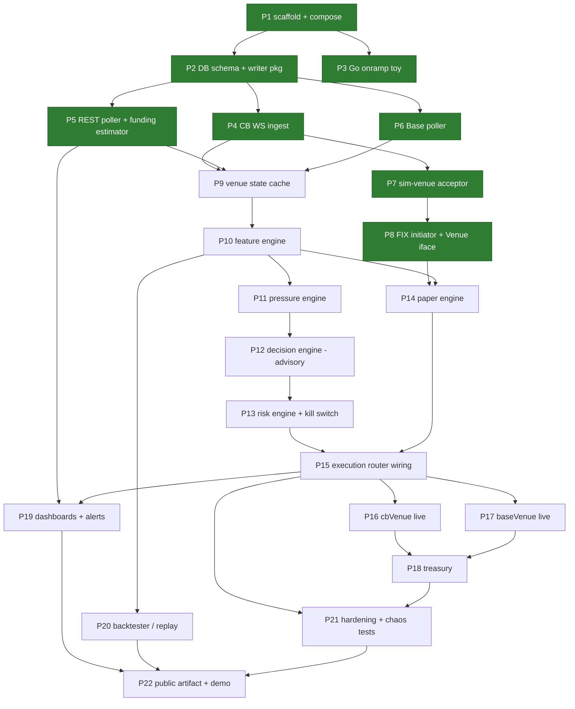

# Build Plan — Basis Carry System

**Source of truth:** [`basis-carry-build-spec.md`](basis-carry-build-spec.md) (v3.1)
**Companion docs:** [Architecture](architecture.md) · [API Spec](api-spec.md) · [PRD](prd.md) · [Venue Facts](venue-coinbase-perps.md)

This is the execution document. The build is decomposed into **numbered parts** small enough to complete and review in one sitting, sequenced so every part starts with its dependencies already merged. Each part lists objective, deliverables (file-level), tasks, acceptance criteria, and tests. Point at a part ("do Part 7") and it should be executable from this document plus the spec, without re-deriving design.

Working rules for every part (spec §1–2):

- AI writes the code; **every diff is read before commit**. Anything unexplainable is rewritten.
- Go services, Python research. Idiomatic patterns are deliverables in themselves: one writer goroutine, `context` cancellation through the stack, consumer-defined interfaces, error wrapping (not log-and-continue) except on feed loops, graceful shutdown.
- Public/private split respected from Part 1 (`.env.private` gitignored before any secret exists).
- Prices and quantities are `decimal`/`numeric` end to end — no float money.
- **Acceptance is demonstrated, not asserted.** Where a criterion can be executed — run the binary, induce the failure, scrape the metric, show the rows — it is executed, and the Evidence paragraph records what was observed rather than what was expected. Prose acceptance hides bugs that executable acceptance finds: the Part 3 backpressure claim was written as a confident sentence first, and running it instead exited 1 on a defect that also existed in Part 2's accepted writer. **Every fix ships with a test that fails against the old code, and the failure is shown.** A regression test that was never run against the defect is a guess about what it would have caught; running it there is the only thing that turns it into evidence. This has paid for itself repeatedly — a redaction test that covered four paths, all of which already worked, while three that leaked went unasserted; a test named for catching a swapped column binding that could not catch one; a rejection test that would have hung rather than failed. The same habit applies to claims in comments and docs: `TestBatchIsAtomic` and the codec-registration experiment both started as sentences that turned out to be wrong or unprovable as written.

---

## Part index and dependencies

**Status key:** green in the diagram above = complete. A completed part carries a **Status** line under its heading and an **Evidence** paragraph under its acceptance criteria recording what was actually observed, plus a dated entry in the [changelog](#changelog--decision-record).

Mapping to spec §10 weeks: P1–P3 ≈ wk 0, P4–P6 ≈ wk 1, P7–P8 ≈ wk 2, P9–P12 ≈ wk 3, P13–P15 ≈ wk 4, P16–P18 ≈ wk 5, P19–P20 ≈ wk 6, P21–P22 ≈ wk 7–8.

---

## ⛔ Funding and live-capital gates

**Nothing before Part 16 can move money.** Parts 1–15 read venues and write a local database; the only order-placing code is the FIX initiator (Part 8), which can reach nothing but `sim-venue` — there is no live FIX endpoint, and `FIX_HOST` names the simulator — no Ethereum signing code exists anywhere in the repository, and the only credential in use is a **view-only** Coinbase key. Adding `WALLET_ADDRESS` enables balance *reads* and nothing else.

Three parts change that, and each needs something from the PO **before** it can start. None of it can be provisioned by the agent — every item is an account action, a funding move, or an on-chain operation the PO performs.

| Part | Prerequisite the PO must complete first | What goes live |
|---|---|---|
| **16 — `cbVenue`** | **A second Coinbase API key**, trade-scoped and IP-allowlisted — *not* the view-only key Part 5 uses ([ADR-0016](decisions/0016-hand-rolled-coinbase-client.md) requires it be created only once the kill switch exists). CFM futures account funded with margin for one contract. | **Real perp orders.** First act is a far-from-market limit order that cannot fill, to prove place/cancel; then one tiny real round trip. |
| **17 — `baseVenue`** | **Base Sepolia funded** for the rehearsal, then the named wallet funded on **Base mainnet** with ETH for gas and USDC. **A session key provisioned by hand from the owner wallet** — router-scoped, allowance-capped, explicit expiry — which is itself an on-chain transaction the PO signs. | **Real on-chain swaps** from the named wallet. Sepolia first, then one tiny mainnet swap. |
| **18 — Treasury** | Both legs funded and a position open. A deliberate test transfer between Coinbase spot and futures. | Reconciliation across real balances; **first fully automated carry entry and exit**. |

Parts 16–18 are additionally **gated on Parts 13 and 15 being accepted** (spec §1) — the kill switch and the full loop must exist and be demonstrated before any of this is reachable.

> **Agent rule, not just documentation.** When the PO asks to build Part 16, 17 or 18, the agent **stops before writing code**, says in the conversation that this part spends real money and what must be funded first, and waits for explicit confirmation in that conversation. A gate recorded only in a file is a gate nobody is standing at. This is mirrored in [CLAUDE.md](../CLAUDE.md)'s safety rails so it is loaded every session.

---

**Parallel wallet track (manual, not code — never blocked by parts; procedure and log template in the [manual carry playbook](manual-carry-playbook.md)):** wk 0a wallet bootstrap → wk 0b manual carry #1 (the reference sequence) → manual carry #2 opened wk 1, closed wk 2 → manual carry #3 timed by Part-12 advisory signals wk 3 → first automated cycle after P16–P17 → continuous small-size after P19. If a part slips, the week's manual carry still happens.

---

## Phase A — Foundations (wk 0)

### Part 1 — Repo scaffold, Compose stack, config

> **Status: ✅ complete** — accepted 2026-08-16 (`8ec21d5` scaffold, `f3d51cc` decimal hardening).

**Objective:** a running empty system: three placeholder binaries, full infra stack, config loading, metrics endpoints.

**Deliverables**
- `go.mod` (single module), layout: `cmd/{ingest,carry,sim-venue}`, `internal/{ingest,venue,features,pressure,carry,risk,exec,fix,metrics,treasury,db}`, `research/`, `deploy/`, `docs/`.
- `deploy/docker-compose.yml`: `ingest`, `carry`, `sim-venue`, `timescaledb`, `prometheus`, `grafana`, `alertmanager`; Dockerfiles; Prometheus scrape config for all three binaries.
- `Makefile`: `up`, `down`, `test`, `lint`, `migrate`, `replay` (stub).
- `internal/metrics`: Prometheus registry + `/metrics` HTTP server helper used by all binaries.
- Config loader (env → typed struct per binary), `.env.example` with every variable from [API spec §7](api-spec.md#7-configuration-surface) (synthetic values), `.gitignore` covering `.env.private`, FIX stores/logs, data dirs.
- Logging: stdlib `log/slog`, JSON in containers.
- `golangci-lint` config; CI stub optional.

**Acceptance**
- `make up` → all 7 services healthy; each binary serves `/metrics`; Grafana reaches Prometheus and TimescaleDB datasources.
- `make lint` and `make test` pass (trivially).

**Evidence (2026-08-16).** `make up` brings all 7 services to healthy (`--wait` gates on each container's health check); each binary serves 39 metric families on `/metrics` and Prometheus reports `up=1` for all three jobs; both provisioned Grafana datasources return `status: OK` from the health API. `make lint` reports 0 issues; `make test` is green under `-race`, with `goleak` on the metrics server and the module-wide decimal guard. Beyond the letter of the criteria: `SIGTERM` drains the metrics server and exits 0, and the three config safety rails (intraday margin, leverage cap, delta tolerance) were each demonstrated refusing to start the binary.

**Carried forward:** the `decimal` ↔ `numeric` round trip and the `jsonb` snapshot encoding are the two precision boundaries `internal/guard` cannot see — both are Part 2 acceptance items ([API spec §3.5](api-spec.md#35-decimal-rules)).

### Part 2 — Database schema, migrations, writer package

> **Status: ✅ complete** — accepted 2026-08-17.

**Objective:** the full v1 schema and the shared one-writer persistence layer.

**Deliverables**
- `internal/db/migrations/*.sql`: every hypertable and state table from [API spec §5](api-spec.md#5-database-schema), TimescaleDB extension + hypertable creation, indexes on `(product_id, ts desc)` for series tables; `make migrate` applies (golang-migrate or equivalent).
- `internal/db`: pgx pool setup; `Writer` — a goroutine owning batched inserts fed by a channel of typed rows (interval + size flush triggers, per-table batches); insert helpers per table; graceful `Close` that flushes.
- Seed: `cb_products` row for the perp product (placeholder contract size / tick until Part 5 fills it from the products endpoint).
- Includes `cb_account_state` (polled margin/balance snapshot) and the `funding_events.kind` accrual-vs-settlement split — both are load-bearing for reconciliation, not later additions.

**Acceptance**
- Fresh `make up && make migrate` creates all tables; hypertables confirmed via `timescaledb_information`.
- Writer test: 10k rows across 3 tables through one writer, all persisted, one flush on close, no goroutine leaks (`goleak`).
- **Precision round trip** (carried forward from Part 1): a value with more significant digits than a `float64` can represent survives `decimal → numeric → decimal` byte-identical, proving the pgx codec is not routing through a float. The `decisions.input_snapshot` `jsonb` encoding is decided and tested the same way — a decimal marshalled as a JSON number can be read back as a float by any other consumer, so this is a contract choice, not a detail ([API spec §3.5](api-spec.md#35-decimal-rules)).

**Evidence (2026-08-17).** From an empty volume, `make up && make migrate` creates all 14 tables plus `schema_migrations` and reports `schema_version=3`; `timescaledb_information.hypertables` lists exactly the seven series tables from API spec §5.1; the seed row reads `ETP-20DEC30-CDE / 0.10 / UNVERIFIED` with every unverified venue number NULL, and a second `make migrate` logs "schema already up to date" and "perp product already present, left untouched". The integration suite (`make test-integration`, 24 tests + 28 subtests, green under `-race`) drives the acceptance items: 10,000 rows across `cb_venue_state`, `cb_bars` and `base_state` through one writer land as 3,334 / 3,333 / 3,333 rows with the pending remainder flushed on `Close`, and `goleak` covers the writer goroutine. Precision: `9007199254740993` (2^53 + 1), `9007199254740993.0000000000000001`, `0.1000000000000000055511151231257827`, `123456789012345678901234567890.123456` and `-0.0000000000000000000000000001` all round trip byte-identical through `numeric`; a `float64` path would have failed the first value. The `jsonb` snapshot stores `"9007199254740993.0000000000000001"` as a quoted string ([ADR-0011](decisions/0011-decimal-json-encoding.md)). Beyond the letter of the criteria: a schema-versus-row-type test walks `information_schema` for all 14 tables so the migrations and the Go structs cannot drift; re-inserting a candle, a trade bucket or a backfilled funding row is a no-op; the `CHECK` constraints reject an unknown `funding_source` and a `SETTLEMENT` carrying an hourly rate; and `make lint` reports 0 issues with the integration build tag included.

**Correction (2026-08-18, found in Part 3).** This part was accepted with a shutdown defect in `internal/db.Writer`: flushes triggered by batch size or the interval ran on the root context, so a cancellation landing mid-batch skipped the drain and final flush and lost accepted rows. Fixed under Part 3 — see that part's changelog entry. The acceptance evidence above stands; what it did not cover was the one shutdown in which a write is already in flight.

### Part 3 — Go onramp toy *(collaborative part — hand-written first, waived by the PO)*

> **Status: ✅ complete** — accepted 2026-08-18. Built by AI on PO instruction; see the deviation below.

**Objective:** spec wk-0 learning exercise: Jason hand-writes it, then it is refactored with review. Not production code; lives in `research/onramp/` or a branch.

**Scope:** two goroutines read a fake WS feed, fan into a channel, one writer inserts to Postgres via pgx, `/metrics` exposed. Read *Go by Example*: goroutines, channels, `select`, `context`, errors, interfaces.

**Acceptance:** it runs; the refactor diff is read and each change explainable. This part is **pointed at explicitly by Jason when he's written his version** — do not pre-write it.

**Deviation (2026-08-18, PO-directed).** The hand-written-first rule was waived mid-session: the exercise was started, and the Go distance to a working version was judged not worth the time. The half of the acceptance criterion that depends on it — "the refactor diff is read and each change explainable" — cannot be met as written, because there is no before-version to diff against. It is replaced by [`research/onramp/README.md`](../research/onramp/README.md), a walkthrough that reads the code in dependency order, names the Go concept behind each construct, and ends with a table of deliberate breakages that each demonstrate one invariant. "Each line explainable" survives; "each change explainable" does not apply. The learning goal itself is not closed by this part — it moves to reading the Part 4 diffs, which are the same patterns against a real socket.

**Evidence (2026-08-18).** `go run ./research/onramp -run-for 12s -interval 100ms` writes 238 rows to `onramp_ticks`, 119 per product, from two feed goroutines fanning into one buffered channel and one writer goroutine. Prices land exact against `numeric` (`3448.70`–`3453.70` perp, `3449.00`–`3451.00` spot) through the shopspring codec `db.Connect` registers, with no float in the path. A mid-run scrape of `:9109/metrics` shows both `onramp_ticks_produced_total` series advancing together, `onramp_rows_written_total` behind them by the unflushed batch, `onramp_write_queue_depth` at 0, and the Go runtime collectors present; `/healthz` returns `ok`. The shutdown log is the ordering proof: both feeds stop on context cancellation, then `writer stopped final_flush_rows=19`, then the metrics server — the writer outlives cancellation by design, and the endpoint outlives the writer so the final flush is still scrapeable. `go test -race -count=1 ./research/onramp` is green: batching at the size threshold, the partial final flush, the final flush on an already-canceled context, positional insert arguments, a wrapped insert failure, a table-driven price walk compared with `.Equal`, a feed parked on a full channel that still observes cancellation, and `goleak` over the package. Backpressure was demonstrated separately rather than asserted, and it found a bug: at `-interval 1ms -batch-size 1 -queue 4`, one round trip per row makes the writer the bottleneck, and the first run of that scenario exited 1 with `insert 1 ticks: timeout: context deadline exceeded` — the `-run-for` deadline had landed while a batch was in flight, and only the *final* flush was protected from cancellation. Every write now runs on `context.WithoutCancel` bounded by its own timeout, because cancellation is meant to stop the feeds, not to kill a round trip already in progress; `TestWriterNeverWritesOnACanceledContext` is the regression. The re-run exits 0 with `onramp_write_queue_depth` pinned at the queue ceiling and the feeds throttled from 1000 ticks/s to roughly 270 — producers blocking on a full channel instead of memory growing. `make lint` reports 0 issues.

---

## Phase B — Ingestion (wk 1)

### Part 4 — Coinbase WS ingest

> **Status: ✅ complete** — accepted 2026-08-21, diff reviewed and merged in PR #6. The soak, the SIGTERM flush and the network pull all ran against the live venue and a real TimescaleDB. The one criterion still open is the first one, which is Jason's to close by reading the diff.

**Objective:** live ETH market data flowing into TimescaleDB with reliability plumbing.

**Deliverables**
- `internal/ingest/ws.go` + per-channel handlers: `ticker`, `level2`, `market_trades`, `candles` (**5m — the channel serves nothing else**, see the deviation below), `status` — subscribed for both the perp product and the spot reference product where the spot carries information, **one connection and one goroutine each**, plus `heartbeats` on every connection ([API spec §3.6](api-spec.md#36-ingest-channel-messages)). ~~JWT refreshed before expiry and on reconnect~~ — **not needed and not built:** market data is unauthenticated (deviation below).
- Reconnect loop per stream: exponential backoff + jitter, resubscribe, `ingest_ws_reconnects_total`.
- Gap detection per stream (envelope `sequence_num` discontinuity, candle-time discontinuity, trade-time regression, silence threshold) → `ingest_ws_gaps_total`; `ingest_last_seen_timestamp_seconds` gauge per stream.
- Persistence policy: completed candles → `cb_bars`; top-N book snapshot every `BOOK_SNAP_SECS` (with imbalance + impact px) → `cb_book_snapshots`; trade aggregates per bucket → `cb_trades_agg` (these feed the 3-minute VWAP marks the funding estimator needs); mids sampled into `cb_venue_state` by the sampler Part 5's poller also feeds ([ADR-0014](decisions/0014-one-sampler-owns-venue-state.md)).
- `cmd/ingest` wiring: root context, signal handling, graceful shutdown (cancel → streams stop → drain → writer flush → close).
- **[verify]** live WS payload shapes and that every channel accepts the perp product id; adjust structs. Close the relevant `TODO(verify)` items in [venue-coinbase-perps.md](venue-coinbase-perps.md).

**Acceptance**
- [ ] **The ingest diff was walked line by line and each change explained.** Carried over from Part 3, whose hand-written-first mechanism was waived (see that part's deviation note). The goal the waived criterion existed to serve — reading Go written by someone else and being able to explain every line of it — is met here instead, against a real socket and the same patterns. Per spec §1, anything unexplainable is rewritten; `context.WithoutCancel` and why a write timeout has to be per-call are the specific things to be able to explain, since Part 3 turned both into rules ([architecture §8](architecture.md#8-reliability-design)).
- [x] 1h run: rows accruing in all four tables; zero writer errors; kill -TERM flushes cleanly.
- [x] Pull network mid-run: reconnect metric increments, streams resume, gap recorded.
- [x] Unit tests with a fake WS server: reconnect, gap detection, candle-close-only persistence.
- [x] **[verify]** live payload shapes and perp-product acceptance on every channel.

**Evidence — the 1-hour soak (2026-08-21, 20:16:14–21:17 UTC).** `make up && make migrate`, then `cmd/ingest` in Compose against the live venue and the stack's TimescaleDB. Rows in the hour: **`cb_venue_state` 1372, `cb_bars` 20, `cb_book_snapshots` 298, `cb_trades_agg` 124** — all four accruing, **zero writer errors**, `ingest_write_queue_depth` never above 1. Stability, which is what a soak is actually for: goroutines flat at 18–21 across 332 ten-second samples, RSS 20.8 → 23.9 MB, no trend in either.

*The soak earned its hour by finding a bug that no amount of reading had.* At T+35 `cb_bars` had gained **one** row where it should have gained twelve, and ETH-USD none — silently, with nothing in the logs. Measuring the channel explained it: the venue sends a 100-candle `snapshot` on subscribe and then `update` messages carrying **exactly one** candle, the one still forming. The completion rule looked for a newer candle *in the same message*, so on the five-minute roll the update carried only the new candle and the one that had just closed was never mentioned again. Every unit fixture had carried several candles — the shape of a snapshot, not an update — and the 150-second live test never crossed a boundary. The rule now tracks the newest start seen *across* messages and writes a candle once a strictly newer one appears, carrying its final values rather than whichever snapshot happened to mention it. It was self-healing on restart, which is the uncomfortable part: the fixed binary immediately wrote the missing bars out of the replayed window (ETH-USD 99 → 132, ETP 100 → 133), so an outage longer than that ~8-hour window would have left a permanent hole in a series that looked complete. The soak clock was restarted on the fixed binary; an hour spent proving the stability of code known to be wrong proves nothing.

*Two thresholds were retuned from measurement rather than a second guess.* Over 30 minutes the perp book was fresh in 95% of samples but went quiet for up to **51 seconds** three times — a nano contract's book stops changing when its market makers are idle. `level2Silence = 30s` counted two false gaps in half an hour, and the `maxBookAge` bound added by the 2026-08-20 review punched holes in `cb_book_snapshots` during healthy periods. Both now derive from one constant, `Level2Quiet = 2m`. The re-run vindicates it: **zero level2 gaps across 44 minutes of open market**, and the two that did fire were at 21:02 and 21:07 — after the market closed and the book genuinely stopped.

*The maintenance window validated itself against a real market close.* The soak happened to span Friday 17:00 ET. `cb_venue_state.maintenance_window` reads `f` through 20:59:55 and `t` from 21:00:05 — the configured calendar matching the venue exactly. The rows around it are the more interesting evidence, because they exercise two fixes from the previous day's review in production: the spread blows out from 4.10 bps to **65.6 bps** at 20:59:55 as makers pull, the quote then freezes, and from 21:00:25 `mid` and `spread_bps` go **NULL while `maintenance_window` stays `t`**. Before that review the whole row would have been suppressed by the stale quote — no record at all of the hour the market was shut — and `mid` would have fallen back to the last trade price and written a print into a column documented as a midpoint.

**Evidence — reconnect and gap, unprompted (20:35:24).** The `status` stream took an `EOF` from the venue mid-soak, logged `reconnecting attempt=1 in=440.4ms`, resubscribed and re-reported `status=online` **0.6 s later**, with `ingest_ws_reconnects_total{stream="status"}` at 1. That is the network-pull criterion demonstrated by the venue itself, against the real socket, rather than by a simulation.

**Evidence — full network loss (21:18:53, induced).** `docker network disconnect` on the running container cuts the venue *and* the database, so this exercises the whole reliability chain rather than just the feeds. In order, from the log: the writer's batch fails (`context deadline exceeded`), `ingest streams stopped`, `metrics server stopped`, and the process exits reporting `batch insert of 2 rows abandoned after 1 attempts`. **That first line is the fix from the 2026-08-20 review working in production** — the ticker and status streams never call `Submit`, so before it they would have read a dead socket forever, `Ingest.Run` would never have returned, and the fatal error would never have been surfaced. Compose's restart policy then fired five times, each attempt failing at startup with `ping database: … network is unreachable` rather than coming up half-alive, and the binary recovered cleanly the moment the network returned (`21:19:15`, all five streams resubscribed).

**Evidence — SIGTERM (21:19:58).** With `ingest_write_queue_depth` at **2**, `docker compose stop` produced exactly the order [architecture §8](architecture.md#8-reliability-design) promises — `ingest streams stopped` → `writer stopped final_flush_rows=2` → `metrics server stopped` — and exit code **0**. `cb_venue_state` went from 2182 rows to **2184**: the two rows the producers had been told were accepted were written, not dropped. This is the criterion the previous day's review made non-trivial, since the writer now stops only at `Close`, after every producer has returned.

**Evidence — unit and static.** `go test -race -count=1 ./...` green; `internal/ingest` carries 73 tests and 8 subtests with `goleak` over the package, `cmd/ingest` 2, `internal/db` 26. `make lint` reports 0 issues with the `integration` and `live` tags included. The `[verify]` work is committed as golden fixtures in `internal/ingest/testdata/` — one frame per channel from the live socket, raw except `l2_data.json`, which is the same 74 KB frame cut down to the top twenty levels a side.

**Deviations (2026-08-20, PO-approved).**
1. ***The `candles` channel serves 5-minute candles only***, so the deliverable's "candles (1m)" cannot be met from the WebSocket. Subscribing with `granularity: "ONE_MINUTE"`, with `60`, and with nothing at all all returned candles 300 seconds apart. WS candles are written with `tf='5m'`; one-minute bars come from `GET products/{id}/candles`, which does honour the parameter, with the rest of the backfill in **Part 5**. `cb_bars` keys on `(product_id, tf, ts)`, so the two series coexist rather than colliding.
2. ***No JWT.*** All five market-data channels serve the perp product unauthenticated, so `cmd/ingest` mints no token and holds no credential. JWT is built where it is first actually needed and can be tested against a real key — the `cfm/*` account endpoints in Part 5 and order entry in Part 16. Building it here would have shipped dead code that no test could exercise.
3. ***`cb_venue_state` gets a single sampler*** rather than each producer writing its own rows ([ADR-0014](decisions/0014-one-sampler-owns-venue-state.md)). **This binds Part 5:** the REST poller and funding estimator add their observations to `internal/ingest.VenueState`; they do not construct `db.VenueStateRow`.
4. ***[API spec §3.6](api-spec.md#36-ingest-channel-messages) rewritten.*** It called for a parallel set of per-stream structs (`MidTick`, `BookSnap`, …) that the writer would map to inserts. Part 2 had already put that mapping in `internal/db`'s row types, whose interface method is unexported precisely so producers cannot invent shapes — so the section described a layer that could not exist as written. It now describes what the two timestamps it asked for are actually used for, and documents the `TimeKeeper` hook that replaces a per-handler timer.

### Part 5 — REST poller, funding estimator, backfill

> **Status: ✅ complete** — accepted 2026-08-25, diff reviewed and merged in PR #7; the PO's `cb_account_state` spot-check closed the last open item 2026-09-04. One criterion is carved out to [Part 18](#part-18--treasury-reconciliation) with reasons and PO sign-off (see **Carve-out** below) — deferred with a recorded home, not removed. The funding series exists, 45 days of it reconstructed and verified against an independent reimplementation (1,000 of 1,002 hours to 1e-9), and the account half is live against a real futures account. The backfill is **self-healing**: it runs on every start, downloads only what is missing, and costs ~1s when nothing is. Any future backfill follows the same six steps — [architecture §7](architecture.md#71-historical-recovery--the-backfill-pattern).

**Objective:** the funding / futures-mark / spot-mark series — the system's primary asset — recorded, computed where the venue does not publish it, and backfilled.

**Deliverables**
- REST poller goroutine (`POLL_REST_SECS`): products endpoint → `cb_products` upsert; open interest and the venue's own trading session → `cb_venue_state` via the sampler. Fee and leverage columns stay NULL — the public payload carries neither.
- **Local funding-rate estimator** (the headline of this part): 3-min futures mark (VWAP, mid-TWAP fallback, carried-gap last resort) and spot mark, mean of the hour's 20 sample premiums, then `0.75 × premium + 0.25 × previous`. Writes `funding_rate_est`. **As built (deviation from this line, 2026-08-24):** the venue *does* publish an hourly rate, so `funding_rate_hourly` takes the venue's value with `funding_source='venue'` and the estimator is recorded beside it in `funding_rate_est` — the plan assumed a single column serving double duty because it was written when the published field was believed empty. Rows the estimator itself writes to `funding_events` remain `funding_source='computed'`; backfilled history is `'backfilled'` ([ADR-0015](decisions/0015-backfilled-funding-provenance.md)). No rate for the Friday maintenance hour — that hour is a gap, not a zero.
- Observed funding ledger: hourly rows into `funding_events` (`position_id` NULL, `amount` 0 — nothing was held, so nothing accrued to anyone).
- Backfill: candle history → `cb_bars` at `tf='1m'`, then the funding series reconstructed from it and marked `backfilled` ([ADR-0015](decisions/0015-backfilled-funding-provenance.md)). `fundingHistory` does not publish for this product; candles do.
- `cfm/balance_summary`, `cfm/positions` and `cfm/intraday/margin_setting` → **`cb_account_state`**, with intraday margin asserted off on every poll.
- Decision point (open item #1): **closed** — [ADR-0016](decisions/0016-hand-rolled-coinbase-client.md), hand-rolled, with the credential isolated in `internal/coinbase`.

**Acceptance**
- [x] `cb_venue_state` rows every poll tick with plausible marks and funding; funding/candle history backfilled as far as the API allows (depth recorded).
- [x] Estimator sanity: over a 24h window the computed hourly series is stable and bounded — **met live 2026-08-25** (see *Live estimator window* below), having previously been demonstrated over reconstructed history.
- [x] `cb_account_state` rows accrue every poll; `intraday_margin_enabled` reads false. *(The "match the account UI" spot check was the PO's to eyeball, since this session never printed a balance — **done and matched, 2026-09-04**.)*
- [x] Funding rows are written as `kind='ACCRUAL'`.
- [→] An observed cash adjustment writes a `kind='SETTLEMENT'` row and links the accruals it cleared — **moved to [Part 18](#part-18--treasury-reconciliation), PO-approved 2026-08-24.** Not removed: the criterion is inherited there verbatim, with an addition. The ACCRUAL side keeps running and accumulating here.
- [x] Backfill re-run inserts nothing new. Poller failure degrades to staleness, never crashes the binary.

**Evidence (2026-08-24).** From an empty funding table, one startup reconstructed **45 days in 67 seconds**: 45,493 perp and 64,801 spot one-minute candles → **110,294 `cb_bars` rows at `tf='1m'`**, and **981 funding hours** with 92 unmarkable and the maintenance hours skipped (981 + 92 + the skipped hours = the 1,080 in the window, so every hour is accounted for). The series averages **+8.80% annualised** over the 45 days, ranging −52.71% to +41.27% — the right order of magnitude for ETH perp funding, and independently corroborated by a throwaway Python reconstruction run before any of this code existed, which produced 5–13% over a different day. Estimator sanity over the most recent 24 hours: **standard deviation 3.23 points annualised, largest hour-to-hour move 12.03 points** — stable and bounded, which is the 0.75 smoothing doing its job. Idempotency is structural rather than asserted: every insert carries `ON CONFLICT … DO NOTHING` against the natural key, so a re-run lands as conflicts, and the same property settles precedence in the right direction — a recorded row always beats a reconstructed one.

The account half runs against a real futures account with a view-only Ed25519 CDP key: `cb_account_state` rows every 5 s, `intraday_margin_enabled` **false**, `available_margin` and `liquidation_threshold` present, and **zero warnings or errors** since the fix below. `go test -race -count=1 ./...` is green; `make lint` reports 0 issues with the `integration` and `live` tags included.

**Live estimator window (closed 2026-08-25).** The reconstructed-history evidence above exercised the backfill path; this criterion asks about the live runner, which had never emitted a row until the record was reset. It has now produced **30 consecutive hourly rows** (2026-08-24 14:00 → 2026-08-25 19:00 UTC) with **zero gaps**, over ~30 h of unbroken uptime and **0 error lines**. Stability against the benchmark already recorded for the reconstructed series (sd 3.23 pp, largest move 12.03 pp): live **sd 3.93 pp annualised, largest hour-to-hour move 5.99 pp**, range +12.30% to +28.32% annualised — comparable scatter, materially tighter jumps, and the right order of magnitude throughout.

The stronger check is external. Now that the venue's own published rate is recorded beside the estimate, the two can be differenced directly: over the same 30 hours the estimator sits **+0.22 pp annualised** from the venue's number with **sd 1.91 pp** — under 1% relative on rates of 12–28%, i.e. no material persistent bias. That figure needed the full window to be trustworthy: at 9 hours it read +1.10 pp, which was an artifact of a monotonically rising regime rather than a bias, and it decayed as the series covered both directions.

The residual is **regime-dependent**, and that is diagnostic rather than alarming: +1.74 pp while the venue's rate is rising, +0.14 pp while falling, −0.65 pp while flat. A scale error would hold one sign and magnitude across all three; a *phase* difference produces exactly this ordering. It corroborates the one-hour offset recorded in [venue doc §3](venue-coinbase-perps.md) — our `ts = H` aligns with the venue's value published at *H+1* — which also cuts the scatter from 2.90 to 1.91 pp. **Part 12 must apply that alignment before treating any difference as `carry_funding_reconciliation_error`**, or it will report roughly double the true divergence and inherit a rising-market bias on top.

**Venue findings that cost a poll each until they were found.** The REST trades endpoint is `products/{id}/ticker`; `market_trades` — the obvious name, and the WebSocket channel's name — 404s. `cfm/intraday/margin_setting` returns `setting` as a **bare string**, not the nested object the field name implies: decoding it as an object failed on every single poll, and because the poller degrades rather than crashes, the only symptom was `intraday_margin_enabled` sitting NULL — which is to say nobody checking the one setting v1 requires to be off. Both shapes are now accepted. And **`margin_ratio` is NULL, not zero, for an account with no position**: the venue reports `liquidation_threshold = 0`, so the ratio is undefined. Part 13's floor must read NULL as "nothing at risk"; reading it as zero would look like imminent liquidation on an empty account.

**Carve-out: `SETTLEMENT` rows and accrual linking move to Part 18.** The mechanism cannot be built here, for two reasons that are structural rather than scheduling:

1. **There is nothing to observe.** Funding settles as a cash adjustment against an *open position*. This account holds none, so no settlement exists to record, and a test against a fabricated one would prove only that the fabrication round-trips.
2. **`settled_by` needs an update path the writer does not have.** It is a foreign key to `funding_events.id`, which the database generates; `internal/db.Writer` is append-only and deliberately never reads generated ids back, because a producer that did would be a second writer ([ADR-0012](decisions/0012-idempotent-inserts-natural-keys.md)). Linking an accrual to the settlement that cleared it is an `UPDATE`, and inventing one inside the one-writer layer to satisfy a criterion that has no data behind it is the wrong order to do things in.

Part 18 owns treasury reconciliation, holds the position that generates settlements, and is where the twice-daily cash adjustment is observed. The criterion moves there intact rather than being weakened here.

**PO-approved 2026-08-24**, on two conditions, both met or carried:

1. **The ACCRUAL side keeps running.** Only the settlement *linkage* is deferred; hourly accrual recording continues here and accumulates rows in the meantime. Nothing about `kind='ACCRUAL'` is affected.
2. **Part 18 inherits the criterion verbatim, plus one addition:** the first real observed settlement must reconcile against the accruals it cleared *within tolerance*, and that reconciliation is the test. Recorded in Part 18's acceptance.

Same mechanism as the Part 3 hand-written-first waiver and the Part 4 JWT deferral: a deferred criterion gets a recorded new home, never a silent removal.

### Part 6 — Base poller

> **Status: ✅ complete** — accepted 2026-09-04, diff reviewed and committed as `34d9751` on `main`. Every acceptance item was demonstrated against Base mainnet through the PO's Alchemy endpoint, and an [adversarial review](reviews/part6-adversarial-findings.md) ran over the diff before it landed. Balances and price cross-checked against an independent node at the same block, degradation induced against a refusing endpoint, and a boundary-skipping defect found by the live run and fixed in two components. `WALLET_ADDRESS` points at a public Base address: nothing in this part reads or references the named wallet, and setting it stays the PO's.

**Objective:** the spot side of the book: wallet balances, reference price, gas.

**Deliverables**
- `internal/ingest/ethrpc.go`: a hand-rolled JSON-RPC client — `eth_blockNumber`, `eth_getBalance`, `eth_gasPrice`, `eth_call` — with a parsed `Address` type, keccak-derived method ids, address-argument encoding and fixed-word decoding ([ADR-0017](decisions/0017-hand-rolled-base-rpc.md), amending [spec §3](basis-carry-build-spec.md#2-language-and-tooling), which named `go-ethereum`).
- `internal/ingest/base.go`: poll (`POLL_BASE_SECS`) wallet ETH via `eth_getBalance`, USDC via `balanceOf`, `eth_gasPrice`, ETH/USDC reference px → `base_state`. **As built (deviation from this line):** the reference price is read from the configured Base pool's own `slot0()` rather than from a DEX *aggregator quote*, with the in-process Coinbase mid as the configured fallback ([ADR-0018](decisions/0018-base-spot-px-from-the-pool.md)). Every mainstream aggregator now needs a provisioned API key, and `base_state.spot_px` is documented as a reference rather than an executable quote — Part 14 already models slippage separately. **This does not close [spec §12](basis-carry-build-spec.md#12-open-items) item 2**, which decides where the automated leg *executes* in Part 17.
- Wallet address from config; works against any address.
- Three new config variables, in [api-spec §7](api-spec.md#7-configuration-surface) and `.env.example`: `BASE_USDC_CONTRACT`, `BASE_WETH_CONTRACT`, `BASE_SPOT_POOL`, defaulting to Base mainnet. Two new metrics in [api-spec §6](api-spec.md#6-prometheus-metrics): `ingest_base_last_block` and `ingest_base_spot_px_source_total`.

**Acceptance**
- [x] `base_state` rows accruing with correct balances, **cross-checked against an independent node** — see the table below. A second node was used in place of a block explorer because it can be asked for the *same block*, which a web page cannot.
- [x] RPC failure → staleness, not crash. Demonstrated live against a refusing endpoint, not only in tests.
- [x] The pool is the pair it claims to be, and its price is arithmetically right.

**Evidence — degradation, and the granularity of it (unit, 2026-09-04).** The rule this part had to satisfy is [architecture §8](architecture.md#8-reliability-design)'s, but four columns from four independent reads make "degrade to staleness" a question of *granularity*, and the tests pin the answer: a gas price the node will not quote leaves `gas_gwei` NULL and does not throw away a wallet balance that was read perfectly well; a poll that could read nothing at all writes **no row**, because a missing row is a visible gap where a row of NULLs claims an observation that did not happen; and a failure to read the block height skips the whole row rather than falling back to `latest`, since every other read is pinned to that height so a row is one moment on the chain rather than a smear across three. `internal/ingest` now carries **54 Part-6 tests and subtests**; `go test -race -count=1 ./...` is green across the module and `make lint` reports 0 issues with the `integration` and `live` tags included.

**Evidence — four mutations, each run against deliberately broken code.** Tests that have never seen the bug they are named for are a guess about what they would catch ([Part 3's lesson](#part-3--go-onramp-toy-collaborative-part--hand-written-first-waived-by-the-po)), so each of the load-bearing four was checked by breaking the code under it:

| Mutation | What failed, and how it read |
|---|---|
| `read(ctx, LatestBlock, …)` instead of the pinned tag | `eth_getBalance … read at "latest", want "0x2160ec0"` |
| the pool's token check replaced with `case true` | `spot_px = 400000000.0000000000000001, want 2499.5` |
| the pool layout not cached | `token0() was read 3 times, want 1` |
| a row written even when nothing was readable | `wrote 1 rows with nothing readable: [{TS:… SpotPx:{Valid:false} WalletETH:{Valid:false} …}]` |

The second is the one worth reading twice. A pool holding some other pair answers `slot0()` perfectly happily, and **`400000000.0000000000000001` is what would have gone into `spot_px`** — a number with no error attached to it, in the column the spot leg is marked against. That is why the pool's `token0()`/`token1()` are checked against the configured WETH and USDC on the first read instead of trusted, why the mismatch is permanent and logged at `ERROR`, and why each token's `decimals()` is read rather than assumed at 18 and 6 (the bridged USDbC sits beside native USDC on the same chain).

**Evidence — the price arithmetic.** `slot0()` reports sqrt(token1 per token0) scaled by 2^96, in smallest units, so the conversion is a square, a division by 2^192 and a shift by the difference of the decimals. It is tested on values a reviewer can check by hand rather than on a captured number: `sqrtPriceX96 = 2^96` is a raw ratio of exactly 1, which at 18 decimals against 6 is 10^12 USDC per ETH — and the same pool with its tokens the *other* way round has to give the same answer, which is what makes the inversion branch a check rather than a restatement. Doubling the sqrt price quadruples the price. A zero sqrt price is an uninitialized pool and an error, not a price of zero. One realistic case sits at 2500 USDC/ETH.

**Evidence — the live run (2026-09-04, Base mainnet via Alchemy).** Against a public Base address, not the named wallet: `WALLET_ADDRESS` stays the PO's to set, and nothing in this part reads or references the real one. The pool answered its own description on the first poll — `token0` WETH, `token1` USDC, decimals 18 and 6, ETH on side zero — which turns the three committed contract defaults from constants into verified ones.

The cross-check is stronger than the criterion asks for. Rather than eyeball a block explorer, every column of one row was **re-read from a second, independent node** (the public `mainnet.base.org`) at the same block, and the price recomputed from that node's `slot0` in Python's arbitrary-precision `decimal`:

| Column | Recorded | Independent read at block `0x3088e5c` |
|---|---|---|
| `wallet_eth` | `3.128598018118078032` | `3.128598018118078032` |
| `wallet_usdc` | `41.446887` | `41.446887` |
| `spot_px` | `2451.8722712397392396` | `2451.8722712397392396` |

The price agrees to all sixteen decimal places, which is the whole `sqrtPriceX96` conversion checked against a different implementation. Finding *which* block reproduced it was itself the test of the pinning: the recorded value matched exactly one block in a scanned window of forty, so the row is one moment on the chain rather than three.

**Evidence — degradation, live (02:12:32→02:15:54).** A second ingest instance was started against the same host with a deliberately wrong key. The block read failed `http 401`, classified **`retryable=false`** (a 401 is not a wait-and-see), and the poller emitted **one** warning across roughly seven poll intervals rather than one per tick. The container stayed up with **0 restarts and 0 ERROR or FATAL lines**, and its other feeds carried on. That is "RPC failure degrades to staleness, never crashes" observed rather than asserted.

**The live run found a defect that no test had — the same one Part 4 found, in two more components.** `base_state` was missing boundaries: 20 rows over 10.5 minutes with two 60-second gaps where 30 was expected. Measuring the three pollers against a generated series of boundaries named the cause:

| Table | Scheme | Boundaries missing |
|---|---|---|
| `base_state` | `time.Ticker` (Part 6, as written) | **2 of 20** |
| `cb_account_state` | `time.Ticker` (Part 5, **accepted**) | **11 of 120** |
| `cb_venue_state` | `untilNextBoundary` (Part 4's fix) | 1 of 121 |

A ticker keeps its period but not its phase against the wall clock, and these rows are keyed on a *truncated* timestamp — so a tick arriving a hair late crosses into the next window, truncates onto a boundary already written, is dropped by `ON CONFLICT … DO NOTHING`, and takes its own boundary with it. Part 4 documented this after it silently dropped 914 rows; Parts 5 and 6 then both wrote `time.Ticker` anyway. The scheme now lives in one function, `runOnBoundary`, that all of them call, so there is no fourth component to rediscover it in.

**After the fix**, over 11 minutes on the same stack: **`base_state` 0 missing of 22**, `cb_account_state` 3 of 128, `cb_venue_state` 1 of 128. The account poller's residual is real but is not this defect, and the data says so: **one of its three misses is an instant `cb_venue_state` missed too** — two independent goroutines, one of them already on the correct scheme, so that instant is a process stall rather than a sampling bug. The other two are consecutive-ish and unshared, which is what a poll running past its own interval looks like: `cb_account_state` is three sequential authenticated REST calls on a **5-second** cadence, and a boundary that arrives while the venue is still answering is a boundary that genuinely could not be observed. That is honest staleness — a missing row — rather than a row computed and then dropped, which is what the ticker was doing. `base_state` has 30 seconds of headroom for five RPC calls and misses none.

**The first regression test written for it was worthless, and saying so is the point.** It drove the real loop with a hostile starting phase and real timers — and **passed against the `time.Ticker` code it was written to catch**, because the skip needs a tick to actually run late and on an idle machine none did. It is the *third* time this project has produced a test that could not fail against the defect it was named for. The wait is now an injected seam, so the lateness is scripted and the run is deterministic: against the fixed-period scheme the test reports `boundary 12:00:15Z followed 12:00:05Z: gap of 10s, want exactly 5s`, and against the fix it is green.

**No backfill.** `base_state` is point-in-time wallet and gas state and belongs in the "not recoverable" row of the [backfill pattern](architecture.md#71-historical-recovery--the-backfill-pattern): balances only exist from when polling starts. Historical balances *are* technically reconstructable from archive-node state at past blocks, but that needs an archive RPC tier and buys history for a wallet that had no position before this system existed — so it is deliberately not done. If that ever changes, it follows the six steps in that section rather than inventing its own shape.

**`spot_px_source` added on PO direction (2026-09-04), migration `000006`.** The fallback writes a price from a different market into the same column, so without provenance a row read back later could not say which market it described — the same defect `funding_source` exists to prevent ([ADR-0015](decisions/0015-backfilled-funding-provenance.md)). The column is `CHECK`-paired with `spot_px` in **both** directions, because a column that is merely usually set is one nothing downstream can rely on. Adding the constraint immediately caught a stale fixture in the existing `TestEveryInsertIsIdempotent`, which had been writing a price with no source.

**No backfill.** `base_state` is point-in-time wallet and gas state and belongs in the "not recoverable" row of the [backfill pattern](architecture.md#71-historical-recovery--the-backfill-pattern): balances only exist from when polling starts. Historical balances *are* technically reconstructable from archive-node state at past blocks, but that needs an archive RPC tier and buys history for a wallet that had no position before this system existed — so it is deliberately not done. If that ever changes, it follows the six steps in that section rather than inventing its own shape.

---

## Phase C — Order entry (wk 2)

### Part 7 — sim-venue (FIX acceptor)

> **Status: 🟢 every acceptance item demonstrated 2026-09-16, against the live Compose stack and a scripted FIX client; an [adversarial review](reviews/part7-adversarial-findings.md) ran over the diff on 2026-09-17 and 20 of its 30 findings were acted on; awaiting the PO's diff review.** Orders ran over a real socket against real recorded market data — `ETP-20DEC30-CDE` at 2399.50/2400.50 from ingest's own `cb_book_snapshots` rows — and the sequence numbers survived a container restart on the new `fix-store` volume. **Two of the acceptance criteria were being guarded by tests that could not fail**, which the review found and which are now red-then-green against the defects they name.

**Objective:** the exchange simulator: quickfixgo acceptor with a realistic fill model.

**Deliverables**
- `cmd/sim-venue` + the acceptor half of `internal/fix`: FIX 4.4 acceptor per [API spec §4](api-spec.md#4-fix-44-specification) (session settings built in code, FileStore, FileLog). *Read as the acceptor half of package `fix` rather than an `internal/fix/acceptor` subpackage, matching the package's own doc comment and Part 8's `internal/fix/initiator.go`.*
- Message handling: NOS (D) → ExecutionReport(NEW) then fill reports; OrderCancelRequest (F) → ER(CANCELED) or OrderCancelReject (9); malformed → Reject (3).
- Fill model: fills against last top-of-book read from TimescaleDB; configurable latency (jittered), slippage bps, partial fills above `SIM_PARTIAL_THRESHOLD` (`SIM_PARTIAL_SLICES` slices); deterministic under seed.
- Fills persisted to `fills` (venue='sim'); session state to `fix_sessions`; `fix_*` metrics.

**Four open points settled by the PO, 2026-09-15** — each one a gap the plan did not fill, named rather than guessed. The two that shape what a fill *means* are recorded as [ADR-0019](decisions/0019-sim-fills-against-recorded-book.md), because Parts 14 and 20 answer the same question again:

| Question | Decision |
|---|---|
| Does a non-crossing limit order ever fill later? | **It rests**, re-evaluated on each book read (new `SIM_BOOK_POLL_SECS`, 1s). An order that cannot fill is deferred to the next read, which is also what keeps the engine's loop from spinning |
| The plan's "N slices" had no value | **`SIM_PARTIAL_SLICES`, default 3.** Whole contracts, remainder on the last slice, summing to the order exactly |
| No book, or a stale one | **Reject at entry** with `no market data` (new `SIM_BOOK_MAX_AGE_SECS`, 60s); a resting order simply stops filling. Never a fabricated fill |
| `fix_sessions` is `ON CONFLICT DO NOTHING`, so a row written at logon can never gain its `ended_at` | **Upsert**, as `cb_products` already does. Same key, no migration — only the conflict clause changed |

**Acceptance**
- Bring-up with a scripted FIX client: D→8(NEW)→8(FILLED) round trip; oversized order produces partials summing to full qty; cancel works both pre-fill and mid-partial.
- Restart sim-venue: sequence numbers persist, session resumes without reset.

**Evidence (2026-09-16).** A scripted quickfixgo client on the host, against the Compose `sim-venue` with `ingest` writing live book snapshots beside it:

- **Round trip.** `D` → `8` ExecType=0/OrdStatus=0 LeavesQty=3 → `8` ExecType=F/OrdStatus=2, LastQty=3 at **2400.48** — the 2400.50 ask is not what filled: the touch was 2400.00 and two basis points of adverse slippage is 2400.48, arithmetic anyone can redo from the `cb_book_snapshots` row.
- **Partials.** A 35-contract sell printed **11, 11, 13 = 35**, OrdStatus 1, 1, 2, CumQty 11 → 22 → 35 and LeavesQty 24 → 13 → 0, at 2399.02010 against a 2399.50 bid. Three `fills` rows, `sum(qty) = 35`.
- **Cancels.** Pre-fill: a buy at 1000 rested, then `F` → `8` ExecType=4 with CumQty 0, LeavesQty 0, Text `canceled on request`. Mid-partial is covered by a test at a 500 ms venue latency, where the window is wide enough to be a fact rather than a race.
- **Business rejection.** An OrderQty of 1.5 came back `8` ExecType=8 Text `OrderQty must be a positive whole number of contracts` — the quantization rule enforced at the venue boundary.
- **Restart.** The venue's last outbound sequence before `docker compose restart sim-venue` was **22**; after it the session logged on at **23** and continued 24, 25, 26. No reset, no resend needed.
- **Resend recovery, unplanned.** A client reconnecting with a *fresh* store asked for everything from sequence 1 and the venue replayed its store — SequenceReset-GapFill for the admin messages, the nine ExecutionReports verbatim, then live traffic at 20. The behaviour §4.1 calls "standard resend handling", observed rather than assumed.
- **Rows and metrics.** `fills` under `venue='sim'`, `leg='perp'`, `exec_state` PARTIAL/FILLED, `venue_exec_id` = the FIX ExecID. `fix_sessions`: **one row** across three connect/disconnect cycles, `disconnects=3`, `last_in_seq=23`, `last_out_seq=38`. `simv_orders_total`, `simv_book_age_seconds`, `simv_resting_orders`, `fix_session_up`, `fix_msgs_total{dir,msg_type}` and `simv_rows_written_total{table}` all served from `:9103/metrics`.
- **Suites.** `make test` green (`-race`, includes the socket-level acceptance tests, which need no database); `make test-integration` green, including the new `LatestBook` and `fix_sessions` upsert cases; `make lint` 0 issues.

**One defect found by the live run and fixed in the same session.** The first demonstration produced *three* `fix_sessions` rows carrying disconnect counts of 1, 2, 1 — a row per logon, with a per-process counter split across them and reset by the restart. A row per connection makes `disconnects` a column that can only hold 0 or 1, and a running total split across rows is unreadable in either direction. One row now covers one process's session: opened at the first logon, rewritten at each logout, reopened (`ended_at` back to NULL) on reconnect.

**A known upstream leak, recorded rather than hidden.** quickfixgo v0.9.11 arms two `time.AfterFunc` timers — logon timeout and logout timeout — that fire into the session's event channel with a bare send. After the session stops, nothing reads that channel, so each leaks one goroutine for the life of the process. The library guards two neighbouring sends against exactly this and comments on it; these two it does not. `goleak` ignores both by name in `internal/fix`, with the mechanism written out. It is visible in production through `go_goroutines`, which every binary already exports: a sim-venue whose client flapped would show it as a slow climb.

*Corrected after the adversarial review: only the **logout** timer is sim-venue's. The logon timer is armed solely by initiators — `session_state.go` returns early on `!session.InitiateLogon` — so an acceptor never arms it. It shows up in this package's test runs because the scripted client is an initiator, and it is what `carry` will leak once Part 8 gives it a session. The original wording told an operator to watch sim-venue for a climb it cannot produce on its own.*

### Part 8 — FIX initiator + `Venue` interface

> **Status: 🟢 every acceptance item demonstrated 2026-09-17 (times below are UTC, 2026-09-18), against the live Compose stack; an [adversarial review](reviews/part8-adversarial-findings.md) ran over the diff on 2026-09-18 and all 13 of its 33 verified findings were fixed; awaiting the PO's diff review.** `carry` sent a NewOrderSingle over its own FIX session and read the fill back through the state machine; then, with a slow venue and `carry` killed after the acknowledgement, the fill printed while nobody was listening and arrived by resend recovery when `carry` came back. **The review found that this part shipped a defect against that very criterion** — roughly half the reports arriving during a shutdown were acknowledged to the venue and thrown away — which is now red-then-green under test. **Open items for the PO are listed below**; `ORDER_TIMEOUT` is one of five.

**Objective:** `carry`'s order-entry stack: the interface every venue implements, the exec-report state machine, and the FIX implementation.

**Deliverables**
- `internal/carry/venue.go`: `Venue` interface + `Order`/`Ack`/`ExecReport` types exactly per [API spec §3](api-spec.md#3-internal-go-contracts).
- `internal/exec/statemachine.go`: order-state tracking (NEW→PARTIAL→FILLED|CANCELED|REJECTED), CumQty-monotonic sequencing, idempotent duplicates, per-order timeout.
- `internal/fix/initiator.go`: `fixVenue` — quickfixgo initiator, Order→NOS mapping, ER→ExecReport mapping, session-state metric, ClOrdID = ULID.
- Round-trip latency histogram (`carry_order_roundtrip_seconds`).

**Decisions made in this part** — each a gap the plan did not fill, decided rather than guessed where a conventional answer existed and **flagged** where none did. The three that shape what every later venue does are [ADR-0020](decisions/0020-initiator-delivery-guarantees.md):

| Question | Decision |
|---|---|
| The plan names a per-order timeout and gives it no value | **`ORDER_TIMEOUT`, placeholder `30s`, flagged for the PO.** It is a bound on how long an acknowledged order may go unanswered before the router is told, not a lifetime — a resting limit order outlives any timeout. Nothing in the docs measures it; the sim's latency (20 ms) and a live ack (sub-second) bound it from below, and nothing bounds it from above |
| `ExecReport` had no field for the venue's execution id, yet `fills.venue_exec_id` is `NOT NULL` and "every venue supplies one" | **`ExecID` added to `ExecReport`** (api-spec §3.2). The one contract addition; it is also what lets a resent report be recognised as a duplicate exactly rather than by inference |
| What `Submit` does while the session is down | **Refuses, `ErrSessionDown`, nothing sent.** quickfix would queue the order into its store for the venue's resend to recover — an order executing at a price chosen before the link died |
| What an OrderCancelReject does to the order | **Logged and counted, not on the report channel.** The next ExecutionReport says what the order is |
| A report for an order the tracker never saw | **Adopted**, under its own outcome. After a restart every resting order is one |
| Should `carry` record `fix_sessions` rows of its own | **No, not in this part.** The row is the venue's record of the session and already exists; carry has no writer yet and a second row per session from the other side would be the same session under another name. Revisit when carry gains its writer (Part 12) |
| `ALO` and `ReduceOnly` over FIX 4.4 | ALO **refused** (post-only is an `ExecInst` the simulator does not honour; a GTC in its place takes liquidity it was told not to). ReduceOnly **not carried** — no standard tag; the router enforces it by what it asks for |

**Open items named for the PO rather than decided** — each is something the plan and the spec do not say, where a defensible guess would be indistinguishable from a decision until it was wrong. None blocks Part 9.

| Open item | What is undecided, and what it costs to leave open |
|---|---|
| `ORDER_TIMEOUT` (30 s placeholder) | Nothing in production asks the question it answers — `Tracker.Overdue` has no caller until Part 15's router — and no series exports open or overdue order counts, so it cannot be corrected by measuring the way two Part 4 thresholds were. Deciding it needs either a measurement path or a number from the PO |
| Tracker retention | `Tracker.orders` only grows; `Forget` exists and nothing calls it. One tracker lives for the life of the process and Part 15 submits continuously. How long an ended order must stay remembered is a trade between the resend window it protects and unbounded memory |
| What an `invalid` report means | Engineering rules say "feed errors degrade to staleness; invariant violations are fatal". A venue reporting more filled than was ordered is arguably the second — the system's belief about its own perp position is then wrong — but it currently logs at Warn and continues. Fatal, alert, or halt-the-venue is a risk decision, not an execution one |
| `reportBuffer` = 256, `deliverTimeout` = 30 s | Chosen, not measured, and now recorded as such in the code and [api-spec §3.1](api-spec.md#31-venue-interface-defined-in-internalcarry-the-consumer). The buffer is exactly what a `kill -9` can destroy, since a report in it has already been acknowledged |
| What binds the order path to the simulator | The gate protecting Parts 16–18 used to be the absence of order-placing code. It is now `FIX_HOST`/`FIX_TARGET`, and the tracker's venue label is hardcoded to `sim` regardless. Nothing in code prevents pointing carry's initiator at another FIX endpoint — there is none to point it at today, which is why this is an item rather than a finding |

**Acceptance** *(spec wk-2 done-when)*
- `carry` (temporary CLI trigger) sends NOS → sim-venue → ExecReports arrive on the channel, state machine terminal.
- **Kill and restart `carry` mid-session: sequence numbers survive, resend recovery completes, no ExecReport lost** — proven by a test that fills while the initiator is down.
- Unit tests: state machine transitions incl. out-of-order and duplicate reports.

**Evidence (2026-09-17).** The temporary trigger is `carry -probe-order side=…,qty=…,px=…,tif=…`, run as a one-off Compose container on the service's own store volume while the service is stopped (two initiators on one session would be two processes on one store). It is an operator pressing a button, not code deciding to trade, and the only venue it can reach is the simulator.

- **Round trip.** Against the live stack, `carry` sent a buy of 1 at 2479.50 against a recorded 2474.50 ask and read back `NEW` then `FILLED` for 1 at **2474.9949** — the ask plus two basis points, `2474.50 × 1.0002`, arithmetic anyone can redo from the `cb_book_snapshots` row and which the review's critic asked to see reproduced. The tracker reported both as `applied` and the order terminal; round trip **32.3 ms**; exit 0. *(Re-run 2026-09-18 on the post-review build; the first run, on the pre-review build, printed 2460.9921 against a 2460.50 ask in 56.75 ms.)*
- **Restart with a fill in flight.** A one-off `sim-venue` with `SIM_LATENCY_MS=20000`; the probe sent a marketable buy, read its `NEW`, and was stopped with `SIGTERM` while the order was still working, logging *"stopping with the probe order still working at the venue; a restart recovers its reports"*. The venue printed the fill **after the client had gone**, at 2474.9949, and recorded it in `fills`. The `carry` service was then started on the same store: it logged on resuming at **5/4**, quickfix reported *"MsgSeqNum too high, expecting 4 but received 5"* and sent `ResendRequest FROM: 4 TO: 0`, the venue replayed the ExecutionReport, the tracker applied it as **`adopted`** — `FILLED`, cum 1, `last_px 2474.9949` — and a `SequenceReset` gap-filled 5→6 over the admin messages. Metrics after: `fix_resend_events_total{CARRY->SIMV} = 1`, `carry_exec_reports_total{adopted} = 1`, `fix_msgs_total{in, 8} = 1`, `fix_session_up = 1`. **`carry_order_roundtrip_seconds_count` is 0**, and that zero is the adversarial review's histogram fix demonstrated live: an adopted order has no acknowledgement, so it has no round trip, where the pre-review build filed a fabricated 0-second sample into the fastest bucket and made the outage read as the fastest execution the system had ever done.

  *Two operational notes from re-running this, both now recorded as open items.* The stores must be reset on both ends or neither: a first attempt left the pre-review carry store against a fresh venue and the session never logged on, exactly as [api-spec §4.1](api-spec.md#41-session) says. And `docker compose run` with a timeout kills the client, not the container — the probe kept running against the same store volume as the `carry` service and the two fought over it, which is the "two processes on one FIX store" hazard the review named. `docker stop` on the probe container is the correct way to send it `SIGTERM`.
- **Sequence numbers across restarts.** Both containers rebuilt and restarted together: the previous run ended at 3/3 and the new one logged on at **4/4**; the probe run after it at 6/6. Never 1 on a store that survived.
- **The same, as a test.** `TestReportsSurviveARestartOfTheInitiator` runs both ends in-process: an order rests, the initiator is stopped, the market is moved so the venue fills and records while nobody is listening, and a new initiator on the same store receives the `FILLED` by resend — asserting the resend counter moved, that the venue saw the client come back on the sequence number after the one its Logout carried, and that the recovered session still trades.
- **Suites.** `make test` green (`-race`; 25 transition cases in `internal/exec`, the initiator's socket-level suite, the binary's wiring and probe tests); `make lint` 0 issues.

**Defects found by this part, all fixed in it.**

- ***A data race in the Part 7 session recorder***, exposed the moment the acceptor had a client that disconnects while an order is working. `sessionRecorder` read the sequence numbers through `quickfix.GetExpectedSenderNum`, which reads the store without the session's send lock, on the session goroutine at logout — while the engine goroutine was writing the same store through `SendToTarget` for a fill. Sequence numbers are now read off the message headers as they pass through the shared counter (quickfix sets the outbound number before `ToAdmin`/`ToApp` see the message; an inbound message reaches `FromAdmin`/`FromApp` only after its number is checked), which also removes the store from the recorder entirely. One consequence: a row's `last_in_seq` at logon is now the Logon's own number rather than the message before it.
- ***A third upstream goroutine leak in quickfixgo v0.9.11***, the initiator's. `Initiator.handleConnection` asks the session for its session time by spawning a goroutine that sends on the session's admin channel, then selects on the answer or on `Stop`; when `Stop` wins, the deferred `session.stop()` ends the only reader while the sender may not yet have sent. It fires when the venue is down at the moment carry is stopped. Ignored by name with the other two, mechanism written out in `internal/fix/main_test.go`.
- ***The probe cancelled on a dead context.*** Told to stop with the order resting, it correctly left the order working, then fell through to the overdue path and tried a cancel on the cancelled context. Found by the live run, its own outcome now, with a test.
- ***The reason a session is refused was invisible.*** See the changelog entry: the first live contact was refused as *"MsgSeqNum too low, expecting 31 but received 6"* and carry's log said only that it had logged out.

---

## Phase D — The brain (wk 3)

### Part 9 — Venue state cache

**Objective:** `carry`'s read model: latest venue + wallet state refreshed from TimescaleDB on a ticker (same read path live and replay — architecture §2).

**Deliverables**
- `internal/venue/state.go`: cache struct per spec §6.2 (funding now and estimated next, futures mark, spot mark, mid, premium proxy, spread bps, contract size, margin ratio, leverage/max leverage, tick, fee tier, OI, maintenance-window flag; Base inventory, gas, venue status flags); `Refresh(ctx)` pulling latest rows; staleness computed per source.
- Staleness exposed as typed flags (`FeedOK`, per-stream ages) consumed later by risk.

**Acceptance:** with ingest running, cache refresh returns current values in <50ms; with ingest stopped, staleness flags trip at `STALE_FEED_SECS`. Unit tests against seeded DB rows.

### Part 10 — Feature engine

**Objective:** Tier 1–3 + risk features computed each tick and persisted.

**Deliverables**
- `internal/features/`: computation per spec §6.3 — Tier 1 (funding_rate_hourly, funding_rate_est, funding_source, funding_annualized, funding_zscore over rolling window, cumulative_funding, expected_carry_N_hours, futures_mark, spot_mark, basis, trade_premium, time_to_next_funding), Tier 2 (spread bps, ToB imbalance, impact imbalance, trade imbalance, sweep intensity, mid-vs-mark, slippage estimate), Tier 3 (log returns, EMAs, ATR, realized vol, VWAP, momentum slope), risk features (margin ratio at current + proposed size, effective leverage, net delta, residual delta, contracts held, notional).
- Rolling windows fed from DB history at startup (warm start), then incrementally.
- Persist full row to `cb_features` each tick; tick driver in `cmd/carry` (fast ticker + funding-boundary alignment).
- Formula fidelity to spec §8 table; window lengths and all bands from config.

**Acceptance** *(spec wk-3 done-when, first half)*
- `cb_features` rows land every tick with all columns non-null (Tier gaps explicit as NULL where data insufficient, e.g. z-score before window fills).
- Golden tests: fixed input series → expected feature values (hand-computed fixtures).
- Z-score after restart matches z-score without restart (warm-start correctness).

### Part 11 — Funding-pressure engine

**Objective:** the brain's summary judgment per spec §6.4.

**Deliverables**
- `internal/pressure/`: inputs funding_rate, funding_zscore, cumulative_funding, basis, imbalance → `PressureOut{crowded_side, pressure_level, expected_pain, exhaustion_flag}`; z-band mapping (|z|<1 / 1–2 / 2–3 / ≥3 → NORMAL/ELEVATED/EXTREME/FORCED); pressure score `w1·z + w2·cum + w3·basis` with weights from config.
- Outputs appended to the `cb_features` row + `carry_pressure_level` metric.

**Acceptance:** table-driven tests covering each band and the exhaustion condition (|imbalance| > threshold AND momentum slope flattening); visible in Grafana explore.

### Part 12 — Decision engine (advisory mode)

**Objective:** ENTER/HOLD/REBALANCE/EXIT/BLOCKED per spec §8, emitted and persisted — **advisory only**: signals logged and alerted, human executes (this times manual carry #3).

**Deliverables**
- `internal/carry/decision.go`: rule evaluation exactly per spec §8 v1 rules; closed reason-code enum; `TargetPosition` emission on funding ticks + risk events; sizing per §8 (perp `min(notional_cap, margin_avail × leverage)/mark`, spot to net delta ≈ 0).
- Persist every decision to `decisions` with full `input_snapshot` JSON.
- Advisory surface: decision-state metric, log line, and an Alertmanager route for ENTER/EXIT transitions (so a human can act on it).

**Acceptance** *(spec wk-3 done-when, second half)*
- Replaying a seeded day of features produces a deterministic, explainable decision sequence; every §8 rule reachable in table-driven tests (one test per reason code).
- Two identical runs over the same data → identical decisions (reproducibility NFR).

---

### Research task R1 — carry break-even study *(before Part 13; notebook, not code)*

**Question:** at 0.10 ETH per contract and `k ≥ 2`, how many hours of positive funding does one carry need to clear round-trip perp fees, DEX slippage, and gas?

**Why it gates Part 13:** costs are a one-time round-trip toll while funding accrues hourly, so break-even time is set by cost-rate vs funding-rate — it is **independent of position size** (only gas is fixed, and on Base it is small). The lever is therefore `CARRY_HORIZON_HOURS`, not `MAX_NOTIONAL_USD`. Set the horizon too short and the ENTER rule is arithmetically unsatisfiable at any size; the engine would look healthy and simply never trade.

**Deliverable:** a notebook computing break-even hours across fee/slippage scenarios and funding APRs, using the fee tier and contract spec confirmed in Part 5 (venue doc `TODO(verify)`), plus the realized slippage and gas from manual carries #1–#3. Output: a recommended `CARRY_HORIZON_HOURS`, and the funding APR below which entering is never worth it (a candidate `z_enter` floor).

**Also check:** whether the EXIT rule (`funding_z ≤ z_exit`) tends to fire *before* break-even at that horizon. If it does, entry and exit thresholds are fighting each other and one of them needs to move — better to learn that in a notebook than from a month of tiny realized losses.

---

## Phase E — Risk and paper (wk 4)

### Part 13 — Risk engine + hard stops + kill switch

**Objective:** the only component allowed to emit orders; everything that can flatten the book.

**Deliverables**
- `internal/risk/`: position/delta/residual-delta/notional/margin-ratio/accrued-and-pending-funding/P&L-split state (from fills + funding_events + marks + balance summary); pre-trade checks (FR-4.2) including the maintenance-window guard and the "at least one whole contract affordable" test; hard stops (FR-4.3, margin-ratio floor replacing any liquidation-price estimate) → flatten + `risk_events` row + alert; rebalance trigger on |residual delta| > tolerance, trimmed on the spot leg; daily loss limit with UTC day roll.
- Contract quantization helper: desired notional → whole contracts, **truncating** toward zero (`Truncate`/`IntPart`, never `Floor` — a short is negative and `Floor(-7.9) = -8` rounds up into more risk); spot target derived from the resulting contract count. Table test covers both signs and the exact-boundary case ([API spec §3.5](api-spec.md#35-decimal-rules)).
- Intent → approved order deltas: converts `TargetPosition` into leg orders (spot-first on entry, perp-first on exit sizing per unwind safety), or BLOCKED with reason.
- Kill switch: config flag + SIGUSR-style runtime trigger → cancel all, flatten, halt all venues; engaged state metric.
- Persistence to `positions`, `fills` linkage, `funding_events` (position-linked), `risk_events`.

**Acceptance** *(spec wk-4 done-when, risk half)*
- Every hard stop demonstrated firing in tests (seeded conditions per stop); flatten orders generated correctly from arbitrary open state.
- Kill switch test: with open paper position and resting orders → everything canceled, flattened, submissions refused until reset.
- Restart with open position: state rebuilt from DB matches pre-restart state exactly.

### Part 14 — Paper engine

**Objective:** the second `Venue`: realistic fills for both legs without a network.

**Deliverables**
- `internal/exec/paper.go`: implements `Venue` for perp + spot legs per FR-5.3 — perp orders quantized to whole contracts; marketable orders consume recorded book depth; passive orders queue-aware slippage; maker/taker fees from `cb_products`; funding accrued hourly (`contracts × contract_size × mark × funding_rate`) into `funding_events` and cash-settled on the venue's twice-daily schedule (`settled_at`); unrealized P&L on futures mark; spot leg vs `base_state.spot_px` + configured DEX slippage + gas.
- Fills → `fills` (venue='paper'); positions bucket venue='paper'.

**Acceptance:** scripted scenario test — enter carry, hold across 3 funding boundaries, exit — produces hand-checkable P&L decomposition (price/funding/fees/slippage each verified); partial-fill behavior on thin seeded books.

### Part 15 — Execution router wiring (full loop)

**Objective:** close the loop: decisions drive orders through both FIX and paper simultaneously; this is spec wk-4's headline.

**Deliverables**
- `internal/exec/router.go`: routes approved orders to configured venues (perp leg → fixVenue and/or paperVenue; spot leg → paper), merges ExecReport streams into risk state; leg-sequencing (spot-first entry, timeout unwind) per architecture §6.4.
- `cmd/carry` final wiring: state cache → features → pressure → decision → risk → router, all under one root context, graceful shutdown order per architecture §8.
- Config: advisory / paper / sim / live mode switch per leg.

**Acceptance** *(spec wk-4 done-when)*
- End-to-end soak on live data (paper + sim): decisions → orders → fills → delta tracked ≈ 0; runs 24h unattended; hard stop injected mid-soak flattens both paths.
- Leg-failure drill: sim-venue configured to reject perp leg → spot leg unwound within timeout, risk event recorded.

---

## Phase F — Live (wk 5) — *gated on Part 13 & 15 acceptance*

> Live parts sign real transactions from the named wallet. Notional cap hard-coded low. Credentials only in `.env.private`. The manual carries (wallet track) have already exercised every step by hand — the code reproduces the reference sequence from wk 0b.

### Part 16 — `cbVenue` (Coinbase live adapter)

> ### ⛔ STOP — this part spends real money
> **Before any code is written, the agent must say so in the conversation and wait for the PO's explicit go-ahead.**
>
> **What the PO must have done first:**
> - **A second Coinbase API key: trade-scoped and IP-allowlisted.** The Part 5 key is view-only and cannot place orders. [ADR-0016](decisions/0016-hand-rolled-coinbase-client.md) requires the order-capable key be created *only once the kill switch exists* — so this key should not exist before Part 13 is accepted.
> - **CFM futures account funded** with enough margin for one contract at ≤ 3×.
> - **Parts 13 and 15 accepted** — the kill switch and the full loop, demonstrated.
>
> **What happens when it runs:** real orders reach a real venue. The first is deliberately a limit order priced far from market so it *cannot* fill — it proves place and cancel. Only then, one tiny real round trip.

**Deliverables**
- `internal/exec/cb.go`: `Venue` impl over Advanced Trade — CDP JWT auth (per the Part-5 client decision), order place/cancel with tick rounding and **integer contract sizes**, client order id = ClOrdID, fills via WS `user` channel → ExecReports; leverage ≤ 3× overnight enforced and intraday opt-in asserted off; maintenance-window guard; kill-switch check before every submit.
- Reconciliation: positions and margin from `cfm/positions` + `cfm/balance_summary` vs internal state; divergence → risk event. Funding actually applied vs accrued → `carry_funding_reconciliation_error`.

**Acceptance:** full order lifecycle exercised at minimum size (place, partial where reachable, cancel, reject) — a far-from-market limit order proves place/cancel without taking risk; then one tiny real round trip in the perp product; positions, margin ratio, and funding accrual all reconcile against the venue. Fractional-contract submission is rejected by our own guard before it reaches the API.

### Part 17 — `baseVenue` (Base spot live adapter)

> ### ⛔ STOP — this part spends real money and signs on-chain transactions
> **Before any code is written, the agent must say so in the conversation and wait for the PO's explicit go-ahead.**
>
> **What the PO must have done first:**
> - **Base Sepolia funded** — the rehearsal happens there first (spec §1).
> - **The named wallet funded on Base mainnet**: ETH for gas, USDC as working capital. This is the wk-0a checklist item that is still open.
> - **A session key provisioned by hand from the owner wallet** — router-scoped, allowance-capped, explicit expiry. *This is itself an on-chain transaction the PO signs*, and it is its own reviewed step before any adapter code.
> - Note the **two-address question** ([spec §12](basis-carry-build-spec.md#12-open-items) item 9): the swap executes from the ERC-4337 **smart account**, which is a different address from the owner EOA that `WALLET_ADDRESS` names today.
>
> **What happens when it runs:** real swaps from the named wallet. Sepolia first, then one tiny mainnet swap.

**Deliverables**
- **Session-key provisioning first, as its own reviewed step:** create the key from the owner wallet on-chain — scoped to the DEX router, capped allowance, explicit expiry — recording address, scope, allowance, and expiry in `.env.private`. This is a wallet operation the PO performs, and it is itself a legible on-chain event under the ENS name.
- `internal/exec/base.go`: `Venue` impl — USDC↔ETH swap via DEX aggregator (per wk-4 decision, open item #2) from the Alchemy Smart Wallet: build swap calldata, wrap in UserOp, sign with session key, Gas Manager sponsorship, submit via bundler RPC, receipt → ExecReport with effective px + gas; slippage bound from config; kill-switch gated.
- Session-key preflight: refuse to construct `baseVenue` with a missing or past `SESSION_KEY_EXPIRY`, and re-check before every submit; export `carry_session_key_expiry_timestamp_seconds` and wire the `SessionKeyExpiring` alert (7 days out). A lapsed key must fail loudly, never as an opaque bundler error mid-carry.

**Acceptance:** Base Sepolia swap round trip; then one tiny mainnet swap from the named wallet; effective price within slippage bound; receipt persisted. **Expiry drill:** with the expiry set in the past, `baseVenue` refuses to start with a clear error and the perp leg is never opened one-sided; with expiry inside 7 days, `SessionKeyExpiring` fires.

### Part 18 — Treasury reconciliation

> ### ⛔ STOP — this part moves real balances between accounts
> **Before any code is written, the agent must say so in the conversation and wait for the PO's explicit go-ahead.**
>
> **What the PO must have done first:** both legs funded, an open position to reconcile against, and willingness to run a **deliberate test transfer** between Coinbase spot and futures.
>
> **What happens when it runs:** the acceptance criterion is the **first fully automated carry entry and exit** — spot leg on-chain from the named wallet, perp leg at Coinbase. This is the part where the system trades by itself.

**Deliverables**
- `internal/treasury/`: balance reconciliation across the Coinbase spot (CBI) account, futures (CFM) margin account, and the Base wallet, reading `cb_account_state`. Four tracked transitions, each with its own timeout from config per [spec §6.8](basis-carry-build-spec.md#68-treasury-internaltreasury--week-5): CBI→CFM auto-transfer (`TREASURY_TRANSFER_TIMEOUT`), CFM→CBI sweep (`TREASURY_SWEEP_TIMEOUT`), funding cash adjustment vs expected settlement time (`TREASURY_SETTLEMENT_TIMEOUT`), Base tx submitted→confirmed (`TREASURY_BASE_TX_TIMEOUT`). Breach or mismatch → risk event + alert; a missed settlement also feeds `carry_funding_reconciliation_error`. Snapshot table + metrics.

**Inherited from Part 5 (PO-directed 2026-08-24).** The settlement half of the funding ledger lives here, because this is where its evidence lives: funding settles against an open position, and `settled_by` is a foreign key to a database-generated id, so linking is an `UPDATE` that `internal/db.Writer` — append-only, never reading generated ids back ([ADR-0012](decisions/0012-idempotent-inserts-natural-keys.md)) — deliberately cannot do. Whatever performs that update is a second writer and needs its own decision recorded before it is built.

**Acceptance:** a deliberate test transfer between Coinbase spot and futures margin, and a Base wallet funding move, each tracked through every state; a synthetic mismatch (edited row) alarms. **Milestone: first fully automated carry entry + exit** — spot leg via P17 (on-chain from the named wallet), perp via P16, tracked by treasury. Plus, inherited verbatim from Part 5:

- An observed cash adjustment writes a `kind='SETTLEMENT'` row and links the accruals it cleared.
- **And the addition that makes it a real test:** the first *real* observed settlement reconciles against the accruals it cleared **within a documented tolerance** (`FUNDING_RECON_TOLERANCE_USD`). A settlement row that links accruals but does not reconcile against them is the failure this criterion exists to catch — the reconciliation *is* the test, not the row.

---

## Phase G — Observe and validate (wk 6)

### Part 19 — Dashboards + alert rules

**Deliverables**
- `deploy/grafana/`: provisioned four-panel dashboard per spec §6.9 — (1) funding & basis, (2) position & delta, (3) P&L decomposition by venue bucket, (4) system health (staleness, gaps, FIX state, round-trip latency); headline stat: *"Who is paying whom, how much, and is the crowd getting exhausted?"*
- `deploy/prometheus/alerts.yml`: the six rules from [API spec §6](api-spec.md#6-prometheus-metrics); Alertmanager routing (start: log/webhook receiver).

**Acceptance:** dashboards render from provisioning on fresh `make up`; each alert proven by inducing its condition (stop ingest → FeedStale, etc.).

### Part 20 — Backtester / replay

**Deliverables**
- `research/backtest/`: Python (polars/duckdb) chronological replay per FR-8; same decision rules imported as config-parity (thresholds read from the same env); funding at hourly boundaries; report per FR-8.2; results → `bt_runs`/`bt_results` for Grafana.
- `make replay`: 30 days end-to-end + dashboard refresh.
- Parity check: replay over a period the paper engine also traded → decisions match.

**Fixtures: capture and restore on demand, not seed on start** *(raised 2026-09-16, PO-directed).* This part needs a reproducible dataset, and the temptation is to seed one on container start. Three cases want different answers:

- **Development needs nothing built.** `make down` keeps the data volumes (only `make clean` drops them), and the gap-driven backfill rebuilds `cb_bars` and the funding series on every start. A dev database already survives restarts and repairs its own candle gaps.
- **Tests must stay hermetic.** The integration suite drops and recreates its own throwaway database every run, which is what keeps it honest. Seeding a shared database would make tests depend on ambient state — the failure this repository has now hit four times, where a test passes for a reason other than the one it is named for.
- **The backtest wants a captured window**, version-pinned and not re-downloaded, so a result is reproducible. The capture half already exists: [`research/quarantine/export.py`](../research/quarantine/export.py) dumps exactly the five non-backfillable tables to Parquet with numerics as **strings**, which is what keeps `numeric` out of a float at the export boundary. What is missing is the restore.

So `make snapshot` / `make restore`, invoked deliberately — **not** seeding on boot. Two reasons, and the second is the one that matters:

1. Seeding every start would race the backfill, which writes the same `cb_bars` and `funding_events` rows, and make "what is in this database" depend on boot order.
2. **Provenance.** This system goes to real lengths to keep measurement classes separable — `funding_source` splits venue/computed/backfilled, `spot_px_source` splits dex/coinbase, and [ADR-0015](decisions/0015-backfilled-funding-provenance.md) exists solely because two kinds of measurement mixed into one column cannot be told apart afterwards. Fixture rows landing silently beside observed ones is that exact failure. **If restored data can ever reach the live tables it needs a marker of its own**, on the same footing as `backfilled`; if it cannot, restore must target a separate database and say so.

That second point is the acceptance criterion this note contributes: **a restored dataset must be distinguishable from a recorded one by a query**, without knowing which command was run.

**Acceptance** *(spec wk-6 done-when)*: `make replay` runs 30 days clean; **PnL decomposition matches on-chain reality for the live book** within tolerance (fees/gas exact, slippage modeled); acceptance rule wired: report prints ACCEPTED/REJECTED per the profitable-after-costs rule.

---

## Phase H — Hardening and artifact (wk 7–8)

**Where the history comes from, and what it is.** The funding series Part 20 replays is not uniform: hours carry `funding_source` of `venue`, `computed` or `backfilled`, and a `backfilled` hour was derived from one-minute candle closes where a live one came from three-minute trade VWAPs ([ADR-0015](decisions/0015-backfilled-funding-provenance.md)). **Deciding what to do with that is acceptance work for this part** — weight them, exclude them, or document that they are treated identically. The provenance column exists so the decision is possible, not so it is automatic. If this part needs history the database does not have, it backfills by the six steps in [architecture §7](architecture.md#71-historical-recovery--the-backfill-pattern) rather than writing a third variation.

### Part 21 — Hardening + chaos tests

**Deliverables**
- Fault-injection test suite: WS drop/flap mid-decision, DB outage (writer backpressure), FIX disconnect mid-partial-fill, sim-venue reject storms, cancel/replace races, clock-skew on funding boundary, maintenance-window entry and exit, funding-settlement reconciliation mismatch, crash-restart during an open live position.
- Fixes for everything found; runbook notes in `docs/runbook.md` (new): start/stop, kill switch, manual flatten, credential rotation, "feed is stale" triage.
- Optional (open item #3): investigate Coinbase Exchange FIX sandbox for spot leg; record findings; wire initiator config if viable.

**Acceptance:** chaos suite green in CI/`make test`; 1-week continuous run at small size with zero unexplained alerts.

### Part 22 — Public artifact + demo

**Deliverables**
- Public/private scrub: verify no real thresholds/credentials in history; synthetic `.env.example` complete; `positions`/P&L exports excluded.
- README finalized: wallet address (ENS + .base.eth), architecture diagram, demo script (`docs/demo.md`): 10-minute walkthrough — dashboard tour, a decision row with its snapshot, FIX resend demo, kill-switch demo, wallet-history walkthrough matching on-chain reality.
- Interview-surface checklist (spec §11) — each item mapped to where it's demonstrable in the repo/system.

**Acceptance:** a cold reader can run `make up`, follow the demo script, and audit the wallet against the decision log.

---

## Changelog / decision record

Record here as parts complete (date, part, decisions made, deviations from plan). This is the chronological index; anything structural also gets an ADR in [`decisions/`](decisions/README.md). Test conventions for all parts: [testing strategy](testing-strategy.md).

- *2026-08-16 — plan created from spec v3.0. Open decisions pending: Base spot venue (before P17, wk-4), FIX beyond sim-venue (P21).*
- *2026-08-16 — **CHANGE-001 applied**: perp venue migrated from Hyperliquid to Coinbase US perpetual-style futures. See [CHANGELOG](../CHANGELOG.md) and [ADR-0009](decisions/0009-perp-venue-coinbase.md). Adds contract quantization, local funding estimator, margin-ratio hard stop, and the Friday maintenance guard across P5, P9–P16. Open decision: Advanced Trade Go client (hand-rolled vs community, before P16, informed in P5).*
- *2026-08-16 — ADRs 0001–0008 backfilled for decisions already embedded in spec/architecture; testing strategy and manual carry playbook added.*
- *2026-08-16 — **Part 1 complete.** Decisions and deviations:*
  - *Module path `github.com/Jason-Dorman/funding-carry`; Go 1.26.6.*
  - ***Added `internal/config`**, which the Part 1 package list does not name. The deliverable asks for a typed config loader per binary but gives it no home; the alternative was parsing the environment three times in three `main.go` files. Not structural enough for an ADR — recorded here and in [architecture §2](architecture.md#2-process-model).*
  - ***`.env.example` is the committed file, `.env` is a gitignored working copy** created by `make env`. [API spec §7](api-spec.md#7-configuration-surface) previously described `.env` itself as the committed public file, which conflicted with this part's deliverable list and put a file that will sit next to real values inside the repo. §7 updated to match.*
  - ***Three config values fail the load rather than being checked at trade time**: `INTRADAY_MARGIN_OPT_IN` true, `MAX_LEVERAGE` outside (0, 3], and `DELTA_TOLERANCE_ETH` above half a contract. Each is an existing documented rail (spec §9, architecture §12); enforcing them at startup makes them unbypassable rather than conditional on a later code path being reached.*
  - ***New config variables**, added to §7 and `.env.example`: `INGEST_METRICS_ADDR` / `CARRY_METRICS_ADDR` / `SIM_METRICS_ADDR`, `LOG_LEVEL`, `LOG_FORMAT`, and the deploy-scope `POSTGRES_USER` / `POSTGRES_PASSWORD` / `POSTGRES_DB`.*
  - ***`make migrate` and `make replay` exit non-zero** with a pointer to the part that implements them (2 and 20). A stub that exits 0 would report success for work that did not happen.*
  - *`MAINTENANCE_BREAK` is parsed into a weekday plus a local time range in a named location, not fixed UTC hours, so the Friday break follows US Eastern across daylight saving. The IANA database is embedded in the binaries (`time/tzdata`) rather than installed in the image.*
- *2026-08-16 — **decimal correctness hardened** (post-Part-1, prompted by a PO review question). Three failure modes in `shopspring/decimal` are silent when violated, so each now has a mechanism rather than a convention — see [API spec §3.5](api-spec.md#35-decimal-rules):*
  - ***`==` on a decimal is always false***, *even for two values parsed from the same string, which makes `x == decimal.Zero` a check that can never fire. No linter catches it, so **`internal/guard`** (new, test-only package) type-checks the whole module and fails on `==`/`!=` against `decimal.Decimal` and on any `NewFromFloat*` call. Verified by planting violations and watching it fail.*
  - ***`make test` and CI now run `-count=1`.*** *The guard's result depends on every package in the module, which the Go test cache cannot represent — it reported a stale pass after a violation was planted. Caching off is the cost of the guard being trustworthy.*
  - ***`decimal.DivisionPrecision` is pinned to 16*** *in `internal/config`'s `init`. It is a mutable package global; leaving it at the library default meant any dependency could silently change rounding, which the reproducibility NFR cannot tolerate. `Div` is for ratios only.*
  - ***Quantization is `Truncate`, not `Floor`.*** *A short is a negative contract count and `Floor(-7.9) = -8` rounds up into more risk — the one thing the sizing rule forbids. API spec §3.3 and Part 13's deliverable reworded, with a table test over both signs required at Part 13 acceptance.*
  - *New test-only dependency: `golang.org/x/tools` (go/packages), used by the guard.*
- *2026-08-19 — **adversarial review of Parts 1–3**, run as a six-lens multi-agent pass over the whole tree with a refutation stage on every finding. 20 raw findings, 18 after dedupe, top 8 verified adversarially: 4 survived, 4 were killed (including a "critical" that named code with no callers). Each fix below carries a regression test that was **run against the unfixed code first** to prove it fails there.*
  - ***`Secret` redacted on every path except the one production uses.*** *It implemented `String` and `LogValue` but not `MarshalJSON`, `MarshalText` or `GoString`, and slog resolves `LogValuer` only on the attribute value itself — so a `Secret` nested inside a struct handed to the JSON handler (the committed `LOG_FORMAT` default) printed in full, as did `%#v` and `json.Marshal`. Demonstrated with a real loader before the fix. `TestSecretsAreRedacted` previously asserted only the four paths that already worked; it now asserts twenty, including the whole `Carry` config through the JSON logger. No live exposure — nothing logs a config and no real credential exists yet — but Parts 16–17 are where it would have surfaced, holding a live CDP key.*
  - ***Every published Compose port bound to `127.0.0.1`.*** *Docker inserts published ports into the `DOCKER` iptables chain ahead of the host firewall's `INPUT` rules, so `ufw`/`firewalld` do not cover them. The stack was publishing an anonymous-viewer Grafana and a TimescaleDB owned by a committed password on all interfaces.*
  - ***The test that existed to catch a swapped column binding could not catch one.*** *`TestRowColumnsAndValuesLineUp` compared slice lengths and rejected duplicate names — a transposition changes neither, which is exactly the failure its own comment described. Proven by transposing `cfm_usd_balance`/`cbi_usd_balance` (futures margin vs spot cash) and watching both suites stay green. Replaced by `TestRowValuesBindToTheRightColumns`: reflection fills every field with a value unique to it, and the resulting column→field map is diffed against a committed golden, `internal/db/testdata/row_bindings.json`. Covers all 14 row types; 8 had no value-level coverage at all before.*
  - ***`Writer.Run` left `stop` open on the three exits `Close` did not cause*** *(fatal flush from either trigger, root-context cancellation), so `Submit` returned `nil` for rows queued into a channel whose only reader had gone. Latent — the Writer has no non-test callers yet — but it contradicted `Submit`'s contract eight lines above it, and Parts 4–6 are the producers that would have hit it. `Run` now closes `stop` through the same `stopOnce` as `Close`.*
  - ***`research/onramp -h` printed the database password.*** *The `-database-url` flag defaulted to `os.Getenv("DATABASE_URL")` and `flag.ContinueOnError` calls `PrintDefaults` on `-h` or any malformed flag, which renders a string flag's default verbatim. The environment is read after parsing now.*
  - ***The integration suite reported success while running nothing.*** *`go test -tags integration` with `DATABASE_URL` unset skipped every test and exited 0. Building with the tag is an explicit request to run them, so it now exits non-zero with the command to use.*
  - ***The documented reason for registering the shopspring pgx codec was wrong***, *found by a lens attacking the precision story and settled by experiment: with the registration removed every value round trip still passes, 2^53 + 1 included, because pgx falls back to shopspring's own textual `Scanner`/`Valuer` — there is no float on that path. What the codec actually preserves is **scale**: unregistered, `4000.10` returns with exponent −1. [API spec §3.5](api-spec.md#35-decimal-rules), the `Connect` comment and `internal/db`'s package doc all corrected to say what is true and demonstrable.*
  - ***Open item for the PO: `DATABASE_URL` is a plain `string` on `config.Common` and carries the database password.*** *Nothing logs it, and pgx redacts it in its own errors, but a `%v` of a whole config would print it. Typing it as `Secret` changes a shape every later part consumes, so it is recorded rather than changed unilaterally. Recommendation: make it a `Secret` before Part 4 wires the first real consumer.*
- *2026-08-19 — **idempotent inserts across all fourteen tables** (PO direction, same session). The duplicate-row fix below made the writer correct by refusing to re-send anything in doubt, which bought correctness with availability: a dropped connection became a restart, a restart a gap, and a gap in `cb_venue_state`, `cb_features`, `cb_book_snapshots` or `cb_trades_agg` is unrecoverable — those series are computed here and exist nowhere else, so "Part 5 backfills it" is only true for the tables that matter least. [ADR-0012](decisions/0012-idempotent-inserts-natural-keys.md); migration `000004_natural_keys`.*
  - ***Each table now carries the unique key that is the identity of one of its rows***, *and every insert is `ON CONFLICT … DO NOTHING`. The in-doubt branch of the retry policy flips from abandon to re-send, and a repeat of a batch that did commit lands as a no-op. The policy table survives unchanged in purpose: idempotency answers whether a repeat is safe, not whether it can succeed, so a check violation still fails at once rather than spending the flush timeout.*
  - ***`positions` was the one table with no honest natural key***, *and rather than manufacture one from a content hash — a synthetic key wearing a natural key's clothes, which would silently collapse two genuinely distinct rows — its identity is now assigned by whatever opens it: `positions.id` is a client-minted ULID, the convention `ClOrdID` already uses. **This closes the open question left against Part 13**: a database-generated id would have to be read back before fills and funding events could reference it, and a producer reading it back is a second writer. `fills.position_id` and `funding_events.position_id` follow it to `text`. The tables are empty, so this was a type change, not a data migration — and it is the one item here that is a structural decision rather than a fix, so it is the one to push back on if you disagree.*
  - ***Two obligations the schema cannot enforce alone***, *recorded in [API spec §5.3](api-spec.md#53-constraints-and-indexes): producers must align `ts` to the sampling or tick boundary rather than passing `time.Now()` (a nanosecond clock reading makes every row unique and the constraint decorative — Parts 4–6 own this), and `funding_events.ts` is the start of the funding hour for an accrual, since the rate is a property of the hour. `fills.venue_exec_id` became `NOT NULL`: it is the identity of a fill, and every venue mints one.*
  - ***Two mechanisms hold the assumption up***, *because it is the kind that rots quietly. `TestEveryRowTypeIsIdempotent` fails if a row type is added without a conflict clause; `TestEveryInsertIsIdempotent` inserts all fourteen rows twice against the real schema, because a clause naming a key the database does not have is a runtime error rather than a compile error. Both were run against a removed clause to confirm they fail there.*
  - ***`rows_written_total` now counts the command tag, not the submission***, *with `rows_conflicted_total` beside it. This became load-bearing the moment `ON CONFLICT` went everywhere: a re-sent batch is silent in every other signal, and one counter adding writes and no-ops together would report a retry storm as healthy throughput.*
  - ***The decimal guard bans floats by signature rather than by name.*** *The old rule listed `NewFromFloat*` and so caught only what someone had thought of — `Float64`, `InexactFloat64` and anything the library adds later were open doors, and a value could go out to float64, be operated on there, and come back. Any decimal function with a float in its parameters or results is now rejected, and the rule matches references as well as calls, so `f := decimal.NewFromFloat` is caught even before it is invoked. Two more silent-equality doors closed while in the file: `switch` on a decimal and a map keyed by one both compare with `==` and are never true, and neither is a `BinaryExpr`. All four were proven by planting violations.*
  - ***The decimal pins were asserting nothing.*** *Both are set to values shopspring already defaults to, so deleting the whole `init` body left `TestDivisionPrecisionIsPinned` passing — it compared a global to the same constant just assigned to it. The pins are still right (they are locks against a dependency moving a mutable global, not settings), but they are now asserted through the behaviour they control: a ratio rounding to sixteen places, and a decimal marshalling as a JSON string. Verified by unpinning both and watching the new test fail.*
  - ***A regression I introduced and the existing suite caught.*** *Rewriting `flush` to attribute command tags dropped the `context.WithoutCancel` that Part 3 had put there, re-opening the flush-on-a-cancelled-context defect. `TestWriterFlushesOnContextCancel` failed immediately. Worth recording as evidence for the rule above rather than quietly fixing: the test earned its place a second time.*
  - ***The writer re-sent batches whose commit status was unknown, duplicating rows*** *— the first of the unverified findings, taken up straight after the review and verified before it was fixed. `sendOnce` treated a failure of `results.Close()` as a batch failure even when every statement had already reported success, and `send` then re-sent the identical batch: if the batch had in fact committed, every row in it was inserted again, silently, in the nine tables with no unique constraint. Two facts settled it, both now permanent tests. A flush really is atomic (`TestBatchIsAtomic`: the first statement reports success, the second is rejected, and **zero** rows survive) — which is what makes re-sending safe after a server-reported error. And the in-doubt window is real: all statements acknowledged, commit acknowledgement lost. The writer now re-sends only when the failure proves nothing landed — `pgconn.SafeToRetry`, or a `*pgconn.PgError` with a transient SQLSTATE — abandons anything in doubt, and stops retrying deterministic rejections (a check violation no longer burns three attempts and the flush timeout). **Behaviour change:** a dropped connection mid-flush is now fatal rather than retried, because the driver cannot tell "never sent" from "committed, acknowledgement lost". A gap is visible as staleness and backfillable; a duplicate corrupts the funding sums invisibly. The alternative — making every insert idempotent so a retry is safe by construction — is a schema change across nine tables and is the PO's call, not the writer's.*
  - ***10 lower-severity findings were left unverified*** *by the review's own cap and are not addressed here: retry re-sending a batch that may already have committed (duplicate rows in the tables with no unique constraint), `rows_written_total` counting `ON CONFLICT DO NOTHING` no-ops as writes, the decimal guard banning float construction but not float extraction (`InexactFloat64`, `Pow`), both decimal pins being set to values identical to shopspring's own defaults so the test asserting them proves nothing, and an onramp interval test that passes with its branch deleted. Worth a pass before Part 4.*
- *2026-08-17 — **Part 2 complete.** Decisions and deviations:*
  - ***Migrations are embedded and applied by a new fourth binary, `cmd/migrate`*** *— [ADR-0010](decisions/0010-embedded-migrations.md). golang-migrate as a library over a `//go:embed` of the SQL, with its `pgx/v5` driver. `make migrate` runs it as a one-shot Compose service behind a profile, so `make up` never migrates as a side effect. The part's file list does not name a binary; the alternative was migrating on service startup, which makes a schema change a side effect of a restart and races three services against each other.*
  - ***Decimals in `jsonb` are JSON strings*** *— [ADR-0011](decisions/0011-decimal-json-encoding.md), closing the second Part-1 carry-forward. Pinned in `internal/config`, re-checked at the point of encoding in `internal/db`, and proven by a round trip through a real column.*
  - ***`decimal` ↔ `numeric` goes through the registered shopspring pgx codec***, *set on every connection in `db.Connect`, rather than pgx's generic `pgtype.Numeric`. This is the mechanism behind the precision acceptance item.*
  - ***The build plan said `(coin, ts desc)`; the schema has no `coin` column.*** *Left over from the Hyperliquid-era naming (CHANGE-001 renamed `hl_*` → `cb_*` and keyed on `product_id`). Corrected here and in the architecture ER diagram, which still declared `text coin` on `cb_venue_state` and `cb_features`.*
  - ***Indexes and constraints added beyond the §5 column lists***, *now documented as [API spec §5.3](api-spec.md#53-constraints-and-indexes): unique keys on `cb_bars`, `cb_trades_agg` and observed `funding_events` rows (what makes the Part-5 backfill idempotent), a partial unique key on `fills (venue, venue_exec_id)` (what makes a Part-8 FIX resend idempotent), `CHECK` constraints for every closed vocabulary, and a cross-column check that a `SETTLEMENT` carries no rate. Each one exists because a later part's acceptance criterion depends on it.*
  - ***TimescaleDB published on host port 15432, not 5432.*** *A developer machine usually already has a Postgres on the default port — this one did, and the integration suite silently authenticated against it. Inside the Compose network the port is unchanged.*
  - ***`make test-integration` added*** *(the testing strategy already referenced it). It creates and drops its own `carry_integration` database beside the working one: the recorded market history is the system's primary asset, and a test suite must not be able to delete it. CI gained a matching job against the same TimescaleDB image, and `golangci-lint` now lints with the `integration` build tag.*
  - ***`cb_products` is seeded with only what configuration knows*** *— product id and contract size, `status='UNVERIFIED'`, everything else NULL, `ON CONFLICT DO NOTHING`. A plausible placeholder in a fee or tick column would be used by later parts with nothing saying it had never been verified.*
  - ***Open question for Part 13: how a generated `positions.id` reaches the rows that reference it.*** *The writer is append-only and does not read ids back, which is what keeps the one-writer rule intact. Part 13 either adds a request/response path to the writer or switches `positions.id` to a client-minted ULID (the same convention as `ClOrdID`). Recommendation: the ULID — it keeps every insert on the batch path. Deciding it now would be guessing at a risk engine that does not exist; the table is empty, so the migration is free either way.*
- *2026-08-18 — **Part 3 complete.** Decisions and deviations:*
  - ***The hand-written-first rule was waived by the PO mid-session*** *and the exercise was built by AI. This is a deviation from the part as written and from CLAUDE.md; it is recorded here rather than silently absorbed. The unmet half of the acceptance criterion and what replaced it are described in the part's deviation note. No ADR: nothing structural changed, only who typed it.*
  - ***The toy creates its own `onramp_ticks` table at startup instead of a migration.*** *The migrated schema is a contract owned by [API spec §5](api-spec.md#5-database-schema); a learning exercise must not be able to widen it. The table is unindexed, is not a hypertable, and can be dropped at any time.*
  - ***Configured by flags, not `internal/config`.*** *Same reasoning against the other contract: none of `-interval`, `-batch-size`, `-queue`, `-flush-every` or `-run-for` belongs in [API spec §7](api-spec.md#7-configuration-surface), and they exist to make the concurrency observable by hand. `DATABASE_URL` is read from the environment as the default for `-database-url`, so `make up` is the only setup.*
  - ***`onramp_*` metrics are deliberately outside the [§6](api-spec.md#6-prometheus-metrics) catalogue*** *and nothing scrapes them; noted in §6 so the exception is visible rather than looking like drift.*
  - ***It reuses `internal/db.Connect` and `internal/metrics`, but hand-rolls its own writer*** *rather than using `internal/db.Writer`. Reusing the pool gets the decimal codec, which is the one thing the exercise must not get wrong; hand-rolling the writer is the exercise. The differences from the production writer — no retry, no per-table batching, a single channel-close stop signal instead of stop/done channels — are called out in the walkthrough.*
  - ***Writes do not inherit cancellation.*** *Found by running the toy, not by reading it: a shutdown landing mid-flush killed the round trip and failed the run. `flush` now derives `context.WithoutCancel` with its own timeout for every batch, not just the last one. Cancellation stops producers; a write already in flight gets a bounded life of its own.*
  - ***Part 2 defect found and fixed in Part 3: `internal/db.Writer` lost rows on shutdown.*** *The same bug the toy hit, in production code. Its size- and interval-triggered flushes called `flush(ctx)` with the root context, and `send`'s retry loop returned `abandoned` at its first `ctx.Done()` check, so a `SIGTERM` landing while a batch was in flight made `Run` return fatal and skipped `shutdown` entirely — the drain and final flush that [architecture §8](architecture.md#8-reliability-design) promises, on the one path that exists to stop rows being lost. Every flush now runs on `context.WithoutCancel` bounded by `FlushTimeout`. The PO rejected deferring this to a later part: a known shutdown-corruption bug in accepted code does not get to wait for a phase boundary, because the window it fires in is a live carry.*
  - ***The test for this already existed and passed anyway.*** *`TestWriterFlushesOnContextCancel` was written to cover exactly this promise, but the fake database ignored the context it was handed, so a canceled write still "succeeded". The fake now fails a dead context the way a driver does, and that test fails against the unfixed writer along with the two new ones — `TestWriterNeverWritesOnACanceledContext` (ported from the toy) and `TestWriterDrainsAndFinalFlushesAfterCancellationMidBatch` (a cancellation landing mid-batch still drains the queue and writes every row). Both were run against the reverted fix to confirm they fail. **The lesson is about fakes, not about contexts:** a fake that is more forgiving than the real dependency converts a test into a decoration.*
  - ***One-pass audit of the generic pattern*** *("cancellation of the parent kills in-flight I/O that should complete"), since the bug is not specific to writers. `db.Writer.send` was the only instance. `db.Connect`'s `Ping` and `SeedPerpProduct` are startup calls where cancellation loses nothing — the seed is `ON CONFLICT DO NOTHING` and re-runs. `Migrate` takes no context at all, and each file is an implicit transaction behind an advisory lock. `metrics.Server` already used `WithoutCancel` for its shutdown grace. The rule is now written down in [architecture §8](architecture.md#8-reliability-design) so Parts 4–6, which all perform I/O during shutdown, are bound by it rather than rediscovering it.*
  - *Test-only note: the flush-on-interval case injects a `<-chan time.Time`, the same technique `internal/db.Writer` uses, so no test in the package sleeps to wait for a timer.*
  - *New dependencies: `github.com/jackc/pgx/v5`, `github.com/jackc/pgx-shopspring-decimal`, `github.com/golang-migrate/migrate/v4`.*
- *2026-08-20 — **Part 4 code and tests delivered; not accepted.** Three acceptance items are open for want of a running TimescaleDB (`docker` unavailable in this WSL distro): the 1-hour soak, the `kill -TERM` flush, and the mid-run network pull. Decisions and deviations, all PO-approved before implementation:*
  - ***WebSocket client: `github.com/coder/websocket`*** ([ADR-0013](decisions/0013-websocket-client-coder.md)), behind a three-method `Conn` interface so nothing above `conn.go` imports it. Chosen over `gorilla/websocket` because its reads take a context, which is the project's cancellation rule rather than a second mechanism beside it.*
  - ***`cb_venue_state` has one sampler, fed by every producer*** ([ADR-0014](decisions/0014-one-sampler-owns-venue-state.md)). **Binds Part 5:** the REST poller and funding estimator add observations to `internal/ingest.VenueState` instead of writing rows. Two producers writing their own rows on the same `(product_id, ts)` boundary would silently lose one to `ON CONFLICT … DO NOTHING`, and the loss would be indistinguishable from a healthy retry.*
  - ***WS candles are 5-minute, not 1-minute.*** The channel ignores a `granularity` argument (verified three ways against the live socket). Written as `tf='5m'`; 1m bars move to Part 5's REST candle path. [API spec §1.1](api-spec.md#11-websocket-channels-internalingest) and the [venue doc](venue-coinbase-perps.md) updated.*
  - ***No JWT in Part 4.*** All five market-data channels serve `ETP-20DEC30-CDE` unauthenticated, so `cmd/ingest` holds no credential; JWT is built in Part 5 (account endpoints) and Part 16 (order entry) where it is testable against a real key.*
  - ***[API spec §3.6](api-spec.md#36-ingest-channel-messages) rewritten*** — it described a per-stream struct layer that Part 2's row types had already made impossible to build as specified. Doc bug, fixed rather than coded around.*
  - ***Venue `TODO(verify)` items closed:*** the retail API returns `perpetual_details.funding_rate` **empty** for this product (so the local estimator is the primary source, not the fallback); `level2` arrives labelled `l2_data`; an unknown channel is answered `"authentication failure"` and then silence; book sides are `bid`/`offer`; the full perp book snapshot is 74 KB on the wire, over `coder/websocket`'s 32 KB default read limit; `contract_expiry_type` reads `EXPIRING`, so a `PERPETUAL` filter would not return the product. Captured frames are committed as golden fixtures in `internal/ingest/testdata/` — raw except `l2_data.json`, trimmed to the top twenty levels a side.*
  - ***New build tag `live`*** for tests that hit the real venue, added to `.golangci.yml` so those files are not a lint blind spot. Like `integration`, building with it is a request to run: it fails rather than skips when the venue is unreachable.*

- *2026-08-20 — **adversarial review of Part 4**, six lenses over the diff with a refutation stage on every finding: 26 raw, 20 after dedupe, top 8 verified adversarially — 6 survived, 2 were killed. Every fix below carries a regression test that was **run against the unfixed code first** and observed to fail there. Two of the six are shutdown defects in the new wiring, and one of those reaches back into accepted Part 2 code:*
  - ***A fatal write failure hung the binary instead of exiting it.*** A stream learns the writer has gone only by being told `ErrWriterStopped` from a `Submit`, and two of the five never submit — the ticker hands its quotes to the venue-state sampler, the status stream hands it a flag. Neither ever returned, `Ingest.Run`'s WaitGroup never completed, `writer.Close()` was never reached and the fatal error was never surfaced: the process sat alive with a dead database, discarding market data, still answering `/healthz` with 200 so no restart fired. `cmd/ingest` now gives the streams a context it cancels when the writer dies. `TestPipelineExitsWhenTheWriterDies`.*
  - ***The writer was given the root context, so its drain raced its own producers.*** `Writer.shutdown` drains the rows producers have already handed over — correct only once producers have stopped. On `SIGTERM` it began draining while five streams were still submitting (a frame already read when the signal lands is dispatched on the canceled context and submits from there), and a row accepted after the drain had passed was stranded with its producer told `nil`. Two fixes: `cmd/ingest` starts the writer on `context.WithoutCancel` so it stops only at `Close`, after every producer has returned; and **`internal/db.Writer` now closes `stop` before it drains** rather than after, so `Submit`'s documented contract — "returns ErrWriterStopped once the writer has begun shutting down" — is true of the implementation. It was not, and the window was the full width of the final round trip. `TestSubmitIsRejectedOnceShutdownBegins` (a Part 2 defect, fixed here). The rule is now [architecture §8](architecture.md#8-reliability-design).*
  - ***Book snapshots were written from a frozen book.*** `Tick` is driven by frame arrival and heartbeats keep every socket talking, so a level2 channel going silent with the socket up left the handler writing the same stale book at every boundary as a fresh observation. It now stops after `maxBookAge`, matching the rule the venue-state sampler already applied to a stale quote.*
  - ***`maintenance_window` was suppressed by a stale quote.*** The flag comes from the venue calendar and the status stream, not the ticker, and gating the whole row on quote freshness dropped it at exactly the moment it matters. Freshness now gates the quote, not the row ([ADR-0014](decisions/0014-one-sampler-owns-venue-state.md)).*
  - ***`mid` no longer falls back to the last trade price*** on a one-sided book — a print in a column documented as a midpoint, with nothing on the row to mark it — and the sampler now writes **one row per boundary**, so ticker jitter cannot hand the fresher observation to a boundary already spoken for.*
  - ***A trade bucket lost across a reconnect is now counted as a gap.*** `Reset` discards the bucket that was open when the socket dropped, and none of the three detectors could see it: the sequence check is disarmed by the reconnect, this stream's silence threshold is two minutes, and a discarded bucket leaves no trace in the data.*
  - ***Test defects fixed and proven by mutation:*** `internal/guard` type-checked only the default build, so every `//go:build`-tagged file — `internal/db`'s integration suite and the new `live` suite — was outside the decimal rules that [API spec §3.5](api-spec.md#35-decimal-rules) says cover "the whole module"; adding `BuildFlags` was verified by planting a `==` on a decimal in `live_test.go` and watching the guard pass before and fail after. `TestLiveCandlesFrameIsFiveMinuteGranularity` asserted the spacing was a *multiple* of `CandleInterval`, which any interval dividing 300 s satisfies — it would have passed a regression to 1m, and now fails one. The `errWriterGone` escape on the `Tick` path had no test and could be deleted with the suite green. And a pair-wise loop over the fake venue's subscriptions indexed past the end on an odd count, turning a timing artifact into a panic that would take the whole package binary down.*
  - ***Doc corrections:*** the fixtures were described as "unedited" when `l2_data.json` is trimmed to twenty levels a side; the 74 KB / 122 KB figures for the same capture are now distinguished (wire bytes versus pretty-printed file); [API spec §1.2](api-spec.md#12-rest-poller) still specified the `contract_expiry_type=PERPETUAL` filter that the venue doc records as returning nothing for this product; and the `cb_bars` migration comment still named `'1m', '1h'` as the `tf` vocabulary.*
  - ***Two findings were refuted and are recorded as such:*** that `FeedStale` (60 s) contradicts the per-stream silence budgets — the alert does not exist yet (Part 19), nothing consumes `last_seen`, and the gap counter and the staleness gauge are different contracts; and that `conn.go`'s cancellation is untested — the mutation does survive the suite, but the shipped code was measured cancelling a parked read in 328 µs and honouring its deadline, so ADR-0013's claim is true and the fake is faithful to the real client.*

- *2026-08-21 — **Part 4 acceptance run: the 1-hour soak, the SIGTERM flush and the network pull**, against the live venue and the stack's TimescaleDB. Every executable criterion demonstrated; the diff-review criterion is the PO's to close. The soak paid for itself twice:*
  - ***`cb_bars` was silently losing almost every bar.*** The venue sends a ~100-candle `snapshot` on subscribe and then `update` messages carrying exactly one candle — the forming one — so the rule "complete once a later candle appears in the same message" essentially never fired, and each five-minute close was dropped. Found by watching `cb_bars` gain one row in thirty minutes, not by reading; the unit fixtures all had the shape of a snapshot rather than an update, and the 150-second live test never crossed a boundary. Completion is now "a strictly newer start has been observed", tracked across messages. It self-healed on restart from the replayed window, which is what made it invisible: only an outage longer than ~8 hours would have left a hole. [API spec §1.1](api-spec.md#11-websocket-channels-internalingest) and the [venue doc](venue-coinbase-perps.md) record the message shape.*
  - ***`level2Silence` and `maxBookAge` retuned from measurement.*** The perp book was measured quiet for up to 51 s while healthy, so the 30 s threshold counted false gaps and removed real snapshot rows during ordinary lulls. Both now derive from `Level2Quiet = 2m`; the re-run produced zero level2 gaps across 44 minutes of open market and fired only after the close.*
  - ***Three fixes from the 2026-08-20 review were confirmed working in production*** rather than only in tests: the streams stopping when the writer died (`ingest streams stopped` in the network-pull trace, where the ticker and status streams would previously have hung forever); the final flush landing rows a producer had been told were accepted (`final_flush_rows=2`, `cb_venue_state` 2182 → 2184); and the venue-state row surviving a stale quote so the Friday maintenance hour is recorded at all, with `mid` correctly NULL rather than a last-trade print.*
  - ***Venue behaviour recorded at the Friday close:*** spread widens ~4 bps → 65.6 bps a few seconds ahead of the calendar boundary, then the ticker publishes empty `best_bid`/`best_ask` while still arriving, while the `status` channel keeps reporting `online`. The calendar, not the status channel, is what identifies the window.*
  - ***Operating model recorded (PO question).*** `cb_venue_state`, `cb_book_snapshots` and `cb_features` cannot be backfilled from anywhere — they are computed here and exist nowhere else — so downtime is permanent loss in the series the funding z-score and the backtest depend on. Measured cost of running: **~7 MB/day of row data, ~10–12 MB/day with indexes** (`pg_column_size`: book snapshot 522 B, venue state 70 B, trade bucket 92 B, bar 88 B). The hosting decision — this machine, or something always-on — wants making before Part 5, which is where the funding series starts being computed.*

- *2026-08-22 — **22-hour continuous run audited; two silent data-fidelity defects found and fixed.** Neither was visible in the logs or the metrics as a failure; both were found by checking the recorded series against the series that should exist. The stack itself was clean over the period: 22 hours, zero container restarts, zero writer errors, ten venue-initiated WebSocket reconnects all recovered automatically.*
  - ***The venue-state sampler dropped 6.4% of its boundaries*** — 914 rows over 19 hours, always exactly one at a time, in the most heavily sampled series in the system. `time.Ticker` keeps its period but not its phase against the wall clock, and the boundary was derived by truncating the arrival time of the tick; with the phase near a boundary edge, a millisecond of jitter made a tick land just below its intended boundary, truncate onto the previous one, and be discarded as a duplicate — losing its own boundary with it. It now waits for the boundary rather than for a period. Diagnosis came from the row spacing: 13,119 deltas of exactly 5 s against 914 of exactly 10 s, with every row correctly on a 5-second mark, which rules out the sampling and points at the scheduling.*
  - ***Trades with `side: "UNKNOWN_ORDER_SIDE"` were discarded entirely*** — 330 of them in 22 hours, in bursts, mostly on the replay after the Friday reopen. The closed-vocabulary check treated a third real value as malformed and threw away the trade's price and size along with its side, understating `trade_count`, `vwap` and `max_single_sz` for those buckets; the only outward sign was `ingest_ws_gaps_total` moving. Such trades now count everywhere except the buy/sell split. **Contract consequence: `buy_vol + sell_vol` is the known portion of a bucket's volume, not its total** ([API spec §5.1](api-spec.md#51-hypertables)); a side outside the vocabulary remains an error.*
  - ***What the audit confirmed as correct:*** `cb_book_snapshots` ran 7,478 consecutive 10-second intervals with no gap outside the market close; `cb_bars` was complete for both products bar the Friday maintenance hour (the perp publishes no candles when shut, and spot has all of them) and one 5-minute window with genuinely zero trades, which the venue simply does not publish; `cb_trades_agg` lost exactly the two buckets spanning the single mid-run reconnect, and reported them as a gap, which is the behaviour added on 2026-08-20.*
  - ***Open tuning item closed by measurement, 2026-08-24 — `maxQuoteAge` stays at 3 sampling intervals (15 s).*** The measurement this item specified was taken over the first 10 hours of the fresh record, by exactly the paired-boundary method it named: **7,131 spot boundaries, 15 with the perp row absent — 0.21%**, not the ~1% the first short window suggested. The droughts are short and nearly all single-boundary (nine 10 s gaps, one 15 s, one 25 s). Over the same window the spot product recorded **7,126 of 7,126 intervals at exactly 5 s with zero skipped**, which is what makes this a statement about per-product quote age rather than feed health. At 0.21% the threshold is not mistuned, and widening it to swallow a 25-second drought would blunt a staleness rule that is working for the sake of a very small hole. **Decision: no change** — the number is now measured rather than guessed, which is what the item asked for.

- *2026-08-24 — **Part 5 delivered.** The funding series — the system's primary asset — now exists, with 45 days of it reconstructed rather than waited for. Decisions and findings:*
  - ***Funding history is reconstructed from candles, marked `backfilled`*** ([ADR-0015](decisions/0015-backfilled-funding-provenance.md), migration `000005`). `fundingHistory` does not publish for this product; one-minute candles do, back to the perp's launch. The same `RateForHour` computes the live and the reconstructed series, so they are comparable by construction — but a reconstructed mark is a volume-weighted candle close where a live one is a three-minute VWAP of trades, so the rows say which. **Every consumer of the z-score has to decide what to do with `backfilled` hours; the column exists so the decision is possible, not automatic.**
  - ***Open item #1 closed: the client is hand-rolled*** ([ADR-0016](decisions/0016-hand-rolled-coinbase-client.md)), with the credential isolated in `internal/coinbase` so the market-data path cannot reach it. JWT signing is ~50 lines over `crypto/ed25519`, no dependency. Part 16 inherits both the client and the split.*
  - ***JWT is EdDSA over Ed25519, not ES256.*** The api-spec said ES256 and the key was nearly created to match; the CDP portal marks ECDSA as legacy. A doc of ours does not overrule the venue about the venue. Also removes the multi-line-PEM hazard in `env_file`.*
  - ***Three venue findings, each of which cost a poll:*** the REST trades path is `products/{id}/ticker`, not `market_trades`; `cfm/intraday/margin_setting` returns `setting` as a bare string, which failed silently on every poll and left `intraday_margin_enabled` NULL; and `margin_ratio` is NULL rather than zero for an account with no position, because `liquidation_threshold` is 0 — **a distinction Part 13's floor must respect or it will read an empty account as facing liquidation.***
  - ***`maintenance_window` now also reads the venue's own session calendar*** from the product payload, alongside the configured weekly rule and the status channel. The Part 4 soak showed the status channel reporting `online` straight through the Friday break, so the calendar and the session are the signals that work.*
  - ***Carve-out, needs PO sign-off:*** `SETTLEMENT` rows and accrual linking move to **Part 18**. Funding settles against an open position and this account holds none, so there is nothing to observe; and `settled_by` needs an `UPDATE` that the append-only writer deliberately does not have. Building either here would mean fabricating the data or weakening the one-writer rule.*
  - ***New config:*** `BACKFILL_WINDOW` (default `1080h`), documented in api-spec §7 and `.env.example`.*

- *2026-08-24 — **adversarial review of Part 5**, six lenses with a refutation stage: 40 raw findings, 27 after dedupe, top 8 verified — 7 survived, 1 killed. Every fix carries a regression test run against the unfixed code first. Three of the seven were in the funding arithmetic itself, which is the number the whole strategy trades:*
  - ***The venue DOES publish a funding rate, and this project recorded the opposite as a verified fact.*** It is at `future_product_details.funding_rate` (`0.000019`/hr ≈ 16.6% annualised, with `funding_time` and `funding_interval` beside it). The empty field that was read instead is `perpetual_details.funding_rate`, one level deeper, which carries the same names and is permanently blank for this contract. `funding_rate_hourly` now takes the venue's rate with `funding_source='venue'`, and the local estimate stays in `funding_rate_est` — which is what the schema was designed for all along, and what makes `carry_funding_reconciliation_error` measurable. [ADR-0015](decisions/0015-backfilled-funding-provenance.md) carries a correction note; its decision stands, because the venue publishes only the *current* rate and the backfill is still the only route to history. The same payload also closed the overnight-margin `TODO(verify)`: `{long 0.24525, short 0.33475}`.*
  - ***Hour-boundary off-by-one: every funding hour averaged the wrong twenty windows.*** A MarkSample is stamped with its window's END, so the sample at exactly `hourStart` describes the three minutes *before* the hour. Selecting `At >= hourStart && At < hourStart+1h` took one window from the previous hour and dropped the last of its own, shifting the whole series by three minutes. The regression test showed a premium of **0.00218 where 0.0001 was correct — a 22x error from one leaked window.** It bit hardest at the Friday close, where the discarded window is exactly the one in which the spread blows out from ~4 bps to 65.6 bps.*
  - ***Every live mark dropped the final minute of its own window.*** The marks sampler fired exactly on the three-minute boundary, but a trade bucket is not closed until `lateGrace` after its end — so the last of the three buckets had never been aggregated. Sampling now waits out `lateGrace` plus a margin.*
  - ***`cfm/positions` would have failed the moment a position existed.*** It sends `avg_entry_price` and `unrealized_pnl` as bare strings where `balance_summary` sends `{value,currency}` objects. Invisible while flat — and therefore invisible right up until the first live carry, when `contracts_held` would silently have stopped being recorded. `wireAmount` now accepts both shapes.*
  - ***The smoothing carry-forward could be deleted with the whole suite green.*** Every funding test used a constant basis, where `0.75x + 0.25x = x` for any weights summing to one — so equal weights, or no smoothing at all, passed them. Two hours at different bases now pin the venue's coefficients; both mutations were confirmed to fail.*
  - ***`FundingRunner.Seed` had no production caller***, so the first live hour after every start was published as its own raw premium instead of continuing the reconstructed series. The backfill now returns its newest hour and seeds the runner.*
  - ***A stale trading session pinned `maintenance_window` true indefinitely.*** It was a bare bool that, once set, was never cleared, while every other polled contribution ages out — so a REST outage beginning while the market was shut would have blocked entries on a reading of a market that had since reopened. It and open interest now age with `maxSessionAge`.*
  - ***An unknown intraday-margin setting read as "off".*** Absent, null and `UNSPECIFIED` all mapped to `false` — the flag asserting that the intraday-to-overnight transition cannot trigger a margin call. Unknown is now an error, which leaves the column NULL ("not observed") rather than claiming "checked, and safe". And a 64-byte blob that is not an Ed25519 key was accepted, turning a paste error into an authentication failure every five seconds hours after a successful-looking startup, rather than a refusal to boot.*
  - ***One finding refuted:*** that `Marks.Run` ignores cancellation — the finder quoted code that is not in the repository; the real loop selects on `ctx.Done()`.*
  - ***Housekeeping:*** a verifier agent overwrote `internal/coinbase/account_test.go` mid-run; it was rebuilt and the tree checked for other unexpected modifications (there were none).*

- *2026-08-24 — **the backfill became self-healing, and that fixed the data-fidelity problem the audit found.** Asked for on PO direction: a container start should notice missing history and recover it by itself. The two turned out to be the same change.*
  - ***The backfill is now gap-driven.*** It reads what is already stored (`internal/db.Reader`), downloads only the ranges missing from it, and computes from the two together. A start with nothing missing costs **0.24 s and zero HTTP requests**, against roughly 70 s and ~370 requests for the unconditional download it replaced — which is what makes it safe to run on every boot rather than something to switch off. A container down for an hour recovers that hour by itself. Coverage is judged on the **spot** product and applied to both: spot trades every minute, so a missing minute there means a range was never downloaded, while the perp is sparse and a missing minute usually just means nobody traded — absence there proves nothing.*
  - ***Computing from stored bars fixed the 5.5% of hours the audit flagged.*** A single download returned 45,525 perp candles where the accumulated store held 46,655, and the hours containing those missing minutes were computed from the short set. Reading the store instead: agreement with an independent reimplementation went from **931/985 hours to 1,000/1,002**, with the two remaining differences at 9.8e-8 *relative* on near-zero premiums — numerical noise in the comparison, not disagreement. 17 hours that were previously unmarkable became markable, and unmarkable hours fell from 88 to 71.*
  - ***It also makes the series reproducible***, which it was not before. A reconstruction computed from one download is a function of whatever that call returned; one computed from `cb_bars` is a function of the database, so anyone can recompute it and check. That is the property the audit needed and could not use.*
  - ***`internal/db.Reader` is a narrow, named exception to "nothing but the writer touches the database"***, recorded in [architecture §3](architecture.md#3-concurrency-model-ingest). The rule is about serializing writes; a read is none of those things. One caller, two methods, both read-only.*
  - ***Also fixed from the audit: the stored rate was growing 16 decimal digits an hour.*** `alpha` came out of `Div` carrying DivisionPrecision's sixteen places, and the smoothing recursion handed all sixteen to every result — 18 digits at hour 1, 15,810 by hour 980. PostgreSQL `numeric` stops at 16,383 places after the point, so the series was about **1,024 hours — six weeks — from an insert the database would refuse**, which is a fatal writer error rather than a retryable one. `alpha` is now exact and the rate is rounded to `FundingScale`; storage for the column fell from 486 kB to 8,865 bytes.*
  - ***Bars audited and clean:*** across 111,455 rows, zero OHLC violations, zero inversions, zero negative volumes, every timestamp minute-aligned; spot complete at 64,800 of 64,800 minutes.*

- *2026-08-24 — **the build spec amended to v3.2, on PO direction.** Until now, deviations were recorded in this changelog and the spec left alone, on the rule that the requirements source of truth is not edited without direction. That leaves the spec describing a system that no longer exists, which is the same defect the lockstep rule calls a bug everywhere else — so on the PO's instruction the spec now says what was built, with every change marked inline as `(amended v3.2, date)` and listed in an amendment record at its head. **A spec that quietly agrees with whatever was built stops being a spec; the markers are what keep it one.** Six corrections:*
  - ***§4: the retail API publishes a funding rate.*** The spec said it "may not". It does, at `future_product_details.funding_rate` — the empty field one level deeper is what misled this project for two parts. The local estimate is not redundant: it checks the venue's number, and it is the only route to history.*
  - ***§6.1: historical recovery is gap-driven on every start***, not a first-run script, and funding history is derived from candles rather than fetched. Points at the pattern in [architecture §7.1](architecture.md#71-historical-recovery--the-backfill-pattern), which is new and normative — the six steps any future backfill follows, written once rather than re-derived per part.*
  - ***§3: the library assumptions are now decisions*** — `coder/websocket` over `gorilla` ([ADR-0013](decisions/0013-websocket-client-coder.md)), hand-rolled Advanced Trade client ([ADR-0016](decisions/0016-hand-rolled-coinbase-client.md)), and JWT signing **EdDSA over Ed25519** rather than `golang-jwt`/ES256.*
  - ***§6.11: the package layout*** gained `config`, `db`, `coinbase` and `guard`, plus the `cmd/migrate` binary — four packages and a binary the original list did not name.*
  - ***§7: `funding_source` is three values***, not two, with the reason the third exists.*
  - ***§12: open item 1 closed***, and two of the five venue `TODO(verify)` items closed (funding-rate exposure, overnight margin) with three still needing an account or a live order.*
  - ***Swept the other docs for the same claims*** rather than fixing only the spec: the PRD's FR-1.5, api-spec §1.2, the README's summary paragraph, architecture §1 and the venue doc's Go-client recommendation all still described the superseded behaviour. Parts 6 and 20 now point at the backfill pattern — Part 6 with an explicit "no backfill, and here is why", Part 20 with a note that the funding series it replays is **not uniform** and that deciding how to treat `backfilled` hours is its own acceptance work.*

- *2026-08-24 — **PO decisions on Part 5 closeout.** Four, taken together:*
  - ***SETTLEMENT carve-out approved.*** "An observed cash adjustment writes a `SETTLEMENT` row and links the accruals it cleared" moves from Part 5 to **Part 18**, on the grounds that a settlement test without an open position validates only the fabrication, and that `internal/db.Writer`'s append-only / no-readback invariant must not be broken to satisfy a phase boundary. Two PO conditions: the ACCRUAL side keeps running and accumulating in the meantime — only the linkage is deferred — and Part 18 inherits the criterion **verbatim plus one addition**: the first real observed settlement must reconcile against the accruals it cleared within `FUNDING_RECON_TOLERANCE_USD`, and *that reconciliation is the test*. A row that links accruals but does not reconcile is precisely the failure the criterion exists to catch. Same mechanism as the Part 3 waiver and the Part 4 JWT deferral: a deferred criterion gets a recorded new home, never a silent removal.*
  - ***The recorded data was wiped and the record restarted, 2026-08-24T13:21Z.*** Self-recorded data is the primary history (spec §6.1), and the 2026-08-21→24 stretch carried three known defect classes — missing sampling boundaries (~6.8% of `cb_venue_state`), understated trade volume (dropped `UNKNOWN_ORDER_SIDE` trades), and mixed funding provenance — which would have put an asterisk on every downstream number. Two days was the cheapest this reset would ever be. **Spec §12 open item 4 (≥ 30 days self-recorded) now measures from 2026-08-24; earliest closure 2026-09-23**, recorded there and in the venue doc.*
  - ***74,938 rows quarantined, not deleted*** — [`research/quarantine/`](../research/quarantine/README.md), five Parquet files with a README naming the three defects, which table carries which, and what the snapshot is still good for. Numerics are exported as **strings**: these values survived `decimal`→`numeric` round trips exactly, and handing them to a float at the export boundary would undo the one rule the whole money path rests on. Condition (c) was checked before the wipe — the running image was verified to be built from the current sources, so the fresh record starts on the fixed recorder rather than re-accumulating the same defects.*
  - ***Found during the reset: on a genuinely fresh volume, `make up` exits non-zero.*** The services start before `make migrate` creates the schema, so `ingest` sees `relation "cb_bars" does not exist`, correctly treats it as an invariant violation, and is restarted by Compose until the schema exists. It self-heals the moment migrations land, and the backfill degrades to a warning rather than dying — but a first-time reader would think the stack was broken, so it is now called out in the README. The two steps stay separate: bringing the stack up must never migrate as a side effect ([ADR-0010](decisions/0010-embedded-migrations.md)).*
  - ***Spec §12 item 2 (Base spot venue) decision memo commissioned*** and delivered as [`docs/decisions/memo-base-spot-venue.md`](decisions/memo-base-spot-venue.md) — two options, the wallet-column cost weighed against §1's ordering rule explicitly, and a recommendation. PO decides on reading it.*
- *2026-09-04 — **Part 5 signed off.** The PO's `cb_account_state` spot-check against the Coinbase UI passed, closing the last open acceptance item; the Parts 4–5 diff review is evidenced by PRs #6 and #7 on `main`, so the "pending PO review" status in the README is retired. **PO decision:** spec §10 milestones gain a `Status` column (bookkeeping only — no requirement altered), because completion was tracked in the build plan and README but nowhere in the spec's own milestone view. Adding it surfaced a gap worth naming: the **wallet track (wk 0a/0b) has no completion record anywhere in the repo**, despite spec §1 ranking it above the code milestones — it happens by hand, so no artifact here observes it.*

- *2026-09-04 — **Part 6 built; two live criteria held open for a Base RPC endpoint.** Four PO decisions taken before any code was written, each because the plan left a gap that would otherwise have been filled by guessing:*
  - ***`spot_px` is read from the Base pool on chain, not from a DEX aggregator quote*** ([ADR-0018](decisions/0018-base-spot-px-from-the-pool.md)). The deliverable named no aggregator and every mainstream one now requires a provisioned key. `slot0()` on the configured Uniswap v3 WETH/USDC pool costs no extra dependency and rides the same RPC connection as the balances; the fallback is the Coinbase mid the binary already holds from the ticker stream, so it costs no request and cannot fail over the network. **The pool is verified, not trusted** — a mismatched pair produced `400000000.0000000000000001` in the mutation test, which is exactly what would have reached `spot_px`. **This does not close [spec §12](basis-carry-build-spec.md#12-open-items) item 2**, which is Part 17's execution venue and still the [memo's](decisions/memo-base-spot-venue.md) question.*
  - ***The Base client is hand-rolled JSON-RPC, not `go-ethereum`*** ([ADR-0017](decisions/0017-hand-rolled-base-rpc.md), amending [spec §3](basis-carry-build-spec.md#2-language-and-tooling)). Four RPC methods, five contract calls, no dynamic ABI types, nothing signed — against a full consensus client's dependency tree. Same reasoning as [ADR-0016](decisions/0016-hand-rolled-coinbase-client.md). One new dependency, `golang.org/x/crypto/sha3`, so the five method ids are **derived from their signatures rather than pasted** and the famous constants become a test; the standard library's `crypto/sha3` deliberately omits legacy keccak.*
  - ***The acceptance demonstration will use a public Base address***, not the named wallet, on the PO's decision — the deliverable already says the poller "works against any address", so nothing in this part reads or references the named wallet. `WALLET_ADDRESS` stays the PO's to set.*
  - ***An Alchemy endpoint over the public `mainnet.base.org`***, also the PO's decision. The code is identical either way; the choice is what the acceptance run points at. Until the key lands, `base_state` polling is **off** rather than broken: an absent `BASE_RPC_URL` or `WALLET_ADDRESS` leaves the poller unbuilt, exactly as an absent CDP credential leaves the account poller unbuilt.*
  - ***New config, new metrics, one row-level gap left open.*** `BASE_USDC_CONTRACT` / `BASE_WETH_CONTRACT` / `BASE_SPOT_POOL` are configuration rather than constants because all three are chain-scoped and Base Sepolia needs different ones; a malformed one fails the startup rather than reading an address nobody meant. `ingest_base_last_block` is this feed's staleness signal, since it has no WebSocket stream and so no `last_seen`. **Raised for the PO and not decided here: `base_state` has no `spot_px_source` column**, so a fallback row cannot say where its price came from — the symmetric fix is a schema change, which is a deviation needing sign-off.*

- *2026-09-04 — **Part 6 accepted live, and the run found a defect in Part 5's accepted code.** The Base poller ran against Base mainnet through the PO's Alchemy endpoint, pointed at a public address rather than the named wallet (PO decision). `wallet_eth`, `wallet_usdc` and `spot_px` were re-read from a **second, independent node at the same block** and agree to the last digit, the price to all sixteen decimal places — which checks the whole `sqrtPriceX96` conversion against a different implementation. The recorded price matched exactly one block in a scanned window of forty, so the block pinning is demonstrated rather than described. The `spot_px_source` column was added the same session on PO direction, `CHECK`-paired with `spot_px` in both directions; the constraint immediately caught a stale fixture in the accepted `TestEveryInsertIsIdempotent`.*
  - ***Both remaining `time.Ticker` pollers moved onto the boundary wait.*** `base_state` was missing boundaries in the live run, and measuring all three pollers against a generated boundary series named it: **`base_state` 2 of 20 missing, `cb_account_state` 11 of 120, against 1 of 121 for the `cb_venue_state` sampler Part 4 had already fixed.* A ticker keeps its period but not its phase, and these rows are keyed on a *truncated* timestamp, so a late tick truncates onto a boundary already written, is dropped by `ON CONFLICT`, and takes its own boundary with it. Part 4 found this after it silently dropped 914 rows and wrote the reason down; Parts 5 and 6 both then used `time.Ticker` anyway, which is the argument for the scheme living in **one function all three call** rather than in a comment. `cb_account_state` is Part 5's table — the fix is outside Part 6's scope and was made anyway, because the measurement was in hand and a known defect that survives a phase boundary is one nobody re-finds.*
  - ***The first regression test for it was worthless, and that is recorded rather than quietly fixed.*** Written against the real loop with real timers and a hostile phase, it **passed against the `time.Ticker` code it was named for**: the skip needs a tick to run late, and on an idle machine none did. The wait is now an injected seam so the lateness is scripted; the test fails on the fixed-period scheme with `gap of 10s, want exactly 5s`. **Third time this project has produced a test that could not fail against its own defect** — after the swapped-column-binding test and the redaction test — and the common factor every time is a test that was never run against the broken code.*
  - ***Addresses were logging as byte arrays.*** `Address` is `[20]byte` and slog resolves `LogValuer`, not `Stringer`, so the line whose whole purpose is to say which wallet the rows describe printed `"wallet":[216,218,107,242,…]`. Same trap as the `Secret` redaction gap from the 2026-08-19 review, from the opposite direction — there a value meant to be hidden was not, here one meant to be readable was not. Fixed with `LogValue`, with a test that fails against the old code.*

- *2026-09-04 — **adversarial review of Part 6**, six lenses with a refutation stage: 25 raw findings, 8 verified — 7 survived, 1 refuted. Four of the six lenses independently landed on the same line, which is the strongest signal this process has produced. Every fix below carries a regression test **run against the unfixed code first** and observed to fail there.*
  - ***The Alchemy key reached a log line, on the one `*url.Error` path that was wrapped.*** `ethrpc.go` deliberately does not wrap the transport error, because `*url.Error` quotes the URL and the URL *is* the credential — but the request-build error eight lines above it was wrapped with `%w`. Any `BASE_RPC_URL` that `net/url` rejects (a control character from a CRLF-edited env file, a space in the host, a missing scheme) put the full endpoint into the poller's first `WARN`. **`TestATransportFailureDoesNotLeakTheURL` could not reach it**: it uses a well-formed URL on a dead port, so it only ever exercises `http.Do`. Against the unfixed code the new test prints the key verbatim in its failure message.*
  - ***Migration 000006 could not be re-applied.*** Written with a validating `CHECK` pairing `spot_px` and `spot_px_source`, on the reasoning that `base_state` was empty — it was empty for about ten minutes. `migrate down 1` drops the column, which is where the provenance lived, so the re-applied `up` rejects every row whose price survived it and leaves the schema **dirty**. Now `NOT VALID`: binds every write from here, does not demand that rows predating the column invent a market. Fixed on the running database too.*
  - ***And the first test for that could not catch it either.*** The integration suite runs against a throwaway database that is dropped and recreated each run, so the round-trip test exercised the migrations against **empty tables** — where a `CHECK` on an empty column always succeeds. It passed against the exact defect it was written for. It now seeds a row into all fourteen tables first, and the seeding is the whole test. **This is the fourth test in this repository to have needed that**, and the only reason it was caught is the habit of putting the defect back and re-running.*
  - ***"One function all three callers share" was false when written.*** The venue-state sampler still had its private copy of the boundary loop, so the very component the class was discovered in was the one the new shared function and its regression test did not cover. Fixed by making it true rather than by correcting the sentence: `VenueState.Run` now calls `runOnBoundary`.*
  - ***`SpotMid` — the production spot fallback — had no test at all.*** Deleting its staleness check, or keying it on the perp instead of the spot product, left the whole suite green; both mutations are now caught. Either would have written a frozen or wrong-instrument price into the column the spot leg is marked against, labelled `spot_px_source='coinbase'` as though it were fresh.*
  - ***No test constrained which address the balances were read for.*** The fake recorded the callee but ignored the `balanceOf` argument, so swapping the wallet for the pool passed everything while recording the pool's holdings as the wallet's — large, plausible, monotonic numbers that Part 18's treasury reconciliation would have balanced against the wrong account. The fake now records the argument; both swaps fail.*
  - ***Losing both price sources was silent.*** Reached from inside an already-warned pool failure, so the warn-once map swallowed it: `spot_px` goes NULL on every row with no new log line, a frozen counter, and `ingest_base_last_block` still climbing. There is now a `none` value on `ingest_base_spot_px_source_total` and a warning on the transition.*
  - ***Smaller, all with tests:*** a poll is now bounded by its own interval (five sequential 15 s round trips could overrun a 30 s cadence and skip the boundaries it ran through — the residual actually measured on the account poller); `decodeQuantity` refused a signed hex quantity only after review, since `big.Int.SetString` accepts a leading sign and `0x-1` had been decoding to a wallet balance of minus one wei; the one permanent failure (a mismatched pool) was being logged `retryable=true`; graceful shutdown emitted four spurious "the column is going NULL" warnings; and the two new metrics were outside the catalogue test that exists to make a rename deliberate.*
  - ***One finding refuted:*** that the missing `lastBoundary` guard in the two new pollers could re-emit a timestamp already written. A verifier proved the emitted timestamps are strictly increasing by construction — an overrun *skips* boundaries, it cannot repeat one — and demonstrated it with a simulation at a 45 s poll against a 30 s interval: zero duplicates. Its factual observation (that the sampler was not actually sharing the loop) was correct and is fixed above; its failure mechanism was not.*
  - ***17 lower-severity findings were left unverified*** by the review's own top-8 cap. The ones acted on above were pulled from that list after checking them by hand; all 25 are recorded, with their state, in [`docs/reviews/part6-adversarial-findings.md`](reviews/part6-adversarial-findings.md).*

- *2026-09-16 — **the deployment question, raised by the PO and recorded rather than answered.** Eleven days after Part 6 the stack was found down, and the first read of that was wrong: I reported an unrecoverable hole in the 30-day threshold-fitting window. The PO's correction — this runs under Docker Desktop on a laptop and cannot be up continuously — is what surfaced the real shape.*
  - ***The z-score does not depend on uptime.*** It is computed on funding, funding is derivable from candles back to the contract's launch, and the gap-driven backfill rebuilds it on every start. [Spec §12](basis-carry-build-spec.md#12-open-items) item 4's date stands. What downtime actually costs is **Tier 2 microstructure alone** — `cb_book_snapshots` above all, which exists nowhere else — and whether Tier 2 is even used as a rolling window rather than as current state at decision time is Part 11's to settle. Recorded as **open item 8**.*
  - ***Two documentation defects, both found by taking the correction seriously.*** [Architecture §7.1](architecture.md#71-historical-recovery--the-backfill-pattern) asserted "the stack is meant to stay up" — a production claim in a doc describing a laptop — and its recoverability table marked `cb_trades_agg` **Yes**, a documented recovery that **does not exist**: the backfill writes `cb_bars` and `funding_events` and nothing else. The second is the more serious, because Tier 2's trade imbalance and sweep intensity read that table and would have been silently short of history that the doc promised.*
  - ***Live capital needs a home, and it is not the recorder.*** What must be continuously available for an open position is the risk engine, hard stops and kill switch — a recorder that is down costs history, a risk engine that is down costs money. The exposure is specific: margin at Coinbase, the offsetting gain in a wallet on Base, unattended. Recorded as **open item 7**, with the observation that **Part 16's `[verify]` on venue order types is now a decision input** — a stop resting at the venue fires without this system being alive, and is the only mitigation that does not depend on uptime. **Nothing here blocks Parts 7–15**; it must be settled before 16.*
  - ***Part 20 gains a fixtures note:*** capture and restore on demand rather than seed on start, because seeding races the backfill and, more importantly, would put fixture rows in the same tables as observed ones with nothing to tell them apart — the failure ADR-0015 exists to prevent.*
  - ***Funding and live-capital gates made a mechanism rather than a note*** (PO-directed). Parts 16, 17 and 18 are the only parts that can move money, and the PO asked to be told **in the conversation** before any of them starts — "not that it's just in the docs." So it is written in three places on purpose: a gate table at the head of this plan listing what must be funded or provisioned before each, a ⛔ STOP block on each of the three parts, and a rule in [CLAUDE.md](../CLAUDE.md)'s safety rails, which is loaded every session where this file is not. The agent stops before writing code, names the prerequisites, and waits for explicit confirmation; a general "do Part 16" is not that confirmation. **The trigger for this was a good question:** whether configuring `WALLET_ADDRESS` could itself spend from the live wallet. It cannot — the order-emitting packages are empty `doc.go` stubs, no Ethereum signing exists in the repository, the Coinbase credential is view-only, and every session-key variable is unset — but "no, and here is the grep that shows it" is a better answer than reassurance, and the gates now make the next such question unnecessary.*
  - ***Spec §12 item 9 added: which wallet `WALLET_ADDRESS` names once there are two.*** Part 17 swaps from an ERC-4337 smart account whose address differs from the owner EOA the variable names today. Irrelevant to Part 6, decisive for Part 18's treasury reconciliation. Decide with Part 17.*
  - ***Parts 4, 5 and 6 status lines closed.*** All three still read "awaiting the PO's diff review" or similar, months after the reviews happened — the 2026-09-04 entry retired that claim in the README and left the build plan's own lines behind. P4 and P5 are evidenced by PRs #6 and #7, P6 by `34d9751` on `main`; all three are now ✅ and green in the part index. The status key at the top of this document says green means complete, so the diagram had been under-reporting three finished parts.*
  - ***The Part 6 review's raw findings moved into the repository*** ([`docs/reviews/part6-adversarial-findings.md`](reviews/part6-adversarial-findings.md)). The changelog entry below pointed at a run transcript in `~/.claude/`; eleven days later the `/tmp` half of it was already gone. All 25 are now recorded with their state — 20 closed, **5 still open** — rather than a pointer a reader cannot follow.*

- *2026-09-16 — **Part 7: sim-venue, the FIX 4.4 acceptor.** A venue simulator that prices against the system's own recorded market data, so a simulated fill is reproducible from the database rather than from a private model.*
  - ***Four gaps named and decided by the PO before any code was written*** (table in the [part](#part-7--sim-venue-fix-acceptor)): resting orders re-evaluated on each book read; `SIM_PARTIAL_SLICES` = 3; an absent or stale book is a rejection at entry rather than a fabricated fill; and `fix_sessions` becomes an upsert. The first and third add config (`SIM_BOOK_POLL_SECS`, `SIM_BOOK_MAX_AGE_SECS`), the fourth changes only a conflict clause — same key, no migration.*
  - ***The acceptor is one goroutine owning the book***, fed over **unbuffered** channels from quickfixgo's connection goroutines. The buffer is the part worth explaining: with one, a message is accepted by a channel rather than by the engine, and once the engine has stopped `select` picks at random between queueing an order and reporting the shutdown — so half the time an order would be acknowledged into a buffer with no reader. A test written for the shutdown path is what found it.*
  - ***ExecIDs carry the process start in base 36.*** `fills` is keyed on `(venue, venue_exec_id)` with `ON CONFLICT DO NOTHING`, so a counter restarting from one on every boot would make the second run's fills collide with the first run's and vanish — no error anywhere, just missing rows.*
  - ***Two decisions about what not to invent.*** `fills.fee` stays NULL: the simulator observes no fee tier, and a fabricated fee would flow into the P&L decomposition as though it had been charged. And a fill is capped at the order's own limit price, because a limit order printing through its limit is an execution the real venue could not produce.*
  - ***`FIX_STORE_PATH` and a Compose volume.*** `ResetOnLogon` is off, so the sequence store has to outlive the container. Without the volume a restarted session would silently renumber itself, log on, trade, and look healthy right up until a resend recovered the wrong messages.*
  - ***A defect the live run found:*** `fix_sessions` was writing a row per logon, which made `disconnects` a counter split across rows and reset by every restart — 1, 2, 1 down the table. One row now covers one process's session. Fixed in the session that found it rather than carried to a phase boundary.*
  - ***A quickfixgo leak recorded rather than papered over:*** two unguarded `time.AfterFunc` sends into a session's event channel leak a goroutine per logon and per logout in v0.9.11. `goleak` ignores both by name, with the mechanism written out beside the ignore, and `go_goroutines` is where it would show in production.*

- *2026-09-17 — **adversarial review of Part 7**, six lenses plus a refutation stage: 30 raw findings, 16 verified (10 survived, 6 refuted), 14 left unverified by the run's own cap. All 30 recorded with their state in [`docs/reviews/part7-adversarial-findings.md`](reviews/part7-adversarial-findings.md); 20 acted on, 4 left open with reasons, 6 refuted.*
  - ***Two acceptance criteria were being guarded by tests that could not fail, and this is the fourth time this project has produced one.*** `TestSequenceNumbersSurviveARestart` asserted only that a sequence number went up — which a venue that lost its store entirely also satisfies, because the client's resend recovery pulls the numbers forward. Demonstrated by discarding the store on restart: the test passed. It now asserts **contiguity across the restart** (every message, session-level and application-level, carrying exactly the next number, no SequenceReset in the span) and fails with `carries seq 1, want 5 ... the store did not survive`. `TestFillsAreDeterministicUnderASeed` compared wire output that carried nothing derived from the seed, because its 50 ms tick step exceeded the whole [10 ms, 30 ms) jitter range — every slice was due on the first tick whatever the generator returned. Replacing the seeded generator with a wall-clock one passed the entire suite. It now ticks below the jitter spread and asserts that a **different** seed produces different output. Both were mutation-checked red before green.*
  - ***A fill could be dropped at SIGTERM and reported as a fatal error.*** `publish` submitted the fills row on the engine's own cancellable context: with the queue ready and the context cancelled, `db.Writer.Submit` has two ready select cases and Go picks at random, so a fill that had already moved the order's state and gone on the wire was lost about half the time during shutdown. It now submits on `context.WithoutCancel` with its own timeout — architecture §8's rule that shutdown I/O runs on a context cancellation cannot reach, which this part had followed for the session record and not for fills.*
  - ***The `fix_sessions` upsert erased the sequence numbers on reconnect.*** A defect introduced by the same-day fix that made a row span a process's whole session: `logon` writes no sequence numbers, and `DO UPDATE SET last_in_seq = EXCLUDED.last_in_seq` wrote NULL over what the logout had recorded. Proven against the live database by replaying the three writes. The live demonstration had missed it because it ended on a logout. Two changes: the conflict clause now `COALESCE`s the sequence columns — `ended_at` is still overwritten unconditionally, because a session that has reconnected is genuinely no longer down, while a sequence number is a high-water mark that a NULL must never erase — and `logon` now records the numbers the store **resumed** from, which makes the row the audit trail for the restart criterion rather than a hole in it.*
  - ***`simv_book_age_seconds` read zero — the healthiest possible value — in the one state where the venue rejects every order.*** Found independently by three of the six lenses. A simulator that has never read a snapshot is infinitely stale, not perfectly fresh, and `simv_book_age_seconds > SIM_BOOK_MAX_AGE_SECS` would never have fired on the worst case it exists for. It now reports `+Inf`.*
  - ***`fix_msgs_total{msg_type}` took its label from raw tag 35.*** No data dictionary is configured, so one buggy or hostile client on the FIX port could mint a Prometheus series per message. Now an allowlist of the twelve MsgTypes this venue speaks, with everything else counted as `other` — the signal without the cardinality.*
  - ***Smaller, all with tests:*** the book read now has a timeout (it runs on the engine goroutine, the only reader of the order channel, so an unbounded query would stop the venue answering FIX while the process looked healthy); `SimVenue.validate` rejects a book-max-age shorter than the poll interval; a logout with no preceding logon no longer adopts the failed handshake's instant as the session's start; `fixSender.sendCancelReject` and the three `simv_*` series had **no test at all** and no-op versions passed the suite, so both are now covered — the cancel reject end-to-end over a real socket.*
  - ***Three documentation claims were wrong, including one about a leak.*** The goleak ignore and this plan attributed quickfixgo's logon-timeout leak to sim-venue; it is armed only by initiators (`session_state.go` returns early on `!session.InitiateLogon`), so it is the scripted **client's** in tests and will be `carry`'s at Part 8 — the original wording told an operator to watch sim-venue for a climb it cannot produce. api-spec §4.3 said the jittered latency applies "before each report" when acknowledgements and rejections are immediate. And "the row is written before the report is sent" claimed durability the writer does not provide: `Submit` enqueues, the flush is later, so a process killed in between keeps the client's fill and loses the row — an ordering guarantee, now described as one.*
  - ***Six findings refuted, and two of them improved the docs anyway.*** The refutations that held: `SendToTarget` queues rather than touching the socket, so a stalled peer cannot freeze the engine; `carry` has no FIX code yet, so its missing volume is a Part 8 obligation rather than a live defect (recorded in api-spec §7); IOC filling one slice and ClOrdID reuse after a rejection are both the documented contract, the latter harmless because `fills.cl_ord_id` can only ever carry an accepted order's id. The tick-grid finding was refuted as a defect — the code matches ADR-0019 and api-spec §4.3 — but it is true that **every sim fill prints at a price the venue could not have produced**, which was undocumented; ADR-0019 now records it beside the depth limitation.*
- *2026-09-17 — **Part 8: the FIX initiator and the `Venue` interface.** `carry` has an order-entry stack: `carry.Venue` and its types at the consumer ([api-spec §3](api-spec.md#3-internal-go-contracts)), the order-state machine in `internal/exec` (one `Tracker` per venue, reports sequenced by `CumQty`, duplicates by `ExecID`, six counted outcomes), and `fix.Initiator` as the first implementation. Demonstrated live, including the restart-with-a-fill-in-flight case; the part's own section has the numbers. [ADR-0020](decisions/0020-initiator-delivery-guarantees.md) for the delivery guarantees.*
  - ***One contract addition: `ExecReport.ExecID`.*** *The schema requires every venue to supply `fills.venue_exec_id`; the type that carries a report had nowhere to put it. This is the item to push back on.*
  - ***One gap flagged, not filled: `ORDER_TIMEOUT`.*** *The plan names a per-order timeout with no value and no measurement. It ships as a configuration variable with a placeholder of 30 s, marked as such in api-spec §7 and `.env.example`; the tracker only answers "which orders are overdue", so changing the number changes no behaviour until the router (Part 15) acts on it.*
  - ***`carry` has its own FIX store volume*** (`carry-fix-store`), the obligation api-spec §7 recorded at Part 7. **The first live contact was refused**, and it is the most useful thing the live run produced: sim-venue's volume still held the Part 7 scripted client's position and answered every logon with *"MsgSeqNum too low, expecting 31 but received 6"*, while carry reconnected every five seconds and consumed a fresh outbound number each time. That is FIX working as designed — two stores that disagree never log on — and the remedy is to reset both or neither ([api-spec §4.1](api-spec.md#41-session)). The reason was in quickfix's file log inside the container and nowhere else, because a Logout received while the initiator waits for its own Logon never reaches the application; both ends now tee quickfix's event log into their structured log.*
  - ***A Part 7 data race fixed in accepted code***, *between the session recorder's store read at logout and the engine's send of a fill — reachable only once the acceptor had a client that disconnects mid-order, which the initiator's tests are. Sequence numbers now come from the message headers through the shared counter and the recorder no longer touches quickfix's store.*
  - ***Metrics.*** *The three `fix_*` series are now a `SessionCatalogue` both binaries register; `carry_exec_reports_total{venue,outcome}` is new and `carry_order_roundtrip_seconds` is live (api-spec §6). A third quickfixgo goroutine leak, the initiator's, is documented and ignored with the other two.*
  - ***Temporary: `carry -probe-order`***, *the plan's "temporary CLI trigger", removed when Part 15's router submits orders. It runs as a one-off container on the service's store while the service is stopped, because two initiators on one session are two processes on one store.*
  - *New dependency: `github.com/oklog/ulid/v2` for `carry.NewOrderID`.*
- *2026-09-18 — **adversarial review of Part 8**, nine lenses plus a two-skeptic refutation stage over the 43-file diff: 52 raw findings, 33 distinct after merge, and — unlike the Part 7 run, which left 14 of 30 unverified at its cap — **all 33 were verified**. 13 survived, 20 refuted. Every finding got one skeptic who read the code and the documented contract and one who copied the repository and ran an experiment; 5 disagreements went to a third who did both and had to name the mistake. All 30 recorded with their state in [`docs/reviews/part8-adversarial-findings.md`](reviews/part8-adversarial-findings.md). **All 13 survivors are fixed, each with a regression test run against the unfixed code and observed to fail first.***
  - ***This part shipped a defect against its own headline acceptance criterion, and seven of the nine lenses found it.*** `Initiator.run` closed a shutdown channel **before** `initiator.Stop()`, and `deliver` selected over that channel and the report handoff. A closed channel makes both cases ready whenever the buffer has room, so Go chose at random: roughly half the ExecutionReports arriving during the logout were logged and discarded while the consumer was still draining and the buffer still empty — and quickfix acknowledges a report as soon as `FromApp` returns, so every one was acknowledged and could never be resent. "No ExecReport lost" was the criterion. Abandoning a report is now a **timeout**, which cannot fire while the handoff would succeed; the regression measures the old behaviour at **515 dropped out of 1000**. [ADR-0020](decisions/0020-initiator-delivery-guarantees.md) decision 2 amended, including what its original wording got wrong: an always-ready case in a `select` is not a fallback, it is a coin flip.*
  - ***An order could be filled twice.*** quickfix replays a message on a ResendRequest by calling `ToApp` again with `PossDupFlag`; the initiator returned nil, so it replayed `NewOrderSingle`s. sim-venue keeps its book in memory and has no ClOrdID history across a restart, so a replayed order is taken as a brand-new one and filled again — a real position the client believes it already closed. Reachable by resetting one end's FIX store and not the other's, which this part made possible by giving `carry` a store of its own. The initiator now returns `ErrDoNotSend` for any replay and quickfix gap-fills it (new ADR-0020 decision 3).*
  - ***One 35=j would have looped the session to death.*** Both ends answered an unrouted application message with a BusinessMessageReject, and a BusinessMessageReject is itself an application message neither end routed — so the two engines would reject each other's rejects, a sequence number per round trip, until the connection dropped. Both ends now log and accept one (new ADR-0020 decision 4).*
  - ***The restart path was the only path that reported a fabricated latency.*** An adopted order takes its `SubmittedAt` from the first report it ever saw, so when that report is the terminal one — which is exactly the resend-recovery case — the round trip was observed as 0 s and filed into the fastest bucket in the histogram. An outage read as a fast venue. Adopted orders now contribute no sample, and if their submitter catches up the round trip is observed then. Nothing asserted the observed **value** either: replacing it with a constant zero left the whole suite green.*
  - ***A race the probe hit live, fixed at the tracker rather than in the caller.*** `Track` can only be called after `Submit` returns — it needs the `Ack` — and the venue's acknowledgement can cross the socket in that gap. The report then adopted the order and `Track` failed with `ErrAlreadyTracked`, losing the ordered quantity and the submit time and exiting non-zero for an order live at the venue. `Track` now **completes** an adopted order instead of refusing it.*
  - ***`REJECTED` was the one terminal state with no quantity bounds***, so a venue could drive an order terminal with any filled quantity at all while the identical numbers on a `CANCELED` were refused as `invalid` — in the one layer whose documented job is catching a venue whose reports disagree with themselves. Both now go through the same check. **A second defect fell out of fixing it:** the backwards-quantity clamp in `ended()` became unreachable, and unreachable defensive code is code no one can trust, so it is deleted and the guarantee is asserted as a property over every applied transition instead.*
  - ***Three tests that could not fail, and one that compared the code to itself.*** The `Cancel` half of ADR-0020's refuse-while-down decision was covered by a test that could only reach the `ErrUnknownOrder` branch; two quantity guards had no case at all; and `TestExportedSeriesMatchTheCatalogue` asserted the series count equalled `len(allOutcomes)` — the same slice the production code iterates to create them — so the vocabulary could drift from the catalogue with both sides moving together. The outcome names are now spelled out as api-spec §6 spells them out.*
  - ***Docs corrected where they overstated or had drifted:*** the delivery guarantee reaches the channel, not the consumer (api-spec §3.1); `fix_sessions`' sequence columns are what the session's messages carried, not what quickfix's store holds, and a refused Logon is the case where those differ (api-spec §5.2, `internal/db/rows.go`); `fix_msgs_total`'s `msg_type` allowlist and its `other` fold were undocumented, and `msg_type` was missing from §6's own list of low-cardinality labels; and [architecture §6.2](architecture.md#62-order-lifecycle)'s lifecycle diagram showed neither `PENDING` nor adoption, which CLAUDE.md requires a state-machine change to update.*
  - ***Dead code removed rather than left as a seam:*** `exec.Options.Now` was documented as the tracker's clock seam and read by nothing. The tracker deliberately has no clock — every time in a `Status` comes from the caller's `Ack` or the venue's report, which is what makes it replayable — so the field is gone and the reason is written down.*
  - ***Five open items named for the PO*** rather than guessed, in the Part 8 section above: `ORDER_TIMEOUT` (which currently cannot be corrected by measuring, because nothing exports open-order counts), tracker retention, what an `invalid` report should do, the two chosen delivery numbers, and what binds the order path to the simulator now that the gate is a config value rather than the absence of code.*
  - ***A convention was rewritten to match what was built, and that needs saying:*** [testing-strategy.md](testing-strategy.md)'s FIX integration bullet previously said "kill the initiator process mid-fill"; Part 8 changed it to the in-process equivalent because both ends run under one test binary. The criterion is demonstrated either way, but the relaxation was a deviation recorded only in the diff until now.*
  - ***A flaky test, found by a refuted finding.*** The claim that the socket tests race real timers was refuted on its mechanism — the jitter is seeded, so the schedule does not depend on load — but verifying it exposed a different, real race in the same file, which then reproduced during the post-review suite run: `freePort` released a port before the acceptor bound it, so anything on the machine could take it, and the failure surfaced as "timed out waiting for the client to log on" rather than as the `bind: address already in use` it was. The harness now waits until the acceptor is actually accepting, reports a bind failure as itself, and retries on a fresh port. Refutations are worth reading, not just filing.*
  - ***The fixes were demonstrated, not asserted.*** Both rewritten tests were mutation-checked red before green — the restart test now fails with `carries seq 1, want 5 ... the store did not survive`, and the determinism test fails when the generator is seeded from the clock. The `fix_sessions` fix was re-demonstrated against the live stack: after a reconnect the row reads `ended_at` NULL with `last_in_seq=27, last_out_seq=66` where it previously read NULL, NULL.*
  - ***The run's own cap is a known limit.*** 14 of 30 findings were never adversarially verified because verification stopped at the top 16 by severity. Several of those turned out to be real and were fixed after checking by hand; the four left open are recorded with reasons. This is the same cap the [Part 6 review](reviews/part6-adversarial-findings.md) was criticised for, raised from 8 to 16 and still binding.*
