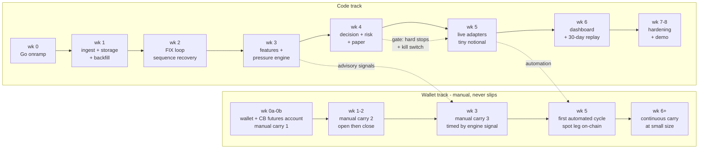

# PRD — Basis Carry System

**Source of truth:** [`basis-carry-build-spec.md`](basis-carry-build-spec.md) (v3.1)
**Companion docs:** [Architecture](architecture.md) · [API Spec](api-spec.md) · [Build Plan](build-plan.md) · [Venue Facts](venue-coinbase-perps.md)

---

## 1. Problem and purpose

Jason is targeting trading-infrastructure / SE / SA roles (Coinbase and similar), where applications ask for an ENS name and reviewers audit what they find on-chain, and where credibility means demonstrable fluency in perp market structure, institutional order entry (FIX), and reliability engineering. Portfolio repos full of paper trades demonstrate none of that.

The product is a **real, small, delta-neutral funding-carry system** on Coinbase US perpetual-style futures (perp leg) + Base (spot leg) that produces:

1. Verifiable on-chain activity tied to one named wallet (ENS + .base.eth → same address).
2. A working system demonstrating perp mechanics, FIX order entry with sequence recovery, and production reliability patterns.
3. A codebase where **AI writes most of the code, and every line is read and explainable**. If a file can't be explained, it gets rewritten until it can.

It could later run capital, but it is not a trading business: **architecture is the product; edge stays private.**

### The one rule that orders everything else

> **Wallet history is the deliverable that can't slip.** Every week must end with more real, explainable activity in the named wallet than it started with. When priorities conflict, wallet history outranks everything.

## 2. Users

| User | Needs |
|---|---|
| **Jason (operator/builder)** | A system he can run, explain line-by-line, and demo; Grafana + alerts to supervise it; manual-trade workflow in early weeks |
| **Reviewer / recruiter** | An ENS name that resolves to a wallet whose history tells a coherent carry story; a public repo with a readable architecture |
| **Interviewer** | Depth on demand: funding mechanics, FIX lifecycle, hard stops, one-writer concurrency, observability (spec §11) |

## 3. Goals and non-goals

### Goals (v1)

- **G1 — Wallet:** continuous, small, readable on-chain carry activity from the named wallet, manual from week 0b, automated from week 5.
- **G2 — Carry engine:** delta-neutral ETH carry (long spot on Base / short the ETH perpetual-style future on Coinbase) timed by a funding-pressure engine, with reason-coded, reproducible decisions.
- **G3 — Order entry:** a real FIX 4.4 session (initiator + sim-venue acceptor) with heartbeats, sequence persistence, and resend recovery.
- **G4 — Reliability & observability:** reconnects, gap detection, staleness handling, hard stops, kill switch, Prometheus/Grafana/Alertmanager, 30-day replay.
- **G5 — Public artifact:** public repo + README + demo script showing architecture with synthetic thresholds.

### Non-goals (v1)

Explicitly out (spec §0, §3): directional funding-fade mode (v2 overlay), reverse carry (short spot / long perp), multi-asset ranking (ETH only), maker-rebate strategies, multi-venue basis arb, options overlay, LLM regime classifier, Rust port, custom public dashboard (Grafana only), a second FIX counterparty, making money as a primary objective.

## 4. Functional requirements

Grouped by component; spec section references in parentheses.

**FR-1 Ingestion (§6.1)**
- FR-1.1 Subscribe to Coinbase Advanced Trade WS channels (ticker, level2, market_trades, candles, status) for the perp and spot products; poll REST for product metadata, positions, and margin summary.
- FR-1.2 Poll Base wallet balances, spot reference price, gas.
- FR-1.3 Reconnect with backoff; per-stream gap detection and `last_seen` heartbeat; stale flag consumed by risk.
- FR-1.4 Persist completed candles, periodic top-N book snapshots, trade aggregates, every funding / futures-mark / spot-mark sample. One writer goroutine per binary.
- FR-1.5 Backfill historical funding and candles via REST on first run; note limited history depth.
- FR-1.6 Compute an hourly funding-rate estimate locally from the venue formula, record `funding_source` (venue or computed), and reconcile accruals against the twice-daily cash adjustments.

**FR-2 Features & pressure (§6.3–6.4)**
- FR-2.1 Compute Tier 1 (funding/basis core), Tier 2 (microstructure), Tier 3 (price, confirmation-only), and risk features every tick; persist to `cb_features`.
- FR-2.2 Pressure outputs: `crowded_side`, `pressure_level` (z-score bands), `expected_pain`, `exhaustion_flag`.
- FR-2.3 Tier 3 never triggers a decision on its own.

**FR-3 Decision engine (§6.5, §8)**
- FR-3.1 Emit `TargetPosition` with state ENTER / HOLD / REBALANCE / EXIT / BLOCKED per the §8 rule table, on every funding tick and risk event.
- FR-3.2 Persist every decision with reason codes and full input snapshot (reproducible).
- FR-3.3 Support advisory mode (signal only, human executes) — this is the week-3 deliverable and the mode manual carry #3 uses.

**FR-4 Risk engine (§6.6)**
- FR-4.1 Track spot inventory, perp contracts, net delta, residual delta, notional, margin ratio, accrued and settlement-pending funding, P&L split (price/funding/fees/slippage).
- FR-4.2 Pre-trade checks: leverage ≤ 3× on overnight margin (intraday never opted in), margin ratio ≥ floor, expected carry ≥ k × costs, spread ≤ max, feed fresh, outside the maintenance window, daily loss limit.
- FR-4.3 Hard stops (max notional, max leverage, margin-ratio floor, basis blowout, funding flip, cascade flag) **flatten and alert**; only the risk engine emits orders.
- FR-4.4 Rebalance when |net delta| > tolerance. The perp leg is quantized to whole 0.10 ETH contracts, so delta is trimmed on the continuous spot leg; residual delta must stay under half a contract.
- FR-4.5 Kill switch: cancel all open orders, flatten, halt submission on all venues; testable against paper.

**FR-5 Execution (§6.7)**
- FR-5.1 Consumer-defined `Venue` interface; identical `ExecReport` state machine (NEW → PARTIAL → FILLED | CANCELED | REJECTED) across all paths.
- FR-5.2 FIX path: FIX 4.4 initiator, 30s heartbeat, file-backed sequences surviving restart, resend handling; sim-venue acceptor with configurable slippage/latency/partial fills.
- FR-5.3 Paper path: contract-quantized book-depth fills, queue-aware passive slippage, Coinbase maker/taker fees, hourly funding accrual (`contracts × contract_size × mark × rate`) settled on the venue's twice-daily schedule, mark-based unrealized P&L; spot leg vs Base reference + assumed DEX slippage + gas.
- FR-5.4 Live path (week 5): `cbVenue` (JWT-signed Advanced Trade REST + WS user channel) and `baseVenue` (ERC-4337 UserOps, session key, Gas Manager) behind the same interface; hard-coded low notional cap; leg-failure unwind.

**FR-6 Treasury (§6.8, wk 5)**
- FR-6.1 Reconcile balances across the Coinbase spot (CBI) account, futures (CFM) margin account, and the Base wallet; track cash auto-transfer into margin, scheduled sweeps back, funding-settlement timing, and Base wallet transactions, each with its own timeout (spec §6.8) raising a risk event and alert when exceeded. A missed funding settlement also feeds the reconciliation error.

**FR-7 Observability (§6.9)**
- FR-7.1 Metrics per the [API spec catalog](api-spec.md#6-prometheus-metrics); four-panel Grafana dashboard; eight alert rules (FIX down, WS gap, delta breach, hard stop, margin ratio, stale feed, funding reconciliation drift, treasury transition timeout).

**FR-8 Backtest/replay (§6.10)**
- FR-8.1 Python replay of recorded data, chronological, funding at hourly boundaries, fees/slippage/mark-based risk; `make replay` = 30 days end-to-end + Grafana refresh.
- FR-8.2 Report: return, expectancy, max DD, Sharpe, profit factor, funding per trade, P&L split, margin near-misses, slippage vs quoted spread.

## 5. Non-functional requirements

| NFR | Requirement |
|---|---|
| Reproducibility | Any decision re-derivable from its persisted input snapshot |
| Durability | Restart-safe: positions from DB, FIX sequences from disk, no in-memory-only state |
| Data ownership | Self-recorded series is primary history; ≥ 30 days before z-thresholds trusted (open item #4) |
| Explainability | Every file explainable by the owner; idiomatic Go patterns (one writer, context cancellation, consumer interfaces, graceful shutdown) |
| Security | Real thresholds, credentials, session keys only in `.env.private`; public repo ships synthetic values (§9) |
| Auditability | Wallet activity small, real, readable; nothing unrelated from the named wallet (wallet doctrine, §1) |
| Safety | Live notional hard-capped; leverage ≤ 3× on overnight margin with intraday never opted in; margin-ratio floor from config; kill switch proven against paper before live |

## 6. Success metrics

- **Wallet:** manual carry #1 by week 1; a carry cycle (or better) added every week; first fully automated carry cycle at week 5; continuous small-size automated carry by week 6; wallet column "never goes backwards." On-chain history comes from the Base spot leg and wallet operations — the perp leg trades off-chain at a regulated venue by design, and the trade log completes the story.
- **System:** FIX sequences survive restart (wk 2); features/pressure live in Grafana every tick (wk 3); hard stops fire in tests and kill switch works vs paper (wk 4); `make replay` 30 days clean (wk 6); reconnect/partial-fill/cancel-replace chaos tests pass (wk 7–8).
- **Strategy:** backtest profitable after fees, slippage, and funding — else the config is not accepted.
- **Narrative:** demo script + README with wallet address; every interview-surface topic (§11) demonstrable in the running system.

## 7. Constraints and assumptions

- Solo builder; one weekend block per milestone; AI-assisted with full-diff review.
- Go for services, Python for research; no second systems language in this repo (Rust deferred).
- ETH only; Coinbase US perpetual-style futures + Base spot; one TimescaleDB instance; Grafana-only UI in v1.
- Live trading is real but tiny; losses bounded by notional cap and daily loss limit are an accepted cost of the artifact.
- Venue mechanics per [venue-coinbase-perps.md](venue-coinbase-perps.md) — hourly funding from a premium TWAP with 75/25 smoothing, twice-daily settlement, 0.10 ETH contracts, margin-ratio liquidation. Its `TODO(verify)` items are confirmed against the live API in week 1.

## 8. Rollout

Weekly milestones (wk 0a–8) per spec §10, with the parallel wallet track. Summary:

Gate for live (wk 5): week-4 hard stops pass in tests and the kill switch is proven against paper. Sim/FIX/paper continue in parallel through week 8 as the reliability showcase; they do not gate the live path after that gate passes.

## 9. Risks and mitigations

| Risk | Mitigation |
|---|---|
| Code milestone slips → wallet stalls | Manual carry for that week happens regardless (rule in §10) |
| Naked delta from one-leg fill | Spot-first ordering, timeout unwind, delta alert |
| Liquidation on perp leg | ≤3× overnight leverage, no intraday opt-in, margin-ratio floor as hard stop, tiny notional |
| Funding flips negative | Exit rule `funding < f_flip`; reverse carry deliberately out of scope |
| DEX slippage worse than modeled at small size | Wk-4 decision point: DEX aggregator vs Coinbase Advanced Trade (open item #2) |
| Venue API drift; funding rate possibly unpublished to this tier | Self-recorded data primary; local funding estimator plus reconciliation; `TODO(verify)` items closed in wk 1; backfill on gaps |
| Contract quantization leaves residual delta | Spot leg trims to under half a contract; delta tolerance and alert sized accordingly |
| Threshold overfitting on short history | ≥30 days self-recorded before trusting z-scores; research/backtest acceptance rule |
| Wallet looks degenerate to a reviewer | Wallet doctrine: small, real, readable, nothing unrelated |
| Solo-builder burnout / scope creep | v2 items fenced off; weekly done-when criteria; sim path can slip without hurting wallet track |

## 10. Open questions

Carried verbatim from spec §12, with owners-by-week:

1. **Wk 1:** Coinbase Advanced Trade Go client — community package vs thin hand-rolled REST+WS wrapper with CDP JWT auth (read the auth code first). No official Go SDK exists.
2. **Wk 4:** automated Base spot leg — DEX aggregator vs Coinbase Advanced Trade + withdrawal.
3. **Wk 7:** point FIX initiator at Coinbase Exchange FIX sandbox for the spot leg (verify sandbox availability then).
4. **Ongoing:** minimum recorded history before trusting z-scores (target ≥ 30 days).
5. **Deferred:** Rust hot-path port — only if targets narrow to prop-shop trading systems.
